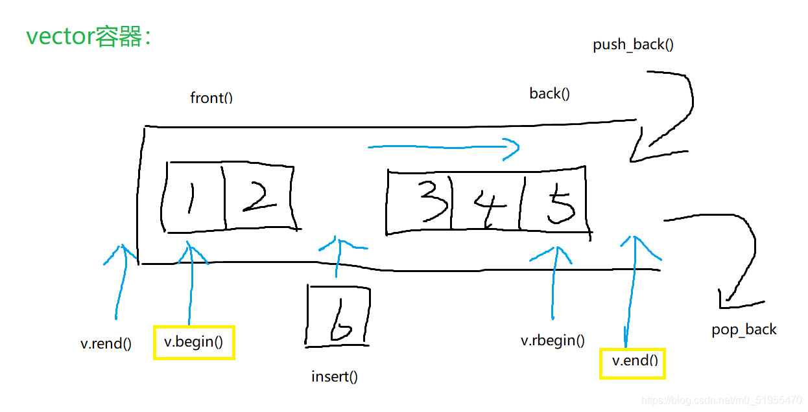
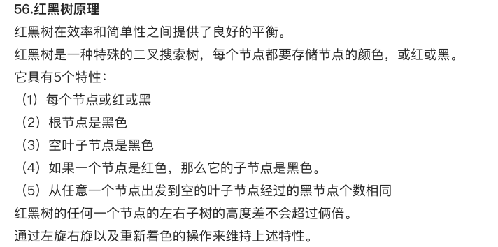

# C++

[TOC]


## c++基础|关键字|static和const的区别

### 1. 修饰局部变量

`const` 修饰局部变量

- **作用**：表示该变量为只读，其值不能被修改。

  ```cpp
  void function() {
      const int localVar = 10;
      // localVar = 20;  // 错误，不能修改
  }
  ```

`static` 修饰局部变量

- **作用**：改变变量的生命周期，使其在超出作用域后仍然存在，直到程序结束时才被销毁。

  ```cpp
  void function() {
      static int counter = 0;
      counter++;
      // counter 的值在函数调用之间保持
  }
  ```

### 2. 修饰全局变量

`const` 修饰全局变量

- **作用**：如果全局变量仅在一个文件中使用，那么 `const` 的作用与局部变量类似，表示该变量为只读。

  ```cpp
  const int globalVar = 100;
  ```

`static` 修饰全局变量

- **作用**：使得全局变量只能在本源文件中使用，其他源文件不能访问，从而实现内部链接。存储在静态存储区，运行期间一直存在

  ```cpp
  static int fileScopeVar = 0;  // 仅在当前文件中可见
  ```

### 3. 修饰类成员变量

`const` 修饰类成员变量

- **作用**：表示成员变量为只读，不能被修改，必须在 **`构造函数初始化列表中初始化`** 。

  ```cpp
  class MyClass {
  public:
      const int constMember;
      MyClass(int value) : constMember(value) {
          // constMember = value;  // 错误，不能在构造函数体内赋值
      }
  };
  ```

`static` 修饰类成员变量

- **作用**：使成员变量**属于类而不是某个对象，所有对象共享静态成员变量**，必须在类外定义。

  ```cpp
  class MyClass {
  public:
      static int staticMember;	// 类内声明
      // static int staticMember = 10;  // 错误：在类内定义和初始化静态成员变量
  };
  
  int MyClass::staticMember = 0;  // 类外定义
  ```

### 4. 修饰类成员函数

`const` 修饰类成员函数

- **作用**：表明该成员函数**`不能修改类的任何成员变量`** ，实际是修饰该成员函数隐含的 `this` 指针。

  ```cpp
  class MyClass {
  public:
      void myFunction() const {
          // 不能修改成员变量
      }
  };
  ```

`static` 修饰类成员函数

- **作用**：使成员函数属于类而不是某个对象，没有 `this` 指针，**不能访问任何非静态成员**。

  ```cpp
  class MyClass {
  public:
      static void staticFunction() {
          // 不能访问非静态成员
      }
  };
  ```

### 5. 修饰类对象和类

`const` 修饰类对象

- **作用**：表示该对象中的所有成员变量均不可被修改，只能调用 `const` 成员函数。

  ```cpp
  const MyClass obj;
  obj.constMemberFunction();  // 只能调用 const 成员函数
  ```

`static` 修饰类和内部类

- **作用**：`static` 不能修饰普通类，但是**可以修饰内部类**，使其可以在不实例化外部类的情况下使用。

  ```cpp
  class OuterClass {
  public:
      static class InnerClass {
      public:
          void innerFunction() {
              // 内部类函数
          }
      };
  };
  
  OuterClass::InnerClass innerObj;
  innerObj.innerFunction();
  ```

- 总结

- **`const`** ：用于表示不可修改的常量。可以修饰局部变量、全局变量、类成员变量、类成员函数以及类对象，保证数据的只读属性。
- **`static`** ：用于控制变量或函数的生命周期和作用域。可以修饰局部变量、全局变量、类成员变量和类成员函数，提供共享和内部链接功能。**静态成员变量和函数的定义（实现）通常在类定义之外进行，以确保它们在程序中只存在一个实例。**

通过理解和正确使用 `const` 和 `static` 关键字，可以编写出更安全、性能更高、可维护性更强的代码。

## c++基础|关键字|final 修饰符的作用

- 修饰类，该类无法被继承

- 修饰类的成员函数，成员函数不能被派生重写

- 提高代码的稳定性和可维护性

## c++基础|关键字|`inline`

**`inline`** 关键字在C++中引入是为了替代C语言中的宏函数，提供一种类型安全、可调试的优化方式。

- 编译器行为
  - 在编译阶段，编译器会 **尝试将`inline`函数的调用替换为函数体本身** ，从而减少函数调用的开销。
  - 这是对编译器的建议，编译器可以根据具体情况决定是否内联。
- 优点
  - **性能提升**：省去函数调用的开销，包括参数压栈、栈帧开辟与回收、返回结果等
  - **类型安全**：与宏定义相比，**`inline`** 函数在代码展开时会进行类型检查和自动类型转换，避免了宏定义中常见的错误。
  - **类成员函数**：在类中声明同时定义的成员函数会自动转化为内联函数，因此可以直接访问类的成员变量。这是宏定义无法实现的。
  - **可调试**：`inline`函数在运行时**可以进行调试**，而宏定义在预处理阶段展开后无法进行调试。
- 缺点
  - **代码膨胀**：每次调用 **`inline`** 函数都需要复制函数体，增加了代码量和内存消耗。
  - **库函数升级问题**：**`inline`** 函数不会随着库函数的升级而自动升级，用户需要**重新编译代码**。非`inline`函数的库升级只需重新链接，而不需要重新编译。
  - **内联不可控**：编译器对内联函数具有最终决定权
- **`限制`**
  - 不能存在**任何形式循环语句**
  - 不能存在过多的条件判断语句
  - 函数体不能过于庞大
  - 内联函数声明必须在调用语句之前

> [C++函数调用过程|函数调用通常涉及哪些开销](##C++函数调用过程)


## c++基础|关键字|`void*`

void*定义一个指针变量，但不说明他指向哪一个类型。即这个指针变量只有地址，没有大小

**函数模板**：`void*`可以用作函数模板的通用参数，使得函数可以处理不同类型的数据。

**空指针**：`void*`可以用来表示一个空指针，类似于`NULL`。`(void*)0`通常表示一个空地址，不指向任何有效的内存位置。

**动态内存分配**：`void*`常用于动态内存分配函数（如`malloc`、`calloc`）的返回类型。这样可以分配任意类型的内存块，并将其指针存储在`void*`类型的指针中。之后，程序可以将`void*`转换为所需的类型进行操作。

- **`calloc`** 在堆上分配内存，并每个字节都被初始化为 0。 

```cpp
void* ptr = malloc(100);  // 分配100字节的内存
int* intPtr = static_cast<int*>(ptr);  // 转换为int* 类型

void* calloc(size_t num, size_t size);
```

## c++基础|关键字|`sizeof`

 **\*有无unsigned修饰都一样**

| 字节 | short | int  | float | long | *(地址) | double | long long |
| :--: | :---: | :--: | :---: | :--: | :-----: | :----: | :-------: |
| 32位 |   2   |  4   |   4   |  4   |    4    |   8    |     8     |
| 64位 |   2   |  4   |   4   |  8   |    8    |   8    |     8     |

## C++基础|define和typedef的区别

- `define`
  1. 只是简单的字符串替换，没有类型检查
  1. 是在编译的**预处理阶段**起作⽤
  1. 可以⽤来防⽌头⽂件

- `typedef`
  1. 有对应的数据类型，是要进⾏**判断**的
  2. 是在**编译、运行**的时候起作⽤
  3. 在**静态存储区中分配空间**，在程序运⾏过程中内存中只有⼀个拷贝

## C++基础|const和define的区别

`const`用于定义常量;而`define`用于定义宏，而宏也可以用于定义常量。

都用于**常量定义时它们的区别**

1.const生效于编译的阶段;define生效于预处理阶段。

2.const定义的常量，在C语言中是存储在内存中、需要额外的内存空间的;define定义的常量，运行时是直接的操作数，并不会存放在内存中。

3.const定义的常量是带类型的;define定义的常量不带类型。因此define定义的常量不利于类型检查,

## C++基础|编译过程

预处理 「Preprocessing」，编译「Compilation」，汇编「Assemble」，链接「Linking」

**每⼀个阶段都有相应的优化技术，一步到位失去了代码优化的机会**


1. 预处理（Preprocessing）

   主要处理源代码中#开头的预处理指令，如#include，将文件内容替换到它的位置；删除所有#define，展开所有宏定义等。生成.i文件

   **内存分区**：这个阶段不涉及程序的运行时内存，处理的是源代码文件。

2. 编译（Compilation）

   将.i⽂件翻译成⽂本⽂件.s ,⽣成 **汇编语言程序** 。每条语句都以标准的⽂本格式确切描述⼀条低级机器语⾔指令

   **内存分区**：编译阶段同样不直接涉及运行时内存，它生成的是目标文件（.o 或 .obj 文件），这些文件包含了汇编代码。

3. 汇编（Assembly）

   汇编器将.s 翻译成**机器语言指令** 。把这些指令打包成可重定位的目标程序，⽣成.o⽂件。它是⼀个⼆进制⽂件，它的字节码是机器语⾔指令，不再是字符。前面俩个阶段都还有字符。

   **内存分区**：这个阶段生成的是机器代码，这些代码在运行时会被加载到内存中执行。

4. 链接（Linking）

   将不同的源文件产⽣的目标文件进行链接，从而形成⼀个可以执行的程序。链接分为 **静态链接和动态链接**

## C++基础|静态链接 动态链接

LIB（**Static Library**）是编译时用到的，DLL（**Dynamic Link Library**）是运行时用到的。如果要完成源代码的编译，只需要LIB；如果要使动态链接的程序运行起来，只需要DLL。

**静态链接`静态库（.a，.lib）`** 就是把Lib文件中用到的函数直接链接进目标程序，程序运行时不在需要调用其他的库文件。

- 空间浪费：每个执行文件所需要的目标文件都需要一个样本；
- 重新编译：每当库函数代码修改，需要重新编译形成可执行程序；
- 运行效率：因已具备索要执行程序所需东西，运行速度快

**动态链接`动态库（.so，.dll）`**，导入库（LIB）文件包含了调用函数在动态链接库（DLL）中的位置信息，这些信息在编译时被用来链接目标程序。程序在运行时会根据这些信息从DLL文件中动态加载相应的函数代码。

- 代码共享，空间少：多个程序执行时共享一个副本；
- 程序升级方便：只要替换文件，无需重新编译；
- 性能损耗大：把链接推迟到运行时

| 特性               | 静态链接（lib                          | 动态链接（dll                          |
| ------------------ | -------------------------------------- | -------------------------------------- |
| **依赖性**         | 无需依赖外部库文件                     | 依赖动态库，程序无法独立运行           |
| **磁盘占用**       | 每个程序包含完整的库代码，浪费空间     | 多个程序共享一个库，节省磁盘空间       |
| **维护和升级**     | 库更新后需重新编译所有程序             | 更新库文件即可，无需重新编译程序       |
| **启动和运行效率** | 启动和运行时不需要加载外部库，效率高   | 运行时动态加载库，启动时有额外开销     |
| **安全性**         | 不依赖外部库，不受外部库篡改或损坏影响 | 依赖外部库，可能会因库的修改而导致问题 |

- **静态链接** 适用于对性能和独立性要求较高的场景，尤其是在不方便频繁更新库的环境中使用。
- **动态链接** 则适用于共享库、节省空间以及需要灵活更新的场合，尤其在需要频繁维护和升级库的应用程序中非常实用。

根据实际需求，在开发过程中可以选择适合的链接方式。

## C++基础|指针和引用的区别

- 指针是一个变量，存储一个地址；引用是原变量的别名

- 指针可以有多级；引用只能一级

- 指针可以为空，且可以先声明而不是初始化；引用不能为NULL且在定义时必须初始化

- 指针在初始化后可以改变其指向；引用在初始化之后不可以再改变

- sizeof指针得到的即使这个指针的大小；sizeof引用得到的是所指向变量的大小；

- 当把指针作为参数进行传递时，也就是将实参的一个拷贝传递给形参，两者指向的地址相同，但不是同一个变量，改变形参的指向对实参没影响

  ```cpp
  void modifyPointer(int* ptr) {
      int newValue = 100;
      ptr = &newValue;  // 改变指针的指向
  }
  
  int main() {
      int value = 42;
      int* p = &value;  // p 指向 value
  
      std::cout << "Before modifyPointer: " << *p << std::endl; // 输出 42
  
      modifyPointer(p);  // 将 p 作为参数传递 
      // 在 modifyPointer 中，ptr = &newValue; 这一行代码并没有改变 p 的指向。它只改变了 ptr 的指向，使其指向新的变量 newValue 的地址
      // 函数执行完毕并返回时，ptr 会被销毁，而 p 仍然指向 value 的地址
  
      std::cout << "After modifyPointer: " << *p << std::endl; // 仍然输出 42
      return 0;
  }
  ```

## C++面向对象|Object Oriented Programming，简称为OOP

**面向过程**强调通过一系列步骤或程序（过程）来解决问题，程序是按照从上到下的顺序执行的。

**面向对象编程**以对象为中心的编程范式，强调使用对象和类来组织代码

**声明式编程**是一种描述“是什么”的编程范式，而不是“如何做”。SQL和HTML是声明式编程的典型例子。

事件驱动编程，常用于图形用户界面（GUI）应用和实时系统，事件（用户交互或其他外部输入触发的动作）驱动

## C++面向对象|的三大特性是封装、继承和多态

- **继承**
  继承允许一个类（派生类）继承另一个类（基类）的属性和方法，促进**代码重用和扩展**。子类可以使用父类的所有功能，并在此基础上进行扩展。继承的过程是从**一般到特殊**的过程。通过继承，可以实现代码的重用，并且建立类之间的层次关系。**访问控制、实现多态**

  - **实现继承**：子类直接使用父类的属性和方法，无需额外编码。

  - **接口继承**：子类继承父类的属性和方法的名称，但提供自己的实现方式。基类作为纯虚类（接口），子类实现接口中的方法。

    ```cpp
    class Base {
    public:
        virtual void show() = 0; // 纯虚函数，没有具体实现
    };
    
    class Derived : public Base {
    public:
        void show() override {
            std::cout << "Derived class show method" << std::endl;
        }	// 接口继承
        void display() {
            std::cout << "Derived class display method" << std::endl;
        }	// 实现继承
    };
    
    ```

- **封装**
  将对象的状态（属性）和行为（方法）打包在一起，并隐藏内部实现细节，只暴露必要的接口给外部。提高代码的可维护性和可复用性。

- **多态**
  多态是指一个接口可以被多个类实现。向不同对象发送相同的消息，不同对象会 **`根据自身的特性响应不同的行为`** 。

- **Overload（重载）**：在同⼀作用域内（**同一类**），使⽤相同的函数名但具有不同的参数列表或类型，构成重载。

- Override（重写）：重写是指在**派生类**（子类）中重新定义基类（父类）的**虚函数（virtual function）**，以提供特定的实现

  ```cpp
  class Animal {
  public:
      virtual void speak() {
          std::cout << "Some animal sound\n";
      }
  };
  
  class Dog : public Animal {
  public:
      void speak() override {  // C++11 引入的 override 关键字，用于明确指出这是一个重写
          std::cout << "Woof!\n";
      }
  };
  ```

- Overwrite（隐藏）：派生类的函数屏蔽了与其同名的基类函数。派生类的函数与基类函数同名，但是参数不同，隐藏基类函数。如果参数相同，但是基类没有virtual关键字，基类函数将被隐藏。

- C++中的多态性主要分为**编译时多态和运行时多态**。

  - 编译期间就可以确定函数的调用地址，并产生代码，则是静态的，即地址早绑定 。
  - 如果函数的调用地址需要在运行时才能确定，则是晚绑定 。
  - *确定函数调用是编译期间还是运行期间确定的，可以通过分析函数是否为虚函数、指针或引用的类型、以及编译器生成的代码等因素：1. 非虚函数（早绑定）虚函数（晚绑定）；2.指针和虚函数*

  **静态多态（早绑定 函数重载）**

  ```cpp
  class Print {
  public:
      void show(int i) { /* 打印整数 */ }
      void show(double f) { /* 打印浮点数 */ }
  };
  ```

  **动态多态（晚绑定 虚函数）**

  ```cpp
  class Animal {
  public:
      virtual void makeSound() { /* 通用声音 虚函数 */ }
  };
  
  class Dog : public Animal {
  public:
      void makeSound() override { /* 狗叫 */ }
  };
  
  class Cat : public Animal {
  public:
      void makeSound() override { /* 猫叫 */ }
  };
  ```

- **模块化（不属于三大特性，但是是面向对象的特点**

  面向对象的设计方法鼓励将程序划分为相互独立的模块或对象，每个模块负责特定功能。这种模块化的设计使得程序更容易理解、维护和调试。同时，模块化促进协作，不同成员独立开发

## C++面向对象|多态和继承在什么情况下使用

这些都是需要尽可能⼤的进⾏代码重⽤的时候⽤到的。  

继承和多态经常⼀起使⽤。通过继承，可以建⽴类之间的层次结构；通过多态，可以根据对象的实际类型来调⽤适当的⽅法。这样可以提⾼代码的可重⽤性、可扩展性和可维护性，使代码更加灵活和易于扩展。  

继承通常⽤于描述"is-a"的关系，⽐如⼀个⼦类可以继承⽗类的特征和⾏为，并且可以添加⾃⼰的特定特征和⾏为。继承的主要优点是代码的重⽤和扩展性。当存在明确的层次关系和共享代码的需求时，可以使⽤继承。

多态的主要优点是增加了代码的灵活性和可扩展性。当需要根据不同的对象类型来执⾏不同的操作时，可以使⽤多态。

## C++面向对象|除了多态和继承还有什么面向对象方法（封装、接口、重载）

除了多态和继承，面向对象编程还包括封装、抽象、重载和组合等概念和技术。

1. 封装（Encapsulation）

   封装是将数据和操作数据的方法封装在一个类中，并通过访问控制（如public、protected、private）隐藏类的内部实现细节，只暴露必要接口。保护对象的内部状态。提高代码的可维护性。

2. 抽象（Abstraction）

   抽象是将复杂的现实世界问题简化为模型，通过提取公共特性，忽略不必要的细节

3. 接口（Interface）

   接口是一组方法的集合。接⼝提供了⼀种规范，规定了类应该实现哪些⽅法，并描述了这些⽅法应该做什么 

4. 重载（Overloading）

   重载是允许在同一个作用域中定义多个同名函数，但这些函数具有不同的参数列表（参数的类型、数量或顺序不同）。重载包括函数重载和运算符重载。

## C++面向对象|多态实现的注意点

### 1. 使用虚函数和`override`关键字

在基类中声明虚函数，以便派生类可以覆盖这些函数实现多态性，并使用`override`关键字明确表示派生类中的函数是重写基类中的虚函数。

```cpp
class Base {
public:
    virtual void display() const {
        std::cout << "Base display" << std::endl;
    }
    virtual ~Base() = default; // 确保基类有虚析构函数
};

class Derived : public Base {
public:
    void display() const override {
        std::cout << "Derived display" << std::endl;
    }
};
```

### 2. 确保基类有虚析构函数

如果基类没有虚析构函数，使用基类指针删除派生类对象时会导致未定义行为。

```cpp
class Base {
public:
    virtual ~Base() { // 确保基类析构函数是虚函数
        std::cout << "Base destructor" << std::endl;
    }
};
```

### 3. 避免对象切片

当**将派生类对象赋值给基类对象**时，会发生对象切片。应**使用基类指针或引用来避免**这个问题。

**<a href="##C++面向对象|对象切片示例">🔗对象切片</a>**

### 4. 理解纯虚函数和抽象类

纯虚函数用于定义抽象类，不能实例化抽象类，只能派生子类并实现所有纯虚函数。

```cpp
class AbstractBase {
public:
    virtual void pureVirtualFunction() = 0; // 纯虚函数
};

class ConcreteDerived : public AbstractBase {
public:
    void pureVirtualFunction() override {
        std::cout << "Implemented pure virtual function" << std::endl;
    }
};
```

### 5. 使用智能指针管理对象生命周期

**使用智能指针**（如`std::unique_ptr`和`std::shared_ptr`）可以更安全地管理对象生命周期，避免内存泄漏。

```cpp
int main() {
    std::unique_ptr<Base> ptr = std::make_unique<Derived>();
    ptr->display(); // 调用 Derived 的 display 方法
    
    // 演示信号和回调通知
    Base* rawPtr = new Derived();
    rawPtr->display();
    delete rawPtr; // 调用 Derived 和 Base 的析构函数

    return 0;
}
```

## C++面向对象|对象切片示例

对象切片（Object Slicing）是 C++ 中的一种现象，发生在将派生类对象赋值给基类对象时。在这种情况下，派生类特有的数据和方法会被“切掉”，只保留基类部分。

```cpp
class Base {
public:
    Base(int val) : baseValue(val) {}
    virtual void display() const {
        std::cout << "Base display: " << baseValue << std::endl;
    }
protected:
    int baseValue;
};

class Derived : public Base {
public:
    Derived(int baseVal, int derivedVal) : Base(baseVal), derivedValue(derivedVal) {}
    void display() const override {
        std::cout << "Derived display: " << baseValue << ", " << derivedValue << std::endl;
    }
private:
    int derivedValue;
};
```

**对象切片发生**

```cpp
int main() {
    Derived d(1, 2);
    d.display(); // 输出: Derived display: 1, 2
    // 对象切片发生
    Base b = d;
    b.display(); // 输出: Base display: 1
    // 基类对象只包含基类部分，派生类的 derivedValue 被切掉
    return 0;
}
```

**避免对象切片,**应使用基类指针或引用来操作派生类对象

```cpp
int main() {
    Derived d(1, 2);
    d.display(); // 输出: Derived display: 1, 2

    // 1.使用基类指针
    Base* bp = &d;
    bp->display(); // 输出: Derived display: 1, 2

    // 2.使用基类引用
    Base& br = d;
    br.display(); // 输出: Derived display: 1, 2
    return 0;
}
```

## C++面向对象|虚函数 多态的底层实现

主要是用来**实现多态**。在基类函数前加上`virtual`关键字，在派生中`override`重写该函数，运行中根据对象实际类型调用对应函数。

```cpp
class Base {
public:
    virtual void show() {
        cout << "Base show" << endl;
    }
    virtual ~Base() {}  // 虚析构函数
};

class Derived : public Base {
public:
    void show() override {
        cout << "Derived show" << endl;
    }
};
```

### 虚函数表

- 当一个类包含虚函数时，编译器会为该类生成一个**虚函数表（vtable，即在编译期间创建）**，保存该类中函数的地址（32位：4字节，64位：8字节）；
- **虚函数表**位于 **`只读数据段(常量区|.rodata)。虚函数存在于代码段(代码区|.text)`**；
- 同样，**派生类继承基类**，自然也会有虚函数，编译器也会为派生类生成自己的虚函数表（vtable）；

### 虚函数指针

- 当编译器检测到定义的派生类有虚函数，会为派生类对象**生成一个虚函数指针（vptr）**，指向该类型的虚函数表，这个虚函数指针的初始化是在构造函数中完成的；
- ==**vptr跟着对象走**==，所以对象什么时候创建，vptr就什么时候创建出来，所以是在程序运行时创建。如果对象在栈上创建，vptr 也在栈上；如果对象在堆上创建，vptr 也在堆上。 
- 如果有⼀个**基类类型的指针指向派生类**，那么当调用虚函数时，就会根据所指真正对象的**虚函数表指针**去寻找**虚函数的地址**，也就可以调⽤派⽣类的虚函数表中的虚函数**以此实现多态**。

- **编译时行为**
  - **虚函数表的生成**：在编译时，编译器为每个包含虚函数的类生成一个虚函数表。虚函数表存储在常量区，因为它们的大小和内容在编译时已经确定，并且在程序运行期间不会改变。
  
  - **代码区**：虚函数的具体实现代码存储在代码区（通常是只读的）。
  
- **运行时行为**

  - **对象的创建**：在运行时，当创建一个包含虚函数的类的对象时，编译器在对象内添加一个虚函数表指针（vptr），并将其初始化为指向该类的虚函数表。

  - **对象在栈上**：如果对象在栈上分配，vptr 也在栈上。

  - **对象在堆上**：如果对象在堆上分配，vptr 也在堆上。

  - **对象在全局/静态区**：如果对象是全局或静态分配，vptr 也在全局/静态区。

## C++面向对象|虚函数优势劣势

**优势**：实现了多态，可以使相同的函数实现不同的功能，提高代码的复用性和接口的规范化。更加符合面向对象的设计理念

**劣势**：

- **运行时开销**：虚函数的动态绑定需要在运行时进行额外查找和解析，因此相对于非虚函数，有一定的运行时开销，导致性能稍微下降。
- **内存开销**：每个虚函数的类都会引入一个虚函数表指针，以及虚函数表。增加了内存开销，尤其在大规模的基层结构中
- 增加了设计的复杂性
- **缺少内联以及其他的优化机会**：编译器在编译阶段无法确定实际调用的函数版本，从而无法进行函数内联优化。并且限制编译器其他方面的优化能力。
- **缓存不友好**：虚函数的调用涉及**动态绑定**，但是动态绑定需要在运行时根据对象的实际类型进行函数调用。这种绑定导致了缓存不友好的情况。由于虚函数表存储了不同函数的地址，但是**不同对象又有不同的虚函数表指针**，这会导**致虚函数调用所涉及代码和数据分散在不同的内存位置**，导致**缓存失效和不连续内存访问**，从而降低缓存的命中率。


## C++面向对象|析构函数写成虚函数原因

1. 如果⼀个类**可能被继承**，
2. 且在其**派生类**中有**可能使用 delete** 运算符来**删除通过基类指针指向的对象**

**`那么该基类的析构函数应该声明为虚析构函数`**

- **原因**
  - **防止内存泄漏**。若定义一个基类的指针指向一个派生类对象，在使用完毕准备销毁时，如果基类的析构函数没有被定义成虚函数，则**编译器根据指针类型就会认为当前的对象是基类，调用基类的析构函数**，进执行基类的析构，造成内存泄漏。
  - 如果基类的析构函数被定义成虚函数，那么编译器就**根据实际对象，执行派生类的析构函数，再执行基类的析构函数，成功释放内存**。

## C++面向对象|构造函数为什么不能声明为虚函数

1. **对象类型确定性**：创建一个对象时需要确定对象的类型，而虚函数是在**运行时确定类型**的。而在构造对象时候，对象还没被创建成功，编译器无法知道对象的实际类型是类本身还是类的派生类；
2. **虚函数表的依赖性** **：虚函数的调用基于虚函数表的虚函数指针，而该指针存放在对象的内存空间**中。构造函数声明为虚函数，那么由于对象还没被创建，还没有对象的内存空间，也就没有虚函数表地址用来调用虚函数。

## C++面向对象|构造函数或析构函数中调用虚函数会怎样  

语法通过，但是失去多态性。如果在构造或析构函数中调用虚函数，都会先**调用父类中的实现**。

- 构造函数中调用虚函数会调用基类的版本，因为派生类版本尚未构造完成，虚函数指针和虚函数表未初始化完毕。派生类特有的实现不会生效，即使是在派生类的构造函数中

- 析构函数中调用虚函数会调用基类的版本(同构造），因为派生类版本已经被销毁。这通常不是问题，因为析构函数的目的是清理资源，通常不需要派生类特定的行为。

**父类中的实现**：

- **构造函数**的执行顺序是**从基类构造函数开始**的。
- **析构函数**的执行顺序是**从派生类析构函数开始**的，调用基类析构函数时，**派生类**的部分**已经被析构**。

## C++面向对象|虚函数和纯虚函数的区别

有具体实现和无具体实现的区别

- 纯虚函数在基类中没有实现，必须在**派生类中实现**。纯虚函数用于定义抽象类，**抽象类不能被实例化，只能被继承。**

 ```cpp
 class AbstractBase {
 public:
     virtual void display() const = 0; // 纯虚函数
     virtual ~AbstractBase() = default; // 确保基类有虚析构函数
 };
 
 class ConcreteDerived : public AbstractBase {
 public:
     void display() const override { // 实现纯虚函数
         std::cout << "ConcreteDerived display" << std::endl;
     }
 };
 ```

## C++面向对象|有几种继承

无论何种继承，基类的私有成员在派生类中都是不可被访问的。只有通过基类的成员函数访问基类的私有数据成员

- **公有继承**：公有继承是最常见继承方式。在公有继承中，基类的公有成员和保护成员都会成为派生类的公有成员和保护成员。派生类是基类的一种类型，可以访问公有成员。**保护成员的访问权限是受限的，是通过基类类型的引用或指针实现的。**

- **私有继承**：基类的公有成员和保护成员都成为派生类的私有成员，无法直接访问。私有继承常用于实现继承的代码重用，而不是通过派生类对象访问积累的成员

- **受保护继承**：介于上面两者之间。在受保护继承中，积累的公有成员和保护成员成为了派生类的受保护成员，无法通过派生类对象访问。很少使用

- **虚继承**：用于解决多重继承中的 **`菱形继承`问题** 。**虚拟继承通过使共同基类在继承链中只有⼀份实例**  

- 多重继承：

  - **菱形继承**：当两个类（B和C）继承自同一个基类（A），然后又有一个类（D）同时继承这两个类（B和C）时，就形成了所谓的菱形继承结构
  - **二义性**：当D类需要访问A类的成员时，编译器无法确定是访问从B继承来的那份还是从C继承来的那份，因此会产生歧义。
  
  ```cpp
  class Base {
  public:
      int baseVar;
  };
  
  // 错误
  class A : public Base {
  public:
      int aVar;
  };
  class B : public Base {
  public:
      int bVar;
  };
  
  // 正确
  class A : virtual public Base {
  public:
      int aVar;
  };
  class B : virtual public Base {
  public:
      int bVar;
  };
  
  // 多继承
  class E : public A, public B {
  public:
      int eVar;
  };
  
  int main() {
      E e;
      e.baseVar = 10; // 正确：没有歧义 错误：ambiguous call
      return 0;
  }
  ```

## C++面向对象|深拷贝和浅拷贝的区别

主要区别在于如何处理对象内部的动态分配的资源

- **深拷贝**

  深拷贝是对对象的**完全独立复制**，包括对象内部动态分配的资源。在深拷贝中，不仅复制对象的值，还会复制对象所指向的堆上的内容。深拷贝通常**涉及手动分配内存**，并在拷贝构造函数或赋值操作符中进行资源的复制。

  **特点**

  - 复制对象及其所有变量的值
  - 动态分配的资源会被复制，新对象拥有自己的一份资源副本

  ```cpp
  public:
      int* data;
      DeepCopy(int val) {
          data = new int(val);
      }
      // 深拷贝构造函数
      DeepCopy(const DeepCopy& other) {
          data = new int(*(other.data));
      }
  ```

- **浅拷贝**

  浅拷贝仅复制对象的值，而不设计对象内部动态分配的资源。在浅拷贝中，新老对象共享相同的资源，而不是复制一份新的资源。浅拷贝通常使⽤默认的拷贝构造函数和赋值操作符，因为它们会逐成员地复制原对象的值。

  **特点**

  - 复制对象及其所有变量的值
  - 对象内部动态分配的资源不会发生变化，新老对象共享相同资源

## C++面向对象|子类已经重写 如何调用父类的函数

使用作用域解析运算符 `::`

```cpp
class Parent {
public:
    virtual void display() {
        std::cout << "Parent display function." << std::endl;
    }
};

class Child : public Parent {
public:
    void display() override {
        std::cout << "Child display function." << std::endl;

        // 调用父类的 display 函数
        Parent::display();
    }
};

int main() {
    Child child;
    child.display();
    return 0;
}

```


## C++内存管理|内存分区

**运行时确定**

- **栈**：自动管理、快速、空间有限。

- **堆**：手动管理、灵活、空间大、易碎片化。

**编译时确定**

- **全局/静态区**：生命周期长、系统管理、占用内存大。
  - 分为初始化和未初始化两个相邻区域，存储初始化和未初始化的 **全局和静态变量**。已经初始化在 **`.data`** ，未初始化在 **`.bss`** 

- **常量区**：只读、安全、系统管理。存储常量，一般不允许更改

- **代码区**：存储程序代码、只读、安全、系统管理。存放程序的二进制代码


## C++内存管理|堆和栈的区别

1. **申请方式** 
   栈内存由操作系统自动管理，生命周期与其所在函数的执⾏周期相同；
   堆内存需要通过 `new` 和 `delete`（或 `malloc` 和 `free`）手动分配和释放，⽣命周期由程序员显式控制

2. **申请大小限制** 
   栈的大小在启动时由系统或编译器预先设定，通常较小。可以通过**`ulimit -a`** 查看，**`ulimit -s`** 修改。  内存是从高地址向低地址扩展的；
   堆内存可以在程序运行时动态调整大小，通常比栈大。分配内存块是不连续的内存区域，向高地址扩展。

3. **申请效率**
   栈由系统分配，速度快，不会有碎⽚；

   堆由程序员分配，速度慢，会有内存碎片

4. **使用时间**

   栈不会产生内存碎片，且分配效率高。所以函数调用通过栈来完成，以及调用过程中的参数、返回地址和局部变量都采用栈来存放。如果少量数据需要频繁操作，程序中动态申请少量栈内存`alloca()`，会得到很好性能提升；

   堆可以申请的内存大很多，需要分配大量内存空间使用堆。

## C++内存管理|内存泄漏

内存泄漏是指由于疏忽或错误造成程序==**未能释放掉不再使用的内存的情况**==。「1.指针指向改变，2.未释放动态分配内存」

内存泄漏并非指内存在物理上的消失，而是应用程序分配某段内存后，由于设计错误，失去了对该段内存的控制，因而造成了内存的浪费。

可以使用`Valgrind，mtrace`进行内存泄漏检查

### 内存泄漏的分类

1. **堆内存泄漏**

   程序运行中需要分配通过`malloc，realloc，new`等从堆中分配的一块内存，再是完成后必须通过对应的 `free `或 `delete `删掉。如果程序的设计错误导致这部分内存没有被释放，那么此后这块内存将不会被使用，就会Heap leak。

2. **系统资源泄漏**

   程序使用系统分配的资源，比如`Bitmap，handle，socket`等没有使用相应的函数释放掉，导致系统系统资源的浪费，严重导致系统效能降低，系统运行不稳定。

3. **没有将基类的析构函数定义为虚函数**

   当基类指针指向子类对象时，如果基类的析构函数不是`virtual`，那么子类的析构函数将不会被调用，子类的资源没有被正确释放，因此导致内存泄漏

### 防止内存泄漏

将内存的分配封装在类中，构造函数分配内存，析构函数释放内存；使用智能指针

解决：加入错误处理代码，使用内存分析工具

## C++内存管理|常见内存泄漏

内存泄漏通常由以下情况引起：

1. 在类的构造和析构函数中没有匹配的调用 `new` 和 `delete`

   **描述**：如果在类的构造函数中分配了内存，但在析构函数中没有释放它，或者在析构函数中释放了与构造函数分配的内存不匹配的内存，就会导致内存泄漏或未定义行为。

2. 没有正确的清除嵌套的对象指针

   **描述**：如果一个对象的成员变量是指向另一个对象的指针，但在析构函数中没有正确释放这些嵌套对象，会导致内存泄漏。

3. 在释放对象数组时在 `delete` 中没有使用方括号

   **描述**：对于动态分配的对象数组，使用 `delete` 而不是 `delete[]` 释放内存，会导致未定义行为和内存泄漏。

   ```cpp
   class MyClass {
   public:
       MyClass() : data(new int[100]) {}
       ~MyClass() {
           delete data; // 错误，应该使用 delete[]
           delete[] data; // 正确
       }
   private:
       int* data;
   };
   ```

4. 释放指向对象的指针数组时只释放了对象空间，没有释放指针空间

   **描述**：如果数组中存放的是指向对象的指针，在释放这些指针时，应该释放每个对象的内存和指针数组的内存。指针数组 `array` 没有被释放。

    ```cpp
    int main() {
        MyClass* array[10];
        for (int i = 0; i < 10; ++i) {
            array[i] = new MyClass();
        }
   
        for (int i = 0; i < 10; ++i) {
            delete array[i]; // 正确释放每个对象
        }
        // 忘记释放指针数组本身
    }
    ```

   **解决方法**：释放每个对象的内存，然后释放指针数组本身。

5. 缺少拷贝构造函数和重载赋值运算符

   **描述**：默认的拷贝构造函数和赋值运算符执行浅拷贝，当类的成员变量是指针时，两个对象会指向同一块内存。释放一个对象的内存时，另一个对象也会尝试释放相同的内存，导致双重释放。

   ```cpp
   int main() {
       MyClass a;
       MyClass b = a; // 调用浅拷贝构造函数，a 和 b 的 data 指向相同的内存
   }
   ```

   **问题**：`a` 和 `b` 的 `data` 指向同一块内存，双重释放会导致未定义行为。

   **解决方法**：定义拷贝构造函数和赋值运算符，执行深拷贝，或禁止拷贝操作。

6. 没有将基类的析构函数定义为虚函数

   **描述**：当基类指针指向派生类对象时，如果基类的析构函数不是虚函数，派生类的析构函数不会被调用，导致派生类的资源未被释放。

   **问题**：`Derived` 的析构函数没有被调用，导致资源泄漏。

   **解决方法**：将基类的析构函数声明为 `virtual`。

## C++内存管理|对`new`和`malloc`的理解

new 和 malloc都是动态内存分配函数。其中，new是C++的操作符号，malloc是c语言中的函数。new会调用对象的构造函数，malloc不会。使用new可以简化代码，并且类型安全

**区别**

1. **分配内存的位置**：malloc是从堆上动态分配内存，new是从**自由存储区**从对象动态分配内存。

   自由存储区的位置取决于operator new的实现。自由存储区不仅可以是堆，还可以是静态存储区，这都看**operator new在哪里为对象分配内存**。基本上，所有的C++编译器默认使用堆来实现⾃由存储  

2. **返回类型安全性**

   malloc内存分配成功后返回void*，然后再强制类型转换为需要的类型；new操作符分配内存成功后返回与对象类型相匹配的指针类型。因此**new是符合类型安全的操作符**；

3. **内存分配失败返回值**

   malloc内存失败返回NULL，

   new失败**会抛异常**（**`std::bac_alloc`**)。如果加上std::nothrow关键字,就不会抛出异常⽽是会返回空指针;

4. **分配内存的大小计**：

   使用new操作符申请内存分配时无须执行内存块的大小，编译器会根据类型信息进行计算，而malloc则需要显式地指出所需内存尺寸大小；

5. **是否可以被重载**：operator new/operator delete可以被重载，而malloc/free则不能重载。

## C++内存管理|delete和free理解

1. **类型安全性:**

   delete会调用对象的析构函数，确保资源被正确释放

   free不了解对象的析构和构造，只是简单释放内存块；

2. **内存块释放后行为**：

   delete释放的内存块的指针会被设置为nullptr，避免野指针

   free不会修改指针的值，可能导致野指针问题

3. **数组的释放**

   delete可以正确释放通过new分配的数组

   free不了解数组大小，不适合用于释放通过malloc分配的数组

## C++内存管理|野指针 悬空指针

```cpp
/**
*野指针指的是没有被初始化过的指针。
*为了防⽌出错，对于指针初始化应该要赋值为NULL
*/
int main() {
    int *wildPtr;
    // 野指针：没有初始化的指针
    cout << "Value pointed by wildPtr: " << *wildPtr << endl; // 未定义行为
    
    int *ptr = new int; // 动态分配内存
    *ptr = 10; // 初始值
    cout << "Value pointed by ptr: " << *ptr << endl;
    delete ptr; // 释放内存：指针最初指向的内存已经被释放了的⼀种指针
    // 此时ptr成为悬空指针，但是以下代码错误地使用了这个悬空指针
    cout << "Value pointed by danglingPtr: " << *ptr << endl;
    
    return 0;
}
```

### 如何避免野指针

- 在释放内存后将指针置为nullptr
- 避免返回局部变量的指针
- 使用智能指针（unique_ptr和shared_ptr)
- 注意函数生命周期

## C++内存管理|`strlen`和`sizeof`的区别 

    1. **`sizeof`**  是 **运算符** ，不是函数
       **编译时运算符**，用于确定数据类型或变量的大小（以字节为单位）。它在编译时计算，所以不会对程序的运行时间产生影响。由于sizeof在编译时确定大小，它不能用于计算动态分配内存的大小。**`malloc` 和 `free`** ：用于动态内存分配和释放。
    2. **`strlen` **  是字符处理库函数
       **库函数**，用于计算以 `'\0'` 结尾的C风格字符串的长度。它在运行时通过遍历字符串来计算长度，不包括终止符 `'\0'`。

## C++ STL|栈和队列的区别

1. 队列**FIFO**先进先出，栈**LIFO**后进先出

2. **插入和删除操作的限制**
   栈：只能在表的一端（栈顶）进行插入和删除操作
   队列：只能在表的一端（队尾）进行插入操作，在另一端（队首）进行删除操作。

3. **遍历数据速度和方式**
   栈：只能从栈顶逐个取出数据，最先放入的元素需要遍历整个栈最后才能取出来。遍历时还需要**`额外的临时空间`** ，保持数据在遍历前的一致性。
   队列：队首取出数据再放入队尾的方式来遍历数据，不需要额外空间。

## C++ STL|vector的实现

- **底层实现**：vector在堆中分配了⼀段连续的内存空间来存放元素 

- **三个迭代器**
  
  - **`first:`** 指向的是vector中对象的起始字节位置
  
  - **`last:`** 指向的是vector中对象的末尾字节位置  
  
  - **`end:`** 指向的是vector中所占内存空间的末尾字节位置
  
    

`rend()` 函数用于返回指向 `vector` 末尾的逆向迭代器。逆向迭代器允许你以逆向顺序遍历 `vector` 中的元素。

## C++ STL|vector的扩容过程

1. 当 `vector` 满时（即当前元素个数达到容量），插入新元素会触发扩容。
2. **分配更大内存**：`vector` 会分配一块新的、更大的内存空间，**通常是原容量的两倍。**
3. **复制数据**：将现有数据从旧内存复制到新内存。
4. **释放旧内存**：释放掉原来的内存空间。
5. **插入新元素**：在新内存中插入新增的元素。
6. **注意**：由于内存重新分配，**所有指向原 `vector` 的迭代器、引用和指针都会失效**。

### vector|`size()`与`capacity()`

- **`size()`** 

  - 返回 `vector` 当前存储的元素个数，即实际元素的数量。

  - `size()` 是一个**动态变化**的值，随着元素的添加或删除而改变。

- **`capacity()`** 

  - 返回 `vector` 在不需要重新分配内存的情况下，最多可以容纳的元素个数。

  - `capacity()` 表示分配的内存空间的总容量，是一个**静态**值，只有在扩容时才会变化。

- **扩容条件**：当 `size` 等于 `capacity` 时，`vector` 扩容，增加 `capacity`，通常是将其翻倍，从而腾出更多的空间用于存储新元素。

### vector|扩容方式

- **固定扩容 Fixed Increment Growth**：空间利用率高；但是多次扩容可能事件复杂度高

- **加倍扩容 Doubling Growth**：需要扩容的次数大大减少（预留空间较多），时间复杂度较低；但是可能很多空间没有利用上，空间利用率不高

- **`resize()` 和 `reserve()`** 

  - resize()：改变当前容器内含有元素的数量size()，而不是容器的容量。**指定n**，精确控制容器中的元素数量。
    - 如果n < size，则将元素size减少到前n个，移除多余的元素(并销毁），capacity不变;  
    - 如果n > size，则在容器中追加元素，如果val指定了，则追加的元素为val的拷贝，否则，默认初始化
    - 如果n <= capacity，只调整 `size`，`capacity` 不变。
    - 如果n > capacity，内存会自动重新分配

  - reserve()：改变当前容器的最大容量（capacity）。**指定n**，避免频繁扩容。
    - 如果 `n>capacity()`，该函数会使得容器重新分配内存使capacity达到n
    - 如果 `n<=capacity()`，则数组中的capacity不变， size不变，即不对容器做任何改变  


  ```cpp
  void resize(size_type n, value_type val = value_type());
  void reserve(size_type n)
  ```

## C++ STL|vector的缺点

**插入和删除效率低**：在头部或中间进行插入或删除操作需要移动大量元素，性能较差。

**动态添加数据的重新分配**：内存重新分配会带来性能开销，并导致迭代器失效。

**访问元素时没有边界检查**：使用下标访问元素时不进行边界检查，可能导致安全问题。

**不支持多维数组**：需要通过嵌套 `vector` 来实现多维数组，增加了复杂性和可能的性能问题

这些缺点使得 `vector` 在某些特定的应用场景下可能不是最佳选择。例如，对于频繁插入和删除操作的场景，可能需要考虑其他容器（如 `deque` 或 `list`）。

## C++ STL|vector和数组的区别

| 特性       | 数组(Array) | `std::vector` |
|------------|--------------|----------------|
| 内存位置   | 栈(Stack)    | 堆(Heap)       |
| 大小       | 固定         | 动态           |
| 内存管理   | 手动         | 自动           |
| 内存分配   | 连续         | 连续（通常）    |
| 内存释放   | 自动         | 自动（析构时）  |
| 功能       | 有限         | 丰富           |
| 异常安全   | 否           | 是             |
| 容量与大小  | 无区分       | 有区分          |
| 访问方式   | 索引         | 索引/迭代器     |

## C++ STL|deque（双端数组）

- **存储结构**
  - 和 **`vector`** 容器采用连续的线性空间不同，**`deque`** 容器存储数据的空间是由一段一段等长的连续空间构成（**部分连续**），各段空间之间并不一定是连续的，可以位于在内存的不同区域。
  - **支持快速随机访问**，由于`deque`需要处理**内部跳转**，因此速度没有vector快。

- **连续空间内部管理**

  - **`deque`维护一个 map数组作为主控**，管理这些连续块。这些指针指向在内存中不连续的各个数据块。
  - 数据块的实际存储是在这些块的 **缓存区(buffer)** 中进行的。

- **设计**：⼀旦有必要在其头端或者尾端增加新的空间，便配置⼀段定量连续空间，串接在整个deque的头端或者尾端  

  - **好处**：避免「vector的重新配置，复制，释放」的轮回，维护**整体连续的假象**，并提供随机访问的接口

  - **坏处**：其迭代器变得相当复杂，需要内部跳转和多个数据块。

- **数据结构**
  - deque 还需要维护 **start、finish 这 2个deque 迭代器**，分别指向 `deque` 的头端和尾端数据块。
  - **由`deque:begin()`与`deque:end()`传回**。start 迭代器记录着 map 数组中首个连续空间的信息，finish 迭代器记录着 map 数组中最后一个连续空间的信息。
  - `deque`必须记住`map`大小，以便正确管理


***tip**：`deque`迭代器较`vector`复杂，为了提升效率，在`deque`进行排序操作时候，可以先把`deque`复制到`vector`中再进行排序最后再返回deque*

- **总结**

在 `deque` 容器中，**`map` 数组**作为中控器，管理着所有数据块的指针，这些指针指向实际存储数据的 **`buffer`** 。每个 `buffer` 是一个在内存中不连续的数据块，用于存储 `deque` 的元素。**`迭代器`**  通过 `map` 数组定位到具体的 `buffer`，从而实现对 `deque` 元素的访问和操作。`map` 数组协调这些不连续的 `buffer`，使得 `deque` 能在头尾动态扩展的同时保持高效的随机访问能力。


  ```cpp
template <class T, class Alloc = std::allocator<T>, size_t BufSize = 0>
class deque {
public:
    typedef T value_type;
    typedef value_type* pointer;
    typedef size_t size_type;

    // Iterator class
    class iterator {
	// ...
    };

protected:
    typedef pointer* map_pointer;
    
    iterator start;
    iterator finish;
    map_pointer map; 	// 指向map
    size_type map_size; // map可以保存的指针数

	// 初始化map和buffer的辅助函数
    void initialize_map() {
        // 假设这里的地图大小和分配逻辑…
    }

};
// T：元素类型
// Alloc：分配器类型，默认为std::allocator
  ```

## C++ STL|`deque`&`vector`的区别

|          |                           `deque`                            |                           `vector`                           |
| -------- | :----------------------------------------------------------: | :----------------------------------------------------------: |
| 内存结构 |                  分段连续内存块（链式结构）                  |                   动态数组，单一连续内存块                   |
| 复杂度   | **随机访问**： O(1)；**插入删除**：在头部和尾部 O(1)；在中间 O(n) | **随机访问**： O(1)；**插入删除**：在尾部 O(1)；在头部或中间 O(n) |
| 组织方式 |        按页或块来分配存储器的，每页包含固定数目的元素        |                 分配一段连续的内存来存储内容                 |
| 效率     | 即使在容器的前端也可以提供常数事件的`insert`和`erase`操作，而且在体积增长方面也比`vector`更具有效率 | 只是在序列的尾端插入元素时才有效率，但是随机访问速度要比`deque`快 |

## C++ STL|`stack`&`queue`的区别

`stack` 是一个后进先出（LIFO）的数据结构。`queue`是一个先进先出（FIFO）的数据结构。栈和队列被称之为**deque的配接器**，其底层是以deque为底部架构的，通过deque执行具体操作。


## C++ STL|`map`&`unordered_map`的区别

|                        |              std::map              |        std::unordered_map        |
| :--------------------: | :--------------------------------: | :------------------------------: |
|        **顺序**        |                有序                |               无序               |
|      **底层结构**      |     红黑树（自平衡二叉搜索树）     |              哈希表              |
| **增删改查时间复杂度** |          O(logn) 「稳定」          |      平均O(1) 「最坏O(n)」       |
|      **存储形式**      |    以（key,value）对的形式存储     |   以（key,value）对的形式存储    |
|      **内存使用**      | 较高，由于红黑树维护额外的平衡信息 | 较低，基于哈希表，内存分配较紧凑 |

## C++ STL|`std::map` 和 `std::set`的区别

|             特性/属性              |                    `std::map`                    |               `std::set`                |
| :--------------------------------: | :----------------------------------------------: | :-------------------------------------: |
|            **基本定义**            |         键值对（key-value pair）关联容器         |    存储唯一的键（key）元素的关联容器    |
|            **存储内容**            |     存储键值对，其中键唯一，每个键关联一个值     |      只存储唯一的键，没有关联的值       |
|            **数据结构**            |       通常使用红黑树实现（平衡二叉搜索树）       |  通常使用红黑树实现（平衡二叉搜索树）   |
|           **键的唯一性**           |              键唯一，不能有重复的键              |        键唯一，不能有重复的元素         |
|           **值的唯一性**           |              值不要求唯一，可以重复              | 不适用（`std::set` 不存储值，只存储键） |
|           **元素的顺序**           |                  按键的顺序排列                  |             按键的顺序排列              |
|            **访问元素**            |      使用键（`map[key]` 或 `map.at(key)`）       | 使用迭代器或查找方法（`set.find(key)`） |
|            **插入元素**            | `map.insert({key, value})` 或 `map[key] = value` |            `set.insert(key)`            |
|            **删除元素**            |                 `map.erase(key)`                 |            `set.erase(key)`             |
|            **查找元素**            |            `map.find(key)` 返回迭代器            |       `set.find(key)` 返回迭代器        |
|            **修改元素**            |          可以直接通过 `map[key]` 修改值          |   不能直接修改元素值，只能删除再插入    |
|            **使用场景**            |        需要键值关联（如字典、数据库记录）        |     需要唯一元素集合，支持快速查找      |
|            **内存开销**            |      较高（存储键值对结构，额外存储关联值）      |            较低（仅存储键）             |
| **时间复杂度（查找、插入、删除）** |                     O(log n)                     |                O(log n)                 |
|            **排序支持**            |        默认按键排序，可使用自定义比较函数        |   默认按键排序，可使用自定义比较函数    |

**总结**

- **`std::map`** ：用于需要根据键快速查找关联值的场景。键必须是唯一的，存储的元素是键值对。
- **`std::set`** ：用于需要唯一键的集合的场景。键必须是唯一的，只存储键，没有关联值。

## C++ STL|vector，list，map，unordered_map各自特点和原理

|                            vector                            |                          list(链表)                          |              map              |       unordered_map        |
| :----------------------------------------------------------: | :----------------------------------------------------------: | :---------------------------: | :------------------------: |
|      底层通过数组实现，存储空间上⼀段**连续的内存空间**      | 通过双向链表实现，把**不连续的内存空间**通过链表的方式连接在一起 |         底层是红黑树          |        底层是哈希表        |
|   插入删除时间复杂度为O(N) ；支持随机访问，时间复杂度O(1)    | 插入删除时间复杂度为O(1) ；不支持随机访问，需要遍历整个链表时间复杂度O(N) | 增删、查找时间复杂度为O(logn) | 增删、查找时间复杂度为O(1) |
| 空间不足时需要另开辟**⼀个俩倍于当前空间大小的空间**，然后将原有的元素复制过去，再析构原空间，会造成原有的迭代器失效 |  每次插入和删除的时候分配和释放空间，所以不会引起迭代器失效  |             有序              |            无序            |

**Map为什么不用AVL树**：红黑树和AVL共同属于平衡二叉树。红黑树确保没有⼀条路径会比其他路径长出两倍，因此是⼀种弱平衡树。AVL树要求严格和平衡，需要更加频繁的旋转来维护） 



## C++ STL|vector和list的区别

- **底层实现**

  vector底层是动态数组；list是双线链表，是不连续的内存块

- **内存分布**

  数组占据的一块连续的内存区，一次性分配好，不足再扩展

  链表在内存中是分散的，通过指针来连接，每次插入都需要内存申请

- **增删改查时间复杂度不同**

  查改：数组支持随机访问O(1)；链表支持顺序访问O(n)，不支持随机访问

  增删：数组需要移动改动后续的O(n),链表O(1)。因为vector在中间插入删除会导致内存拷贝，list不会，只需要调整前后指针

- **内存预读**

  内存管理会将连续的存储空间提前读入缓存，对应**程序局部性原理**

## C++ STL|push_back和emplace_back的区别

- **`push_back`** 用于在容器尾部添加一个元素

```cpp
container.push_back(value);
```

- **`emplace_back`** 用于在容器尾部直接构造一个元素,不需要创建临时变量

```cpp
container.emplace_back(args);
```

```cpp
std::vector<std::pair<int, std::string>> vec;
// 使用push_back
std::pair<int, std::string> p(1, "one");
vec.push_back(p);
// 使用emplace_back
vec.emplace_back(1, "one");
```

**区别**

- push_back接受一个已存在的对象或一个可转换为容器元素类型的对象，并将其复制或移动到容器中；emplace_back直接在容器中构造元素，**不需要创建临时变量**,减少不必要的对象构造和析构
- emplace_back通常比push_back更高效，避免了创建和销毁对象的开销
- emplace_back的参数是传递给元素类型的构造函数的参数，push_back直接接受一个元素

## C++ STL|std::string和C风格字符串有什么区别？

在 C++ 中，`std::string` 和 C 风格字符串（C-style string）是用于处理字符串的两种不同方式。它们之间有许多显著的区别，下面是它们的对比分析：

| 特性/属性        | `std::string`                                   | C 风格字符串（C-style string）                  |
| ---------------- | ----------------------------------------------- | ----------------------------------------------- |
| **定义**         | C++ 标准库提供的字符串类，封装了动态字符数组    | 基本的字符数组，通常以 `char*` 或 `char[]` 表示 |
| **终止符**       | 内部管理，不需要手动处理                        | 必须以 `'\0'`（空字符）结尾                     |
| **内存管理**     | 自动管理内存，支持动态扩展                      | 由程序员手动管理，可能导致缓冲区溢出            |
| **大小计算**     | `size()` 或 `length()` 方法，O(1) 复杂度        | `strlen()` 函数，O(n) 复杂度                    |
| **安全性**       | 自动处理内存分配和释放，减少内存泄漏和溢出风险  | 需要手动分配和释放内存，容易出错                |
| **操作方便性**   | 提供丰富的成员函数（如 `append`、`insert` 等）  | 需要使用 C 标准库函数（如 `strcpy`、`strcat`）  |
| **字符串拼接**   | 使用 `+` 操作符，自动管理内存                   | 使用 `strcat` 函数，需确保目标数组有足够空间    |
| **可变性**       | 是可变的（内容和大小都可变）                    | 固定大小，超出大小需手动扩展或重新分配          |
| **性能**         | 较高（动态扩展时有额外开销，但常规操作更快）    | 较低（特别是在涉及大量字符串操作时）            |
| **多字符集支持** | 支持 Unicode 和宽字符（使用 `wstring`）         | 原生支持 ASCII，需要额外库才能支持宽字符        |
| **标准化**       | C++ 标准库的一部分，符合面向对象编程范式        | C 语言的基本类型，没有面向对象特性              |
| **互操作性**     | 可以轻松与 C 风格字符串互操作（通过 `c_str()`） | 可以直接使用 C 库函数操作                       |
| **扩展性**       | 支持重载运算符和自定义方法                      | 不支持，扩展性差                                |

- **主要区别解析**

1. **内存管理**：
   - `std::string`：C++ 的 `std::string` 类自动管理内存，这意味着它会根据需要自动扩展或收缩，并在销毁时自动释放内存。程序员无需担心内存分配或释放的问题，减少了内存泄漏的风险。
   - C 风格字符串：C 风格字符串是一个字符数组，必须由程序员手动管理其内存。这种方式容易导致内存泄漏或缓冲区溢出等问题。

2. **操作简便性**：
   - `std::string`：提供了许多成员函数（如 `append()`、`insert()`、`erase()` 等）和运算符重载（如 `+` 和 `+=`），使得字符串操作更直观和安全。
   - C 风格字符串：字符串操作依赖于 C 标准库的函数（如 `strcpy()`、`strcat()` 等），这些函数不够直观，而且容易出现错误（例如缓冲区溢出）。

3. **安全性**：
   - `std::string`：自动处理字符串的大小和终止符问题，防止越界访问。
   - C 风格字符串：必须手动添加空字符 `'\0'` 作为字符串结尾，容易出现错误，如果忘记添加或内存分配不足，可能导致程序崩溃或产生安全漏洞。

4. **性能**：
   - `std::string`：在大多数情况下，性能优于 C 风格字符串，尤其是在大量使用字符串操作的情况下。由于 `std::string` 自动管理内存，它可以更高效地执行字符串操作。
   - C 风格字符串：性能取决于使用场景。对于非常简单、静态的字符串操作，C 风格字符串可能稍微快一些，因为它不涉及动态内存分配。然而，对于更复杂的操作，C 风格字符串的性能往往不如 `std::string`。

5. **多字符集支持**：
   - `std::string`：支持宽字符和多字节字符，可以处理 Unicode 字符串（如 `std::wstring` 和 `std::u16string` 等）。
   - C 风格字符串：主要支持单字节字符集（ASCII），对于宽字符和 Unicode 字符集需要使用特定的库（如 `wchar_t` 和 `mbstowcs`）。

- **总结**

  - **`std::string`**  是 C++ 的标准字符串类型，提供了更高的安全性、简便性和扩展性，适合现代 C++ 编程风格，特别是在需要复杂字符串操作的场合。

  - **C 风格字符串** 更接近底层实现，适合简单的、对性能要求极高的场合，但使用时要非常小心，因为它更容易出现内存管理问题和安全漏洞。


在现代 C++ 开发中，建议优先使用 `std::string` 处理字符串，除非有特殊的性能需求或需要与 C 接口兼容。

## C++ STL|迭代器有什么作用？什么时候迭代器会失效

迭代器为不同类型的容器提供了统一的访问接口，隐藏了底层容器的具体实现细节，允许开发者使用一致的语法来操作不同类型的容器。

- 对于序列容器vector，deque来说，使用erase后，后边的每个元素的迭代器都会失效，后边每个元素的迭代器都会失效，后边每个元素都往前移动一位，erase返回下一个有效的迭代器
- 对于关联容器map，set来说，使用了erase后，当前元素的迭代器失效，但是其结构是红黑树，删除当前元素，不会影响下一个元素的迭代器，所以在调用erase之前，记录下一个元素的迭代器即可
- 对于list而言，它使用了不连续分配的内存，并且它的erase方法也会返回下一个有效的迭代器，因此上面两种方法都适用

## C++新特性 智能指针

智能指针作用是用来管理一个指针 防止程序员申请的空间在函数结束时没有被释放，从而造成`内存泄漏`的发生。

使用智能指针可以很大程度避免这个问题，`因为指针指针是一个类`，当超出类的作用域范围时，会自动调用类的析构函数，从而释放资源。

**四种指针指针**：auto_ptr，unique_ptr，shared_ptr，weak_ptr

**动态内存管理中，使用智能指针可以避免手动管理内存的麻烦和出错风险**

## C++新特性 智能指针|`auto_ptr`

`auto_ptr`采⽤所有权的模式，在c++11中被废弃了  

- **`auto_ptr`在拷贝和赋值操作时会导致所有权转移**。`auto_ptr`以copy的语义来转移指针资源，转移指针资源的所有权的同时，会将 **`原指针置为NULL`** (一般的copy，原资源不会更改)
- 使用容器保存`auto_ptr`后，在进行操作后，可能导致容器中保存的原`auto_ptr`所管理的对象失效

## C++新特性 智能指针|`shared_ptr`

**共享所有权智能指针。**实现共享式拥有的概念，多个智能指针可以同时**指向相同的内存资源**。

`shared_ptr`可以被复制，每次复制，内部引用计数就会增加，当最后一个`shared_ptr`被销毁时，计数为0，对象被销毁。

可以调用 `use_cont()` 来查看资源的**所有者个数**，并调用 `release()` 来释放当前指针的的资源所有权，使计数减1，为0时资源会被释放。可能会产生**循环引用**。

> **循环引⽤**：两个对象相互使⽤`shared_ptr`指向对⽅  

## C++新特性 智能指针|`weak_ptr`

**弱引用指针**。指向`shared_ptr`管理的对象，解决**循环引用**的问题。

只可以从⼀个`shared_ptr`或另⼀个`weak_ptr`对象构造，构造和析构不会引起引用计数的增加或减少 

## C++新特性 智能指针|`unique_ptr `

**`独占所有权特性`** 同⼀时刻只能有⼀个`unique_ptr`指向给定对象，离开作用域时，若其指向对象，则将其所指对象销毁（默认delete）。 

**`unique_ptr` 不支持普通的拷贝和赋值操作，支持移动构造和移动赋值操作**，这意味着所有权可以从一个 `unique_ptr` 转移到另一个 `unique_ptr`。

```cpp
unique_ptr<int> ptr1 = make_unique<int>(42);
cout << "ptr1: " << *ptr1 << endl;

// 移动构造，将所有权从 ptr1 转移到 ptr2
unique_ptr<int> ptr2 = move(ptr1);
cout << "ptr2: " << *ptr2 << endl;

// ptr1 现在为空，因为它的所有权已被转移
if (!ptr1)  cout << "ptr1 is now empty" << endl;
```

## C++新特性 智能指针|什么是RAII、为什么智能指针可以防止内存泄漏

RAII全称为Resource Acquisition is Initialization，即资源获取即初始化，是一种编程技术。**在构造函数中申请分配资源，在析构函数中释放资源。**

RAII的核心思想是**将资源的生命周期与对象的生命周期绑定**，这样资源的获取和释放就与对象的构造和析构紧密相关。这种方法有助于减少资源泄露和提高代码的异常安全性。

1. **异常安全**：智能指针确保即使在抛出异常的情况下，资源也能被正确释放。这是通过RAII原则实现的，因为资源的释放与对象的生命周期紧密相关。
2. **避免手动管理**：使用智能指针可以避免手动调用 `new` 和 `delete`，减少了因忘记释放内存而导致的内存泄漏风险

```cpp
class Resource {
public:
    Resource() { std::cout << "Resource created.\n"; }
    ~Resource() { std::cout << "Resource destroyed.\n"; }
};

int main() {
    {
        std::unique_ptr<Resource> ptr(new Resource()); // Resource is created
        // Use the resource
    } // ptr goes out of scope, Resource is automatically destroyed

    {
        std::shared_ptr<Resource> ptr1(new Resource());
        std::shared_ptr<Resource> ptr2 = ptr1; // Shared ownership
        // Use the resource
    } // Both ptr1 and ptr2 go out of scope, Resource is destroyed when the last owner goes out of scope

    return 0;
}
```

## C++新特性|lambda表达式

lambda表达式（匿名函数）代表一个可调用的代码单元，没有命名的内联函数，不需要函数名因为我们直接一次性用它，不需要其他地方调用。

- Lambda 表达式**可以捕获并使用外部作用域中的变量**，这在处理**回调函数或异步操作**时非常有用。
- Lambda 表达式可以**创建闭包**，即**携带外部状态的函数对象**，这在实现某些设计模式时很有帮助。

1. **`lambda`** 表达式语法

```cpp
auto lam = [captures] (parameters) -> return_type { body }
// [捕获列表] (参数列表) -> 返回类型 {函数体 }
// 只有 [capture list] 捕获列表和 {function body } 函数体是必选的
```

大多情况lambda表达式返回值由编译器猜测，不需要指定返回值类型。

2. **`lambda`** 表达式特点和具体用途

   1. 使用STL中的算法(algorithms)库

   2. **`变量捕获`** 

   - **不捕获**：使用空的捕获列表`[]`，Lambda表达式内部不能访问外部变量。

     ```cpp
     auto lam = []() { /* 这里不能访问外部变量 */ };
     ```

   - **引用捕获所有**：使用`[&]`，Lambda表达式可以引用外部作用域中的所有变量。

     ```cpp
     auto lam = [&]() { cout << "Value: " << someExternalVar; };
     ```

   - **值捕获所有**：使用`[=]`，Lambda表达式会复制外部作用域中的所有变量的值。

     ```cpp
     auto lam = [=]() mutable { someExternalVar++; }; // mutable允许修改捕获的变量
     ```

     `mutable` 修饰符允许你修改 lambda 表达式中通过值捕获的变量。

    - **混合捕获**：使用`[=, &foo]`，Lambda表达式以引用方式捕获变量`foo`，其余变量以值的方式捕获。
   
      ```cpp
      auto lam = [=, &foo]() { /* 使用值捕获其他变量，引用捕获foo */ };
      auto lam = [&]() { /* 使用引用捕获其他变量，值捕获foo */ };
      ```

    - **单个变量值捕获**：使用`[bar]`，Lambda表达式只捕获变量`bar`的值，不捕获其他变量。
   
      ```cpp
      auto lam = [bar]() { /* 只捕获bar的值 */ };
      ```

    - **捕获this指针**：使用`[this]`，Lambda表达式捕获其所在类的`this`指针。
   
      ```cpp
      class MyClass {
      public:
          void myMethod() {
              auto lam = [this]() { /* 使用this指针 */ };
          }
      };
      ```

## C++新特性|匿名函数和函数指针的区别

1. **定义方式**：
  
   - **匿名函数**：也称为 Lambda 函数，可以在代码中直接定义，无需命名。
   - **函数指针**：是指向函数的指针变量，需要提前声明和赋值。函数指针类型应匹配函数的签名（返回类型和参数列表）。
     
     ```cpp
     int (*funcPtr)(int) = [](int x) { return x * x; };
     int result = funcPtr(5); // result = 25
     ```
   
2. **声明与调用**：
  
   - **匿名函数**：声明和调用通常在同一处完成，可以直接在需要的地方使用。
     
     ```cpp
     auto result = [](int x) { return x * x; }(5); // 直接调用
     ```
   - **函数指针**：需要先声明函数指针变量，然后将其指向具体的函数，最后通过指针变量进行调用。
   
3. **存储方式**：
   - **匿名函数**：动态创建，通常不会与特定的内存位置直接关联。Lambda 函数的实际存储由编译器处理。
   - **函数指针**：是一个变量，需要分配内存来存储指针地址。函数指针本身是一个指向函数的地址的指针。
   
4. **上下文**：
  
   - **匿名函数**：可以访问其定义所在作用域中的变量，包括外部函数的局部变量。这种特性称为**闭包**。
     
     ```cpp
     int factor = 2;
     auto multiply = [factor](int x) { return x * factor; };
     int result = multiply(5); // result = 10
     ```
   - **函数指针**：没有直接的上下文，函数指针只是一个指向函数的指针，无法自动访问其他变量。函数指针需要通过外部机制访问上下文变量。
   
5. **灵活性**：
  
   - **匿名函数**：通常更灵活，适用于一次性或简单的函数需求。Lambda 函数可以在需要时定义并立即使用。
   - **函数指针**：适合需要在不同上下文中重复使用相同的函数。函数指针可以在多个地方传递和使用，支持回调机制。

## C++新特性|右值引用

**左值**:一个内存实体，有名字并且可以通过引用获取地址的实体，它们在程序执行过程中会长期存在。

**右值**:在表达式中短暂存在，没有独立命名的临时对象，使用`&&`操作符表示。它们通常作为表达式的结果存在，仅在表达式的求值过程中存在。右值不能通过`&`操作符获取地址，因为它们是临时的，使用一次就消失。

- **`std::move`** 是一个标准库函数模板，**用于将左值转换为右值引用**。

  它本质上并不移动任何东西，只是将左值的身份转换为右值引用，以便在需要时使用右值引用进行移动语义。

  ```cpp
  int main() {
      MyClass a(10);               // 创建一个对象
      MyClass b = std::move(a);    // 通过移动构造函数转移资源
      MyClass c;
      c = std::move(b);            // 通过移动赋值运算符转移资源
      return 0;
  }
  ```

实现一个类的时候，会在 **移动构造函数** 和 **移动赋值运算符** 中加以应用右值引用

- **移动构造函数**

  ```cpp
  class MyClass {
  private:
      int* data;
  
  public:
      // 默认构造函数
      MyClass() : data(nullptr) {}
  
      // 带参构造函数
      MyClass(size_t size) : data(new int[size]) {}
  
      // 移动构造函数
      MyClass(MyClass&& other) noexcept : data(nullptr) {
          data = other.data;       // 转移资源
          other.data = nullptr;    // 置空源对象的资源指针
      }
  
      // 析构函数
      ~MyClass() {
          delete[] data;
      }
  };
  ```

  **`noexcept`**  关键字用于告诉编译器此函数不会抛出异常。声明为 `noexcept` 的函数可以让某些优化更有效，可以安全地使用它，而不必担心需要回滚操作。

  - **何时会调用移动构造函数**

    1. **当对象初始化时，通过右值进行赋值，例如**：

    ```cpp
    MyClass s = MyClass(1);
    ```

    2. **当对象被返回并赋值给另一个对象时，例如**

    ```cpp
    MyClass createMyClass() {
        return MyClass(1);
    }
    MyClass s = createMyClass();
    ```

- **移动赋值运算符**

  ```cpp
  class MyClass {
      // 类的其他成员...
  
  public:
      // 移动赋值运算符
      MyClass& operator=(MyClass&& other) noexcept {
          if (this != &other) { // 检查自赋值
              delete[] data;    // 释放当前对象的资源
              data = other.data;       // 转移资源
              other.data = nullptr;    // 置空源对象的资源指针
          }
          return *this;
      }
  };
  ```
  
  - **何时调用移动赋值运算符**
  
    1. **将一个临时对象赋值给一个已经存在的对象**
  
    ```cpp
    MyClass a;
    a = MyClass(); // 临时对象 MyClass() 作为右值，触发移动赋值运算符
    ```
  
    2. **使用 `std::move` 明确将左值转换为右值**
  
    ```cpp
    MyClass a;
    MyClass b;
    b = std::move(a); // a 被转换为右值引用，触发移动赋值运算符
    ```

### 右值引用作用

1. 可以通过右值引用来实现**移动语义**。移动语义可以在**不进行深拷贝**条件下，将对象资源的所有权从一个对象转到另一个对象，从而**提高代码效率**；

   移动语义仅针对于那些实现了移动构造函数的类的对象，对于那种基本类型int、float等没有任何优化作⽤，还是会拷⻉，因为它们实现没有对应的移动构造函数

   ```cpp
   std::vector<int> source = {1, 2, 3, 4, 5};
   std::vector<int> destination = std::move(source);
   ```

2. 右值引用可以用于**完美转发**。在函数模板template中，通过使用右值引用的形参来接受参数，可以实现完美转发（**即保持原参数的值类别，左值或右值**），将参数传递给另一个函数。

   通常，`std::forward` 与右值引用（`T&&`）一起使用，在模板函数中转发参数。这里的 `T` 是一个模板参数，表示传递给模板函数的参数类型。

   ```cpp
   // 一个通用函数，能够接收任意类型的参数
   template <typename T>
   void forwardFunction(T&& arg) {
       std::cout << "forwardFunction called" << std::endl;
       anotherFunction(std::forward<T>(arg)); // 使用std::forward进行完美转发
   }
   
   // 定义两个重载的目标函数，分别接受左值引用和右值引用
   void anotherFunction(int& arg) {
       std::cout << "Lvalue reference called with value: " << arg << std::endl;
   }
   
   void anotherFunction(int&& arg) {
       std::cout << "Rvalue reference called with value: " << arg << std::endl;
   }
   
   int main() {
       int x = 10;
       std::cout << "Passing lvalue:" << std::endl;
       forwardFunction(x);         // 传递左值，调用接受左值引用的目标函数
   
       std::cout << "Passing rvalue:" << std::endl;
       forwardFunction(20);        // 传递右值，调用接受右值引用的目标函数
   
       return 0;
   }
   ```


## C++新特性|`emplace_back`函数

**在容器的末尾就地构造一个新元素。**接收构造新元素所需的参数，然后直接在容器的内存空间中构造这个元素；

与**`push_back`** 不同的是，不需要创建**临时对象**，再将其复制或移动到容器中，而是直接在容器中构造新的元素。因此通常更为高效，避免创建和销毁开销

emplace_back 的参数是传递给元素类型的构造函数的参数：提供的参数会被直接传递给容器中元素类型的构造函数，以便在容器的内存空间内就地构造一个新的元素实例。

```cpp
void emplace_back(Args&&... args);
```

## C++函数调用过程

函数调用的过程不仅仅是控制权转移，还涉及到复杂的栈、寄存器和内存管理。

1. **函数调用前的准备**：
   - 编译器生成代码准备函数调用，包括将参数压栈和设置返回地址。
   - 调用者保存必要寄存器的值，以符合调用约定。
2. **函数调用栈帧的创建**：
   - 每次函数调用时，会在栈上创建一个新的栈帧，用于存储局部变量、返回地址和其他必要信息。
   - `ebp`（基指针）通常指向当前函数栈帧的开始地址，而`esp`（堆栈指针）指向栈帧的最后一个地址。
3. **寄存器管理**：
   - 调用者保存（Caller-save）寄存器需要在函数调用前由调用者保存。
   - 被调用者保存（Callee-save）寄存器需要在函数调用中由被调用者保存和恢复。
4. **执行过程**：
   - 函数入口：保存返回地址，调整栈帧，保存寄存器。
   - 函数执行：访问参数和局部变量，执行函数逻辑。
   - 函数退出：处理返回值，调整栈帧，恢复寄存器，返回到调用点。
5. **控制权返回**：
   - 函数执行完毕后，控制权返回到调用者，调用者继续执行后续代码。

### 函数调用通常涉及哪些开销

1. **栈帧的创建和销毁**：每次函数调用时，都需要在调用栈上为该函数创建一个栈帧，用于存储局部变量、参数、返回地址等信息。函数调用结束后，需要销毁这个栈帧。
2. **参数传递**：函数调用时需要将参数从**调用者的栈帧传递到被调用者的栈帧**，这可能涉及到数据的复制。
3. **返回值处理**：函数返回时，需要处理返回值，这也可能涉及到数据的复制。
4. **跳转开销**：函数调用和返回涉及到代码执行的跳转，这需要一定的时间。

[:link:CPU阿甘：函数调用的秘密](https://mp.weixin.qq.com/s/EoZyMgjEml_2rWu1dA85dA?)

## C++和python的区别

- c++是⼀种编译型语⾔，需要将代码编译成可执行⽂件才能运⾏；python是⼀种解释型语⾔，可以直接运行脚本；
- c++是⼀种静态类型语⾔，需要在编译时指定变量的数据类型；python是⼀种动态类型的语⾔，可以在运行时解析变量类型
- c++可以直接操作内存，效率⾼；python具有很⾼的开发效率，但性能较低  
  **相较于其他语言，有什么特点**
- 引入了模块概念，可复用性高
- 运行效率快
- 三大特性：继承 多态 和 封装

## 三种`i=i+1`执行效率比较

i = i + 1, i += 1 , i++。在实际编译过程中，编译器会自动优化，所以效率⼀样。

如果没有编译器优化：

1. i = i + 1 效率最低。先读取右i地址，将值 +1 --> 读取左i地址 --> 将右值传给左i；
2. i += 1 次之。读取i地址 --> 值 +1 --> 传给i；
3. i++ 效率最高。读取i地址 --> 自增 1

## `extern "C"`

⽀持 C++ 与 C 混合编程

告诉 C++ 编译器在链接指定的函数或变量中按照 C 语言的规则来进行，除函数重载外，**`extern "C"`** 不影响其他特性

**应用场景**（兼容性和可移植性）

- **跨语言集成**：能够被其他不支持 C++ 名称修饰的编程语言调用
- **创建 DLL 或共享库**：避免因名称修饰导致外部程序无法正确解析函数名

## 实现一个String类

`size()` 函数返回字符串的长度；`capacity()` 函数返回已分配的最大容量；`c_str()` 函数返回指向字符串内容的指针

**<a href="####vector|扩容方式">🔗vector|扩容方式</a>**

```cpp
class String {
private:
	char* data;       // 指向字符串数据的指针
	size_t sz;        // 字符串长度（不包括'\0'）
	size_t cap;       // 分配的容量

public:
	// 构造函数：默认构造和从C字符串构造
	String(const char* str = "") {
		sz = strlen(str);
		cap = sz;
		data = new char[cap + 1]; // 为'\0'多分配一个字符
		strcpy(data, str);
	}

	// 拷贝构造函数
	String(const String& other) {
		sz = other.sz;
		cap = other.cap;
		data = new char[cap + 1];
		strcpy(data, other.data);
	}

	// 移动构造函数 右值引用
	String(String&& other) noexcept 
		: data(other.data)
		, sz(other.sz)
		, cap(other.cap) {
		other.data = nullptr;
		other.sz = 0;
		other.cap = 0;
	}

	// 赋值操作符
	String& operator=(const String& other) {
		if (this != &other) {
			delete[] data; // 释放旧的内存
			sz = other.sz;
			cap = other.cap;
			data = new char[cap + 1];
			strcpy(data, other.data);
		}
		return *this;
	}

	// 移动赋值操作符 右值引用
	String& operator=(String&& other) noexcept {
		if (this != &other) {
			delete[] data;
			data = other.data;
			sz = other.sz;
			cap = other.cap;
			other.data = nullptr;
			other.sz = 0;
			other.cap = 0;
		}
		return *this;
	}

	// 析构函数
	~String() {
		delete[] data;
	}

	// 返回字符串长度
	size_t size() const {
		return sz;
	}

	// 返回字符串容量
	size_t capacity() const {
		return cap;
	}

	// 返回指向C字符串的指针
	const char* c_str() const {
		return data;
	}

	// 访问字符
	char& operator[](size_t index) {
		if (index >= sz) {
			throw std::out_of_range("Index out of range");
		}
		return data[index];
	}

	const char& operator[](size_t index) const {
		if (index >= sz) {
			throw std::out_of_range("Index out of range");
		}
		return data[index];
	}

	// 添加字符到末尾
	void push_back(char ch) {
		if (sz + 1 > cap) {
			reserve(cap > 0 ? 2 * cap : 1); // 扩展容量
		}
		data[sz++] = ch;
		data[sz] = '\0'; // 确保C字符串结尾
	}

	// 预留容量
	void reserve(size_t new_cap) {
		if (new_cap > cap) {
			char* new_data = new char[new_cap + 1];
			strcpy(new_data, data);
			delete[] data;
			data = new_data;
			cap = new_cap;
		}
	}

	// 清空字符串
	void clear() {
		sz = 0;
		data[0] = '\0';
	}
};
```

## 情景题。手机店。不同品牌的不同型号手机有不同的业务逻辑。怎么设计系统

设计目标：能够灵活地处理不同品牌和型号的手机。同时保持代码的可理解性、可扩展性和可维护性。

---


# 设计模式

## 单例模式

为保证一个类只有一个实例，并提供一个访问它的全局访问点，该实例被所有程序模块共享。

### 懒汉版

==先不创建实例，在第一次被调用时，才创建实例==。直到调用`get_instance()`方法的时候才 new 一个单例的对象

```cpp
class A{
private:
    A(){}   // 私有构造函数，无法直接创建对象
    static A* instance;
public:
    static A* Getinstance() {
        if (instance == NULL){
            instance = new A();
        }
        return instance;
    }
};

A* A::instance = NULL;

int main() {
    A* a1 = A::Getinstance();
    A* a2 = A::Getinstance();
    if (a1 == a2) std::cout << 'test' << std::endl;
}
```

**优点**：延迟实例化，不需要使用就不会被实例化，只有需要时才创建实例，避免资源浪费；

|       缺点       |                             描述                             |                           解决办法                           |
| :--------------: | :----------------------------------------------------------: | :----------------------------------------------------------: |
|  **线程不安全**  | 多线程获取单例时候可能引发竞态条件。同时两个线程判断**`Getinstance`** 都为空。 |                             加锁                             |
| **内存泄露问题** | 类只负责new出对象，之后没有调⽤delete释放，**因此只有构造函数被调用，析构函数没有被调用**，因此会造成内存泄漏。 | 1.使用共享指针`unique_ptr `(单例其实使用unique_ptr )<br />**2. 使用局部静态变量** |

```cpp
class A {
private:
    A() {}  // 私有构造函数，无法直接创建对象
    static std::shared_ptr<A> instance;
    static std::mutex mtx;  // 用于线程安全
public:
    static std::shared_ptr<A> GetInstance() {
        if (!instance) {
            std::lock_guard<std::mutex> lock(mtx); // 锁定
            if (!instance) {
                instance = std::shared_ptr<A>(new A());
            }
        }
        return instance;
    }
};

// 初始化静态成员
std::shared_ptr<A> A::instance = nullptr;
std::mutex A::mtx;

int main() {
    std::shared_ptr<A> a1 = A::GetInstance();
    std::shared_ptr<A> a2 = A::GetInstance();
    if (a1 == a2) std::cout << "test" << std::endl; // 输出 "test"
}
```

### 饿汉式

无论需不需要这个实例，直接先实例好，当需要使用时，直接调用方法即可。

**优点**：避免了线程不安全问题，线程安全

**缺点**：资源浪费

```cpp
// 饿汉模式
class singleHunger{
private:
    int dataA;
    int dataB;

    // 构造函数私有化
    singleHunger(int a, int b):
        dataA(a),
        dataB(b){}

    // 禁用默认拷贝构造、赋值运算符符号
    singleHunger(const singleHunger& s) = delete;
    singleHunger& operator = (const singleHunger& s) = delete;
public:
    ~singleHunger(){}
    static singleHunger s_instance;
    static singleHunger& getInstance();

    int getAddResult(){
        int res = dataA + dataB;
        std::cout << "add res = " << res << std::endl;
        return res;
    }
};

// 定义静态成员变量
SingleHunger SingleHunger::s_instance(0, 0);

int main() {
    // 创建单例实例
    SingleHunger::createInstance(10, 20);
    // 获取并打印dataA和dataB的和
    std::cout << "Result from getInstance: " << SingleHunger::getInstance().getAddResult() << std::endl;
    return 0;
}
```

潜在问题在于static singleHunger s_instance;和 getAddResult 二者的初始化顺序不确定，如果在初始化完成之前调用getInstance方法会返回一个未定义的实例。

> [Ref| C++ 单例模式总结与剖析](https://www.cnblogs.com/ybqjymy/p/14921444.html)

## 工厂模式

常用的创建型涉及模式，提供了创建对象的最佳方式。创建对象并不会堆客户端暴露对象的创建逻辑，而是通过使用共同的接口来创建对象。

**分类**：简单工厂模式，工厂方法模式，抽象工厂模式  

## 设计模式原则

- **单一职责模式**
