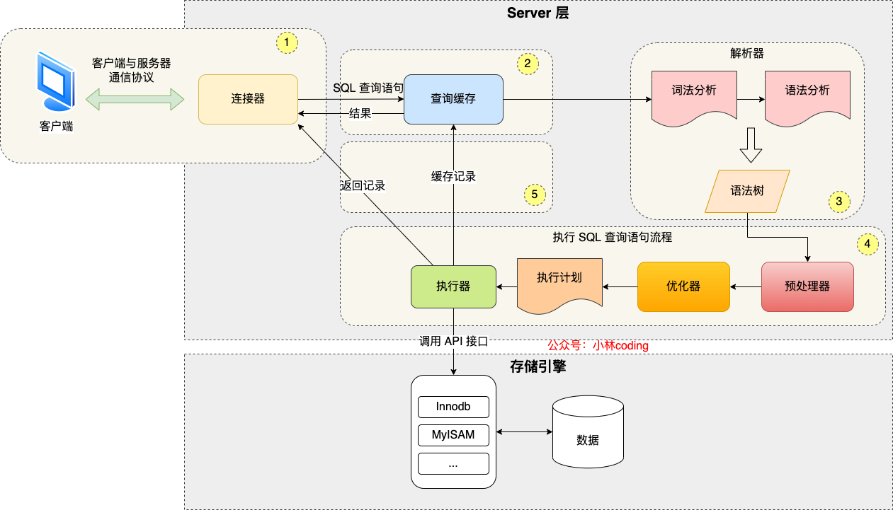
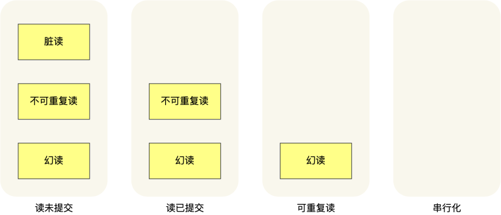
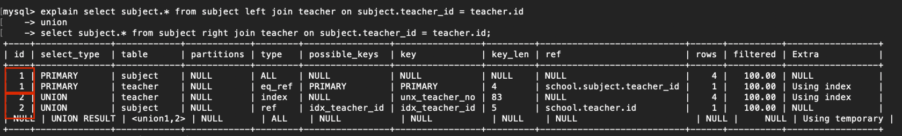

# MYSQL

[TOC]

## 默认端口

MySQL 端口 6000

## 索引

索引是帮助存储系统引擎快速获取数据的一种数据结构，索引是数据的⽬录。

从 MySQL 5.5 开始，**InnoDB** 成为默认的存储引擎。

**InnoDB**主要使用B+Tree索引类型，创建表时，**InnoDB**存储引擎会根据不同的场景选择不同的列作为索引。

- 如果有主键，默认使用**主键**作为聚簇索引的索引键
- 若没有主键，就选择一个==**`不含有NULL值的唯一列`**==作为聚簇索引的索引键
- 若两个都没有，**InnoDB**将会自动生成一个**隐式自增ID列**作为聚簇索引的索引键

其他索引称为辅助索引，或二级索引，非聚簇索引

B+ Tree是一个多叉树，叶子节点才存放数据，非叶子节点只存放索引，且每个节点里的数据都是按主键顺序存放的。每一层父节点的索引值都会出现在下层子节点的索引值中，所以**叶子节点包含所有的索引值信息**，并且**每一个叶子节点都有两个指针**，分别指向下一个叶子节点和上一个叶子节点，形成一个**双向链表**，从而有利于进行范围搜索。


- **覆盖索引**：在数据库中，如果一个查询能够**仅通过索引**中的信息来完成，而不需要访问表中的实际数据行，**即只需要查一个B+Tree就能找到数据联合索引，**那么这个索引就被称为覆盖索引。B+Tree 索引特别适合作为覆盖索引，因为它们可以存储额外的数据，如列值。

- **最左前缀匹配原则**（Leftmost Prefix Rule）
  - 在使用联合索引（即包含多个列的索引）时，查询条件**必须从索引的最左边列开始匹配**，并且按索引中列的顺序连续匹配
  - 如果有一个联合索引 `(idx_col1, col2, col3)`，则以下查询可以利用这个索引：
    - `WHERE col1 = 'value'`
    - `WHERE col1 = 'value' AND col2 = 'another_value'`
    - `WHERE col1 = 'value' AND col2 = 'another_value' AND col3 = 'yet_another_value'`
    - 错误：`WHERE col1 = 'value' AND col3 = 'another_value'`（中间跳过了 `col2`）

## 索引|为什么采用B+树

- **非叶子节点存储索引**：

  B+ 树的非叶子节点不存储实际记录数据，仅保存索引。这使得在相同数据量下，B+ 树的非叶子节点可以存放更多索引，从而降低查询时的 I/O 次数，因为 B+ 树的高度更低（“矮胖”结构）。

- **冗余节点提高效率**：

  B+ 树的所有非叶子节点都是冗余的，这使得插入和删除操作更加高效。例如，删除根节点时，B+ 树不会像 B 树那样经历复杂的结构调整，简化了操作。

- **链表连接的叶子节点**：

  B+ 树的叶子节点通过链表连接，有利于快速执行范围查找。相对而言，B 树进行范围查找需要遍历多个节点，涉及更多的 I/O 操作，效率较低。

## 执行一条`select`语句，会发生什么

**连接器**：跟客户端建立连接、获取权限、维持和管理连接

**查询缓存**：查询预计如果命中查询缓存则直接返回，否则继续往下执行。（MySQL8.0已经删除该模块

**解析SQL**：通过解析器对SQL查询的语句进行词法分析、语法分析，然后构建语法树；

**执行SQL**：三个阶段

- **预处理阶段：**检查表或字段是否存在，将`select *`中的`*`扩展为表上的所有列；
- **优化阶段：**基于查询成本的考虑，选择查询最小的执行计划；
- **执行阶段：**根据执行计划执行SQL查询语句，从存储引擎读取记录，返回给客户端



## 排他锁和共享锁是什么 有什么区别

- **排他锁**

  也叫独占锁、写锁或X锁，锁定的数据只允许进行锁定操作的事务使用，其他事务无法对已锁定的数据进行查询或修改。当我们对数据进行更新的时候，也就是INSERT、DELETE或者UPDATE的时候，数据库也会自动使用排他锁，防止其他事务对数据进行操作

- **共享锁**

  也叫读锁或者S锁，锁定的资源可以被其他用户读取，但不能修改。在进行SELECT的时候，会将对象进行共享锁锁定，当数据读取完毕之后，就会释放共享锁，这样就可以保证数据在读取是不被修改

- **区别**

  排他锁是独占的，一次只能由一个事务持有。它阻止其他事务获取相同资源的任何锁。

  共享锁是非独占的，允许多个事务同时持有相同资源的共享锁。它允许多个事务同时读取相同的数据

  排他锁通常通常用于写操作，例如更新或删除数据；共享锁通常用于读操作，例如查询数据

## 事务|MySQL的事务是什么

在数据库中。事务是一组操作单元，这些操作单元要么全部执行完成，要么全部执行失败。事务是保证数据库一致性的重要机制之一，它可以将一系列的操作看作一个整体，从而保证数据库的完整性和正确性。

## 事务|四大特性

统称为ACID特性

- **原子性（Atomicity）**：确保事务的所有操作要么全部执行成功，要么全部失败回滚，不存在部分成功的状态；

- **一致性（Consistency）**：事务操作前后，数据满足完整性约束，数据库保持一致性状态；

- **隔离性 (Isolation)**：多个事务并发执行时，每个事务应该被隔离开来，一个事务的执行不会影响其他事务的执行；

- **持久性 (Durability)**：事务处理结束后，对数据的修改就是永久的，即便系统故障也不会丢失

## 事务|控制语句

1. **START TRANSACTION**：
   - 这条命令用于显式地开始一个事务。
   - 一旦事务开始，直到提交（`COMMIT`）或回滚（`ROLLBACK`），所有的操作都是暂时的。

2. **COMMIT**：
   - 提交事务，将事务中的所有操作保存到数据库中。
   - 事务提交后，这些操作对其他数据库连接也是可见的。

3. **ROLLBACK**：
   - 通过回滚操作，可以取消事务中的所有更改。
   - 如果在事务过程中发生错误或需要撤销操作，`ROLLBACK`是非常有用的。

此外，MySQL 的 `autocommit` 参数默认是开启的（值为 1），这意味着每条独立的 SQL 语句在执行后会自动提交。要启用显式事务管理，需要关闭 `autocommit` 功能，方式如下：

```sql
SET autocommit = 0;
```

关闭 `autocommit` 后，你需要手动使用 `START TRANSACTION` 开始事务，并使用 `COMMIT` 或 `ROLLBACK` 来结束事务。

## 事务|并行事务会引发什么问题

脏读（dirty read）、不可重复读（non-repeatable read）、幻读（phantom read）

**脏读：**如果一个事务**`读到`**了**`另一个未提交事务修改后的数据`**

**不可重复读：**在一个事务内多次读取同一个数据，出现**`前后两次读到的数据不一样的`**情况

**幻读：**在一个事务内多次查询某个符合查询条件的记录数量，如果出现**`前后两次数量不一样`**的情况

## 事务|隔离级别

- **读未提交：**一个事务还没提交时，他做的变更会被其他事务看见

- **读提交：**一个事务提交之后，他做的变更才能被其他事务看见

- **可重读读：**一个事务执行过程中看到的数据，一直和事务启动时看到的数据是一致的。**`MySQL InnoDB默认隔离级别`**

  - **开销较小**：串行化是最严格的隔离级别，需要对所有事务进行严格的顺序控制，这通常需要更多的锁和更高的资源开销。可重复读虽然也需要一些锁机制，但相对较轻量，性能开销更小。

  - **并发性高**：可重复读允许多个事务并行执行，从而提高了系统的吞吐量。串行化则可能导致事务被强制串行化，降低并发性和整体性能。

  - **可重复读**：保证在一个事务中多次读取相同的数据时，结果是一样的。这对于许多业务场景已经足够保证数据一致性，避免了“不可重复读”的问题。

  - **串行化**：串行化由于其严格的顺序性，容易导致死锁和资源竞争问题。

- **串行化：**对记录加上**读写锁**，多事务对同一记录读写操作发生冲突，需要等待前一个事务结束。

  > **读写锁**：允许多个线程**共同读资源**，只允许**一个线程写操作**。分为读(共享)和写(排他)两种状态



## 事务|「读提交」和「可重复读」隔离级别的实现

Read View 来实现的，它们的区别在于创建 Read View 的时机不同，大家可以把 Read View 理解成一个数据快照，就像相机拍照那样，定格某一时刻的风景。

「读提交」隔离级别是在「每个语句执行前」都会重新生成一个 Read View

**「可重复读」隔离级别** 

1. **Read View**

- **创建时机**：在「启动事务时」创建一个 **Read View**，它记录了当前已提交事务的状态和版本信息。
- **快照管理**：Read View 提供一个快照，使得事务在整个生命周期内都能访问在事务开始时已提交的数据版本。

2. **多版本并发控制（MVCC）**

- **数据版本管理**：每次对数据的修改不会覆盖旧版本，而是创建一个新的数据版本，并将旧版本保留。
- **版本链**：每个数据项维护一个版本链，记录所有历史版本。新版本指向旧版本，从而形成链条。
- **Undo Log**：用于存储旧版本数据，以便在事务回滚时恢复。

## 数据库三大范式

**第一范式（1NF）：**用来确保原子性，要求数据库表的每一列都是不可分割的原子数据项。**解决**：解决数据冗余和重复数据的问题

**第二范式（2NF）：**在1NF的基础上，非码属性必须完全依赖于候选码（在1NF基础上 **解决：消除非主属性对主码的部分函数依赖** ）；确保数据中的每一列都和主键相关，而不能只与主键的某一部分相关；

**第三范式（3NF）**：在2NF基础上，**任何非主属性 (opens new window)不依赖于其它非主属性**（在2NF基础上 **解决消除传递依赖** ） 第三范式需要确保数据表中的每一列数据都和主键直接相关，而不能间接相关。

[数据库三大范式是什么](https://xiaolincoding.com/interview/mysql.html#%E6%95%B0%E6%8D%AE%E5%BA%93%E4%B8%89%E5%A4%A7%E8%8C%83%E5%BC%8F%E6%98%AF%E4%BB%80%E4%B9%88)

## 数据库表优化

1. **使用合理的数据库分表**：考虑拆分子表，更好管理
2. **建立索引**：在经常被查询的列上建⽴索引，提⾼查询性能。但是也要注意过多的索引影响插入、更新和删除的性能。
3. **避免使用`SELECT *`**
4. **选择合适的数据类型**
   - 尽量使⽤TINYINT，SMALLINT，MEDIUM_INT替代INT类型，如果是⾮负则加上UNSIGNED 
   - VARCHAR 的长度只分配真正需要的空间
   - 尽量使用整数或者枚举替代字符串类型
   - 单表不要放太多字段 
   - 尽量少使用NULL，很难查询优化而且占用额外索引空间 

## 什么是慢查询 原因和优化

数据库查询的执行时间超过指定的超市时间（long_query_time 默认10s），就成为慢查询

## EXPLAIN

可以使用 `EXPLAIN` 命令来分析 SQL 的 **执行计划** ，这样就知道语句是否命中索引了。执行计划是指一条 SQL 语句在经过 MySQL 查询优化器的优化会后，具体的执行方式。

`EXPLAIN` 并不会真的去执行相关的语句，而是通过 **查询优化器** 对语句进行分析，找出最优的查询方案，并显示对应的信息。

```mysql
EXPLAIN SELECT * FROM [table_name] WHERE [condition];
EXPLAIN SELECT id, name FROM students WHERE age > 20;
```



## Buffer Pool

MySQL 的数据是存储在磁盘里的，但是也不能每次都从磁盘里面读取数据。Innodb 存储引擎设计了一个**缓冲池（Buffer Pool）**

## MySQL的buffer pool怎么清除

```mysql
FLUSH BUFFER POOL
```

清空所有的缓存页，使得MySQL需要重新从磁盘读取磁盘中的数据，下一次查询速度自然会变慢。

## 了解MongoDB嘛，它和MySQL有哪些区别

MongoDB 更适合处理灵活的、非结构化或半结构化的数据，且需要横向扩展，适用于快速开发和大规模、分布式应用场景。

MySQL 更适合处理有明确关系结构、需要高事务性和数据一致性的场景。

1. **数据模型**

   - **MongoDB**：MongoDB 是一种**NoSQL**（非关系型）数据库，使用**文档模型**存储数据。它的文档使用 BSON（类似于 JSON）格式，灵活性高，支持嵌套结构。
     - 例子：一个用户文档可能长这样：
       ```json
       {
         "_id": "1",
         "name": "Alice",
         "age": 30,
         "address": {
           "city": "New York",
           "street": "5th Avenue"
         }
       }
       ```
   - **MySQL**：MySQL 是一种**关系型数据库**（RDBMS），使用表结构存储数据。数据以行和列的方式存储，具有固定的模式（schema）。
     - 例子：一个用户表的行可能长这样：
       ```sql
       id | name  | age | city      | street
       1  | Alice | 30  | New York  | 5th Avenue
       ```

2. **模式（Schema）**

   - **MongoDB**：模式是动态的、灵活的，数据的结构可以不固定，允许不同文档之间有不同的字段。
   - **MySQL**：使用**固定的表结构**，必须事先定义好模式（schema）。更改表结构需要修改数据库模式，通常会涉及更复杂的操作。

3. **查询语言**

   - **MongoDB**：使用**MongoDB 查询语言**（MQL），基于 JSON 风格的查询方式。
     
     ```js
     // 查找 `age` 为 30 的用户
     db.users.find({ age: 30 })
     ```
   - **MySQL**：使用**SQL**（结构化查询语言），基于表和行的查询方式。
     
     ```sql
     SELECT * FROM users WHERE age = 30;
     ```

4. **事务支持**

- **MongoDB**：自 4.0 版本开始，MongoDB 开始支持多文档事务，允许在多个文档上执行原子性操作。但它的事务处理机制相对较新，可能不如 MySQL 成熟。
- **MySQL**：原生支持事务，具有多年的成熟度，特别适合复杂的事务处理场景。

5. **使用场景**

   - **MongoDB**：适合处理**非结构化数据**或**半结构化数据**，如日志、实时分析、内容管理、物联网等。数据模型更加灵活，支持快速迭代开发。
   - **MySQL**：更适合**结构化数据**，如银行系统、电子商务平台等需要复杂事务和一致性的应用场景。

6. **数据一致性**

   - **MongoDB**：默认提供最终一致性，适合高可用的分布式系统。但也支持强一致性，可以配置写入规则以确保数据的实时性。
   - **MySQL**：默认提供强一致性，确保在事务提交后数据的一致性。特别适合金融、银行等高安全性要求的场景。


