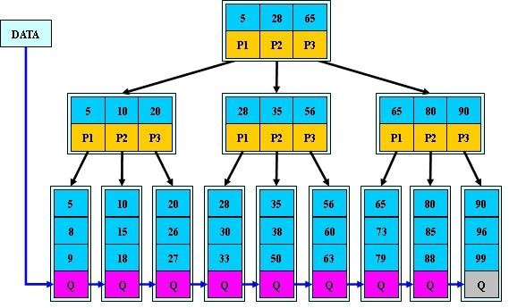

# MYSQL

[TOC]


## 默认端口

MySQL 端口 6000

## MYSQL索引

索引是帮助存储系统引擎快速获取数据的一种数据结构，索引是数据的⽬录。

从 MySQL 5.5 开始，**InnoDB** 成为默认的存储引擎。

**InnoDB**主要使用B+Tree索引类型，创建表时，**InnoDB**存储引擎会根据不同的场景选择不同的列作为索引。

- 如果有主键，默认使用**主键**作为聚簇索引的索引键
- 若没有主键，就选择一个==**`不含有NULL值的唯一列`**==作为聚簇索引的索引键
- 若两个都没有，**InnoDB**将会自动生成一个**隐式自增ID列**作为聚簇索引的索引键

其他索引称为辅助索引，或二级索引，非聚簇索引

B+ Tree是一个多叉树，叶子节点才存放数据，非叶子节点只存放索引，且每个节点里的数据都是按主键顺序存放的。每一层父节点的索引值都会出现在下层子节点的索引值中，所以**叶子节点包含所有的索引值信息**，并且**每一个叶子节点都有两个指针**，分别指向下一个叶子节点和上一个叶子节点，形成一个**双向链表**，从而有利于进行范围搜索。



- **覆盖索引**：在数据库中，如果一个查询能够**仅通过索引**中的信息来完成，而不需要访问表中的实际数据行，**即只需要查一个B+Tree就能找到数据联合索引，**那么这个索引就被称为覆盖索引。B+Tree 索引特别适合作为覆盖索引，因为它们可以存储额外的数据，如列值。

- **最左前缀匹配原则**（Leftmost Prefix Rule）
  - 在使用联合索引（即包含多个列的索引）时，查询条件**必须从索引的最左边列开始匹配**，并且按索引中列的顺序连续匹配
  - 如果有一个联合索引 `(idx_col1, col2, col3)`，则以下查询可以利用这个索引：
    - `WHERE col1 = 'value'`
    - `WHERE col1 = 'value' AND col2 = 'another_value'`
    - `WHERE col1 = 'value' AND col2 = 'another_value' AND col3 = 'yet_another_value'`
    - 错误：`WHERE col1 = 'value' AND col3 = 'another_value'`（中间跳过了 `col2`）

## 执行一条`select`语句，会发生什么

**连接器**：跟客户端建立连接、获取权限、维持和管理连接

**查询缓存**：查询预计如果命中查询缓存则直接返回，否则继续往下执行。（MySQL8.0已经删除该模块

**解析SQL**：通过解析器对SQL查询的语句进行词法分析、语法分析，然后构建语法树；

**执行SQL**：三个阶段

- **预处理阶段：**检查表或字段是否存在，将`select *`中的`*`扩展为表上的所有列；
- **优化阶段：**基于查询成本的考虑，选择查询最小的执行计划；
- **执行阶段：**根据执行计划执行SQL查询语句，从存储引擎读取记录，返回给客户端


## 排他锁和共享锁是什么 有什么区别

- **排他锁**

  也叫独占锁、写锁或X锁，锁定的数据只允许进行锁定操作的事务使用，其他事务无法对已锁定的数据进行查询或修改。当我们对数据进行更新的时候，也就是INSERT、DELETE或者UPDATE的时候，数据库也会自动使用排他锁，防止其他事务对数据进行操作

- **共享锁**

  也叫读锁或者S锁，锁定的资源可以被其他用户读取，但不能修改。在进行SELECT的时候，会将对象进行共享锁锁定，当数据读取完毕之后，就会释放共享锁，这样就可以保证数据在读取是不被修改

- **区别**

  排他锁是独占的，一次只能由一个事务持有。它阻止其他事务获取相同资源的任何锁。

  共享锁是非独占的，允许多个事务同时持有相同资源的共享锁。它允许多个事务同时读取相同的数据

  排他锁通常通常用于写操作，例如更新或删除数据；共享锁通常用于读操作，例如查询数据

## MySQL的事务是什么

在数据库中。事务是一组操作单元，这些操作单元要么全部执行完成，要么全部执行失败。事务是保证数据库一致性的重要机制之一，它可以将一系列的操作看作一个整体，从而保证数据库的完整性和正确性。

## 事务|四大特性

统称为ACID特性

- **原子性（Atomicity）**：确保事务的所有操作要么全部执行成功，要么全部失败回滚，不存在部分成功的状态；

- **一致性（Consistency）**：事务操作前后，数据满足完整性约束，数据库保持一致性状态；

- **隔离性(Isolation)**：多个事务并发执行时，每个事务应该被隔离开来，一个事务的执行不会影响其他事务的执行；

- **持久性(Durability)**：事务处理结束后，对数据的修改就是永久的，即便系统故障也不会丢失

## 事务|并行事务会引发什么问题

脏读（dirty read）、不可重复读（non-repeatable read）、幻读（phantom read）

**脏读：**如果一个事务**`读到`**了**`另一个未提交事务修改后的数据`**

**不可重复读：**在一个事务内多次读取同一个数据，出现**`前后两次读到的数据不一样的`**情况

**幻读：**在一个事务内多次查询某个符合查询条件的记录数量，如果出现**`前后两次数量不一样`**的情况

## 事务|隔离级别

- **读未提交：**一个事务还没提交时，他做的变更会被其他事务看见
- **读提交：**一个事务提交之后，他做的变更才能被其他事务看见
- **可重读读：**一个事务执行过程中看到的数据，一直和事务启动时看到的数据是一致的。**`MySQL InnoDB默认隔离级别`**
- **串行化：**对记录加上读写锁，多事务对同一记录读写操作发生冲突，需要等待前一个事务结束。


## 数据库三大范式

**第一范式（1NF）：**用来确保原子性，要求数据库表的每一列都是不可分割的原子数据项。

**第二范式（2NF）：**在1NF的基础上，非码属性必须完全依赖于候选码（在1NF基础上消除非主属性对主码的部分函数依赖）；确保数据中的每一列都和主键相关，而不能只与主键的某一部分相关；

**第三范式（3NF）**：在2NF基础上，任何非主属性 (opens new window)不依赖于其它非主属性（在2NF基础上消除传递依赖） 第三范式需要确保数据表中的每一列数据都和主键直接相关，而不能间接相关。

[数据库三大范式是什么](https://xiaolincoding.com/interview/mysql.html#%E6%95%B0%E6%8D%AE%E5%BA%93%E4%B8%89%E5%A4%A7%E8%8C%83%E5%BC%8F%E6%98%AF%E4%BB%80%E4%B9%88)

## 数据库表优化

1. **使用合理的数据库分表**：考虑拆分子表，更好管理
2. **建立索引**：在经常被查询的列上建⽴索引，提⾼查询性能。但是也要注意过多的索引影响插入、更新和删除的性能。
3. **避免使用`SELECT *`**
4. **选择合适的数据类型**
   - 尽量使⽤TINYINT，SMALLINT，MEDIUM_INT替代INT类型，如果是⾮负则加上UNSIGNED 
   - VARCHAR 的长度只分配真正需要的空间
   - 尽量使用整数或者枚举替代字符串类型
   - 单表不要放太多字段 
   - 尽量少使用NULL，很难查询优化而且占用额外索引空间 

## 什么是慢查询 原因和优化

数据库查询的执行时间超过指定的超市时间（long_query_time 默认10s），就成为慢查询

## EXPLAIN

```mysql
EXPLAIN SELECT * FROM [table_name] WHERE [condition];
EXPLAIN SELECT id, name FROM students WHERE age > 20;
```


## Buffer Pool

MySQL 的数据是存储在磁盘里的，但是也不能每次都从磁盘里面读取数据。Innodb 存储引擎设计了一个**缓冲池（Buffer Pool）**

## MySQL的buffer pool怎么清除

```mysql
FLUSH BUFFER POOL
```

清空所有的缓存页，使得MySQL需要重新从磁盘读取磁盘中的数据，下一次查询速度自然会变慢。

## 了解MongoDB嘛，它和MySQL有哪些区别  

