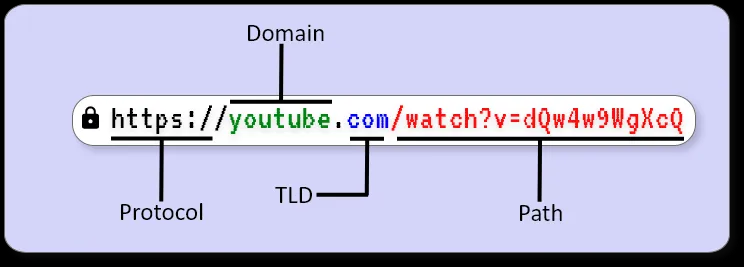

[TOC]


URL编码（也称为百分号编码）是一种在URL（统一资源定位符）中表示特殊字符的方式，以确保这些字符在互联网上传输时不会被误解或丢失。它的主要目的是使数据在URL中安全地传输。

## 为什么需要URL编码？

URL只能使用有限的字符集。根据URL标准（[RFC 3986](https://tools.ietf.org/html/rfc3986)），某些字符具有特殊含义，例如：

- **字母和数字**：A-Z、a-z、0-9
- **保留字符**：如 `:`, `/`, `?`, `#`, `[`, `]`, `@`, `!`, `$`, `&`, `'`, `(`, `)`, `*`, `+`, `,`, `;`, `=`
- **未保留字符**：如 `-`, `.`, `_`, `~`

这些保留字符在URL中有特定用途，比如`?`用于分隔查询字符串，`&`用于分隔多个查询参数等。因此，其他字符（特别是空格、非ASCII字符、以及保留字符）需要进行编码，以确保它们不被解释为URL语法的一部分。

### 使用URL编码的场景

1. **查询字符串**：当需要传递空格、等号、以及特殊字符时（如搜索引擎的查询参数）。
2. **表单提交**：在浏览器中提交表单时，浏览器会自动对数据进行URL编码。
3. **API 请求**：当通过URL传递数据到服务器时，需要确保数据已被正确编码。

## URL编码的工作原理

URL编码通过将非安全字符替换为 `%` 后跟它们的ASCII十六进制表示。例如：

- 空格字符 ` ` 编码为 `%20`
- `=` 编码为 `%3D`
- `&` 编码为 `%26`
- `/` 编码为 `%2F`

### 常见字符编码示例

| 字符 | URL 编码 | 十六进制 |
| ---- | -------- | -------- |
| 空格 | `%20`    | `0x20`   |
| `!`  | `%21`    | `0x21`   |
| `#`  | `%23`    | `0x23`   |
| `$`  | `%24`    | `0x24`   |
| `%`  | `%25`    | `0x25`   |
| `&`  | `%26`    | `0x26`   |
| `'`  | `%27`    | `0x27`   |
| `(`  | `%28`    | `0x28`   |
| `)`  | `%29`    | `0x29`   |
| `*`  | `%2A`    | `0x2A`   |
| `+`  | `%2B`    | `0x2B`   |
| `,`  | `%2C`    | `0x2C`   |
| `/`  | `%2F`    | `0x2F`   |
| `:`  | `%3A`    | `0x3A`   |
| `;`  | `%3B`    | `0x3B`   |
| `=`  | `%3D`    | `0x3D`   |
| `?`  | `%3F`    | `0x3F`   |
| `@`  | `%40`    | `0x40`   |
| `[`  | `%5B`    | `0x5B`   |
| `]`  | `%5D`    | `0x5D`   |

## 如何进行URL编码

在大多数编程语言中，都有内置函数来处理URL编码。例如：

- **JavaScript**：`encodeURIComponent()` 和 `encodeURI()`
  
  ```javascript
  const url = "https://example.com/search?q=hello world";
  const encodedURL = encodeURIComponent(url);
  console.log(encodedURL);  // "https%3A%2F%2Fexample.com%2Fsearch%3Fq%3Dhello%20world"
  ```

- **Python**：使用 `urllib.parse` 模块

  ```python
  import urllib.parse
  
  url = "https://example.com/search?q=hello world"
  encoded_url = urllib.parse.quote(url)
  print(encoded_url)  # "https%3A//example.com/search%3Fq%3Dhello%20world"
  ```

## 如何进行URL解码

1. JavaScript：

   - `decodeURIComponent()`：用于解码由 `encodeURIComponent()` 编码的字符串。
   - `decodeURI()`：用于解码由 `encodeURI()` 编码的字符串。

   ```javascript
   const encodedURL = "https%3A%2F%2Fexample.com%2Fsearch%3Fq%3Dhello%20world";
   const decodedURL = decodeURIComponent(encodedURL);
   console.log(decodedURL);  // "https://example.com/search?q=hello world"
   ```

2. Python：

   - `urllib.parse.unquote()`：用于解码由 `urllib.parse.quote()` 编码的字符串。

   ```python
   import urllib.parse
   
   encoded_url = "https%3A//example.com/search%3Fq%3Dhello%20world"
   decoded_url = urllib.parse.unquote(encoded_url)
   print(decoded_url)  # "https://example.com/search?q=hello world"
   ```

## C++ 使用 第三方库解析URL编码

在C++中，进行URL编码（将字符转换为URL合法的格式）和解码（将URL格式转换回原文本）通常需要手动替换特定的字符，因为标准的C++库并没有直接提供URL编解码的功能。但是可以使用成熟的第三方库，如 `Boost` 或 `libcurl`，这些库提供了更全面和健壮的URL处理功能

```c++
#include <boost/algorithm/string/replace.hpp>
#include <boost/algorithm/string/case_conv.hpp>
#include <boost/uri/uri.hpp>
#include <iostream>
#include <string>

std::string urlEncode(const std::string &value) {
    boost::uri::uri uri;
    boost::uri::encode(value, uri);
    return uri.string();
}

std::string urlDecode(const std::string &value) {
    boost::uri::uri uri;
    boost::uri::decode(value, uri);
    return uri.string();
}

int main() {
    std::string url = "https://example.com/search?query=C++";
    std::string encodedUrl = urlEncode(url);
    std::string decodedUrl = urlDecode(encodedUrl);
    std::cout << "Encoded URL: " << encodedUrl << std::endl;
    std::cout << "Decoded URL: " << decodedUrl << std::endl;
    return 0;
}
```

### 总结

URL编码是确保数据在URL中传输时不会被误解的关键步骤。它通过将特殊字符和非ASCII字符转换为百分比编码格式，确保数据能够在Web环境中安全传输。URL编码是Web开发、数据传输和API集成中不可或缺的一部分。


