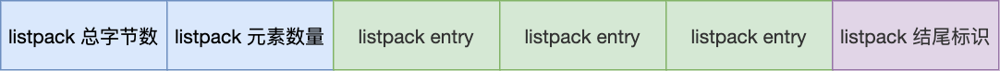

# Redis

[TOC]

## 什么是Redis, 具有哪些特点

Redis是一个基于内存的数据库，读写速度非常快，通常被用作缓存、消息队列、分布式锁和键值存储数据库。

它支持多种数据结构，如字符串、哈希表、列表、集合、有序列表等

Redis还提供了分布式特性，可以将数据分布在多个节点上，以提高可扩展性和可用性。

### 在应用中的使用

1. 用作缓存层，存储频繁访问的数据，提高访问速度；

2. 用作消息队列，通过发布订阅模式传递消息；

3. 存储会话数据、计数器等 

## Redis 与 Memcached 有什么区别

**共同点**

1. 都是基于内存的数据库，一般都用来做缓存使用
2. 都有过期策略
3. 两者的性能都非常高

**区别**

- Redis 支持的数据类型更为丰富，Memcached只支持简单key-value数据类型；
- Redis 支持数据的持久化，可以将内存数据保持在磁盘中，重启再次载入可用；Memcached则没有；
- Redis 支持原生集群模式，Memcached则没有，需要依靠客户端来实现集群中的分片写入数据
- Redis 支持发布订阅模型、Lua脚本、事务等功能，Memcached不支持

## 数据结构|使用场景

| 结构类型     | 结构存储的值                               | 结构读写能力                                                 | 应用场景                                                     |
| ------------ | ------------------------------------------ | ------------------------------------------------------------ | ------------------------------------------------------------ |
| String字符串 | 可以是字符串、整数或浮点数                 | 对整个字符串或字符串中的一部分进行操作；对整数或浮点数进行自增或自减操作 | 缓存对象、常规计数、分布式锁、共享session信息                |
| List列表     | 一个链表，链表上的每个节点都包含一个字符串 | 对链表两端进行push和pop操作，读取单个或多个元素；根据值查找和删除元素 | 消息队列（两个问题：1. 生产者需要自行实现全局唯⼀ID； 2.不能以消费组形式消费数据） |
| Set集合      | 包含字符串的无序集合                       | 字符串的集合，方法：查找、是否存在、添加、删除；还包括**聚合计算** | 聚合计算（并集、交集、差集），例如点赞、共同关注、抽奖活动   |
| Hash散列     | 包含键值对的无序散列表                     | 添加、获取、删除单个元素                                     | 缓存对象、购物车                                             |
| Zset有序集合 | 和散列一样，用于存储键值对                 | 字符串成员与浮点数分数之间的有序映射；元素的排列顺序由分数大小决定；方法：添加、获取、删除单个元素以及 **范围或成员获取元素** | 排序场景，例如排行榜                                         |

Redis版本更新，又增加了几种数据类型：

- BitMap：存储位的数据结构，可以用于处理⼀些位运算操作；例如签到、判断用户登陆状态
- HyperLogLog：海量数据基数统计；例如百万级网页 UV 计数等
- GEO：存储地理位置信息的数据结构
- Stream：专门为消息队列设计的数据类型，解决了List列表两个问题

## 数据结构|类型内部实现

- **String**

  String 类型的底层的数据结构实现主要是 SDS（简单动态字符串）实现

  **SDS 相比于 C 的原生字符串，增加了三个元数据：len、alloc、flags**

  - SDS 的 buf[] 字符数组，不仅可以保存文本数据，还可以保存二进制数据。

  - SDS 使用 len 属性的值而不是空字符来判断字符串是否结束，因此它也保存这长度信息

  - SDS 获取字符串长度的时间复杂度是 O(1)，c是O(n)

  - SDS 拼接字符串不会造成缓冲区溢出，支持动态扩展。`alloc - len` 计算剩余空间

****

- **List**

  List 类型的底层数据结构是由**~~双向链表或压缩列表~~**->==quicklist==

  - 如果列表的**元素个数**小于 512 个（默认值，可由 list-max-ziplist-entries 配置），**所有值**小于 64 字节（默认值，可由 list-max-ziplist-value 配置），使用**压缩列表**作为 List 类型的底层数据结构；

  - 如果列表的元素不满足上面的条件，使用**双向链表**作为 List 类型的底层数据结构；

  - **Redis 3.2 版本之后，List 数据类型底层数据结构就==只由== quicklist 实现了**

- **Hash**

  Hash 类型的底层数据结构是由**~~压缩列表~~或哈希表**->==listpack==

  - 如果哈希类型**元素个数**小于 512 个（默认值，可由 hash-max-ziplist-entries 配置），**所有值**小于 64 字节（默认值，可由 hash-max-ziplist-value 配置）的话，使用**压缩列表**作为 Hash 类型的底层数据结构；

  - 如果哈希类型元素不满足上面条件，使用**哈希表**作为 Hash 类型的底层数据结构。

  - **Redis 7.0 中，压缩列表交由 listpack 数据结构来实现了**。

- **Set**

  Set 类型的底层数据结构是由**哈希表或整数集合**实现

  - 如果集合中的元素**都是整数且元素个数**小于 512 （默认值，set-maxintset-entries配置）个，使用**整数集合**作为 Set 类型的底层数据结构；

  - 如果集合中的元素不满足上面条件，则 Redis 使用**哈希表**作为 Set 类型的底层数据结构。

- ZSet

  Zset 类型的底层数据结构是由**~~压缩列表~~或跳表**->**==listpack==** 

  - 如果有序集合的**元素个数小于 128 个**，**所有值**小于 64 字节时，使用**压缩列表**作为 Zset 类型的底层数据结构

  - 如果有序集合的元素不满足上面的条件，使用**跳表**作为 Zset 类型的底层数据结构

  - **Redis 7.0 中，压缩列表交由 listpack 数据结构来实现了**

## 数据结构|压缩列表 跳表 quicklist listpack

### 压缩列表

**由连续内存块组成的顺序型数据结构**，有点类似于数组

在压缩列表中，如果我们要查找定位第一个元素和最后一个元素，可以通过表头三个字段（zllen）的长度直接定位，复杂度是 O(1)。而**查找其他元素时，就没有这么高效了，只能逐个查找，此时的复杂度就是 O(N) 了，因此压缩列表不适合保存过多的元素**。

**缺点：**

- 如果保存的元素数量增加了，或是元素变⼤了，会导致**内存重新分配**，会有**==连锁更新==**的问题，**直接影响到压缩列表的访问性能**。  
- **压缩列表只会用于保存的节点数量不多的场景**

### 跳表

跳表是⼀种在链表基础上改进过来的，实现了⼀种==「多层」的有序链表==，当数据量很⼤时，跳表的查找复杂度就是O(logN)。用于实现有序集合（Sorted Set）。

### 为什么只用跳表而不是红黑树

- 内存占用：插入和删除操作上的性能表现好，**跳表比平衡树更灵活一些**。
- 范围查找：跳表天然⽀持按范围查找，**跳表比平衡树操作要简单**
- 算法实现：**跳表比平衡树简单多**

### listpack

没有压缩列表中记录前⼀个节点长度的字段， listpack 只记录当前节点的长度。

当我们向 listpack 加入⼀个新元素的时候，不会影响其他节点的长度字段的变化，避免了**压缩列表的连锁更新**问题。  

### quicklist

**双向链表 + 压缩列表组合，** quicklist 就是⼀个链表，而链表中的每个元素又是⼀个压缩列表。 

quicklist 解决办法：通过控制每个链表节点中的压缩列表的大小或者元素个数，来规避连锁更新的问题。因为压缩列表元素越少或越小，连锁更新带来的影响就越小，从而提供了更好的访问性能  

## 线程模型|Redis 采用单线程那么快

- Redis 的大部分操作都在内存中完成，并且采用了高效的数据结构，因此Redis瓶颈可能是机器的内存和网络宽带，而非CPU。CPU不再是瓶颈，这也是为什么采用单线程解决方案的原因；
- Redis 采用单线程的模型可以避免多线程之间的竞争，省去了多线程切换在时间和性能开销，同时不会产生死锁；
- Redis 采用IO多路复用机制处理大量客户端的Socket请求。

## Redis持久化|持久化机制

- **`AOF日志`**：每执行一条写操作，就把该命令以追加的方式写入到一个文件里；

  1. **`先执行写操作命令后，才将该命令记录到 AOF 日志`**

  - **避免额外的检查开销**：如果先将写操作命令记录到 AOF 日志里，当前的命令语法有问题，不进行命令 **语法检查** ，错误的命令记录也会被记录，使用日志恢复数据时就可能会出错。
  - **不会阻塞当前写操作命令的执行**：因为当写操作命令执行成功后，才会将命令记录到 AOF 日志。

    当然，这样做也会带来 **风险** ：

  - **数据可能会丢失：** 执行写操作命令和记录日志是两个过程，那当 Redis 在还没来得及将命令写入到硬盘时，服务器发生宕机了，这个数据就会有丢失的风险。

  - **可能阻塞其他操作：** 因为 AOF 日志也是在主线程中执行，所以当 Redis **把日志文件写入磁盘的时候**，还是会阻塞后续的操作无法执行。

  2. **3 种写回硬盘的策略**

     

  3. 避免 AOF 文件越写越大，提供了 **AOF 重写机制**

  [AOF-日志是如何实现的](https://xiaolincoding.com/redis/base/redis_interview.html#aof-%E6%97%A5%E5%BF%97%E6%98%AF%E5%A6%82%E4%BD%95%E5%AE%9E%E7%8E%B0%E7%9A%84)

- **RDB快照：**将某一时刻的内存数据，以二进制的方式写入磁盘

  执行 bgsave 过程中，Redis 依然**可以继续处理操作命令**的，也就是数据是能被修改的，关键的技术就在于**写时复制技术（Copy-On-Write, COW）。**

  执行 bgsave 命令的时候，会通过 fork() 创建子进程，此时子进程和父进程是共享同一片内存数据的，因为创建子进程的时候，会复制父进程的页表

- **混合持久化：**Redis 4.0新增的方式，集成了AOF和RDB的优点

**总结**

AOF日志 **减低了大量数据丢失的风险**，但是因为记录的是操作命令，不是实际的数据，所以用 AOF 方法做故障恢复时，需要全量把日志都执行一遍，一旦 AOF 日志非常多，势必会造成 Redis 的恢复操作缓慢。

**RDB 优点是数据恢复速度快**，但是快照的**频率不好把握**。频率太低，丢失的数据就会比较多，频率太高，就会影响性能。

混合持久化，AOF 文件的 **前半部分是 RDB 格式的全量数据，后半部分是 AOF 格式的增量数据** 。优点：以上两个；缺点：兼容性差

## Redis持久化|AOF写回策略

| 写回策略 | 写回时机           | 优点                             | 缺点                               |
| -------- | ------------------ | -------------------------------- | ---------------------------------- |
| Always   | 同步写回           | 可靠性高，最大程度保证数据不丢失 | 每个写命令都要写回硬盘，性能开销大 |
| Everysec | 每秒写回           | 性能适中                         | 宕机时会丢失1s内的数据             |
| No       | 由操作系统控制写回 | 性能好                           | 宕机时丢失的数据可能会很多         |

- Redis 为了避免 AOF 文件越写越大，提供了 **AOF 重写机制**
- 使用重写机制后，就会读取**最新的 key-value（键值对）**，然后用一条命令记录到新的 AOF 文件
- 重写 AOF 过程是由后台子进程 *==bgrewriteaof==* 来完成的

## Redis集群|Redis 如何实现服务高可用

### 主从复制

- 将一个Redis实例的数据复制到其他实例，其中一个是主节点，其余是从节点。

- **主节点将==写操作传播==到所有从节点：**主服务器可以进行读写操作，当发生写操作时自动将写操作同步给从服务器，而从服务器一般是只读，并接受主服务器同步过来写操作命令，然后执行这条命令。

- **主从数据不会时时刻刻保持一致**：主服务器并不会等到从服务器实际执行完命令后，再把结果返回，而是本地执行完命令后，就会向客户端返回。这导致无法实现强一致性保证，==**数据不一致**==是难以避免的。

### 哨兵模式

- 监控 Redis 实例的状态，发现主节点的故障并自动进行故障转移 。
- **监控：**监控 Redis 主服务器和从服务器状态，包括连接状态、是否能执行命令、是否持久化；
- **故障转移**：当 Sentinel (哨兵)发现主服务器宕机，他会通过一定的选举机制选择一个从服务器升级为新的主服务器，然后通知其他从服务器切换到新主服务器。

### 切片集群(Redis Cluster)

- 将数据分布在不同的服务器上，以此来降低系统对单主节点的依赖

采用哈希槽（Hash Slot），来处理数据和节点之间的映射关系,**一个切片集群共有 16384 个哈希槽**;

- 根据键值对的 key，按照 CRC16 算法得到16bit值
- 再用 16bit 值对 16384 取模，得到 0~16383 范围内的模数，每个模数代表一个相应编号的哈希槽

哈希槽怎么被映射到具体的 Redis 节点

- 平均分配：9个节点，每个节点槽为；手动分配：需要把 16384 个槽都分配完，否则 Redis 集群无法正常工作

- **优点：**
  1. 无中心架构：Redis Cluster采用P2P模式，完全去中心化，所有的Redis节点彼此互联，内部使用二进制协议优化传输速度和带宽
  1. 数据分片：数据按照slot存储分布在多个节点，节点间数据共享，可动态调整数据分布
  1. 可扩展性：可线性扩展到1000多个节点，节点可动态添加或删除
  1. **高可用性**：部分节点不可用时，集群仍可用

- **缺点：**集群同步问题、部署和维护较复杂

## Redis集群|哨兵工作原理

1. 判断节点是否存活

   每个Sentinel定期向Redis集群所有节点发送PING命令。如果哨兵连续一定次数未收到服务器的响应，则认为**==故障节点主观下线==；**

   被一个Sentinel节点记为主观下线时，并不意味着该节点肯定故障了，还需要Sentinel**集群**的其他Sentinel节**点共同判断**为主观下线才行；

   Sentinel集群中超过quorum数量的Sentinel节点认为该redis节点主观下线，则该redis**==故障节点客观下线==。**

   

2. 选取新主节点Leader

   当发现主服务器下线后，哨兵会协调选举出一个新的主服务器。在这过程中，哨兵会考虑每个可用的从服务器，选择一个作为新的主服务器

   具体过程

   - **选择候选服务器：**哨兵会从可用的从服务器中选择⼀组==**候选服务器**==，通常选择**复制偏移量（replication offset）最大的从服务器**。  
   - **计算投票：**==**每个哨兵为每个候选从服务器投票**==。投票的考量因素包括从服务器的复制偏移量、连接质量、优先级等；
   - **达成共识**

3. 更新配置信息，通知客户端

   ⼀旦新的主服务器被选出，哨兵会更新 Redis 集群的配置信息，包括将 ==**新的主服务器的地址和端口**== 通知给 其他哨兵和客户端。  

   告知客户端新的主服务器的位置，以便客户端重新连接

## Redis缓存|缓存雪崩

**==大量缓存数据在同一时间过期（失效）==**时，如果此时有==**大量的用户请求，都无法在 Redis 中处理**==，于是全部请求都==**直接访问数据库**==，从而导致数据库的压力骤增，严重的会造成数据库宕机，从而形成一系列连锁反应，造成整个系统崩溃，这就是**缓存雪崩**

- **解决方案**

  1. 大量缓存数据同时过期
     - 均匀设置过期时间，将缓存失效时间随机打散
     - 互斥锁：如果发现访问数据不在Redis内，加互斥锁，保证同一时间只有一个请求构建缓存
     - 后台更新缓存：让缓存永久有效，更新缓存交由后台线程定时更新

  2. Redis 故障宕机

  - 服务熔断或请求限流
    - 服务熔断：暂停业务对缓存服务访问，直接返回错误
    - 请求限流：只将少部分的请求发送到数据库进行处理，再多的请求就在入口直接拒绝服务
  - 构建Redis缓存高可靠集群
    - 通过主从节点构建缓存高可靠群
    - 若主节点故障宕机，从节点可以切换成为主节点，继续提供缓存服务

## Redis缓存|缓存击穿

**缓存击穿：**某个**热点数据**过期了，此时大量的请求访问了该热点数据，就无法从缓存中读取，直接访问数据库，数据库很容易就被高并发的请求冲垮。

缓存击穿是缓存雪崩的⼀个⼦集。

**解决方案：**添加互斥锁或者后台更新缓存。

## Redis缓存|缓存穿透

**缓存穿透：**要访问的数据**既不在缓存中，也不在数据库中**，这样就无法构建缓存数据，后续所有的请求都会向数据库查找，增加数据库的负载。

**出现原因** 

- 业务误操作，缓存中的数据和数据库中的数据都被误删除了
- 恶意攻击，通过构造不存在key大量访问缓存，导致对数据的频繁查询

**解决方案**

- 对非法请求做限制
- 针对查询数据，在缓存中设置一个空值或者默认值
- 使用布隆过滤器快速判断数据是否存在，避免数据库判断数据是否存在

<table class="tg"><thead>
  <tr>
    <th class="tg-0pky">缓存异常</th>
    <th class="tg-0pky">产生原因</th>
    <th class="tg-0pky">应对方案</th>
  </tr></thead>
<tbody>
  <tr>
    <td class="tg-0pky" rowspan="2">缓存雪崩</td>
    <td class="tg-0pky">大量缓存数据同时过期</td>
    <td class="tg-0pky">- 均匀设置过期时间，将缓存失效时间随机打散 - 互斥锁：如果发现访问数据不在Redis内，加互斥锁，保证同一时间只有一个请求构建缓存 - 后台更新缓存：让缓存永久有效，更新缓存交由后台线程定时更新</td>
  </tr>
  <tr>
    <td class="tg-0pky">Redis 故障宕机</td>
    <td class="tg-0pky">- 服务熔断或请求限流 - 构建Redis缓存高可靠集群</td>
  </tr>
  <tr>
    <td class="tg-0pky">缓存击穿</td>
    <td class="tg-0pky">频繁访问的热点数据过期</td>
    <td class="tg-0pky">- 互斥锁：如果发现访问数据不在Redis内，加互斥锁，保证同一时间只有一个请求构建缓存 - 后台更新缓存：让缓存永久有效，更新缓存交由后台线程定时更新</td>
  </tr>
  <tr>
    <td class="tg-0pky">缓存穿透</td>
    <td class="tg-0pky">要访问的数据既不在缓存中，也不在数据库中</td>
    <td class="tg-0pky">- 对非法请求做限制 - 针对查询数据，在缓存中设置一个空值或者默认值 - 使用布隆过滤器快速判断数据是否存在，避免数据库判断数据是否存在</td>
  </tr>
</tbody>
</table>

## Redis缓存|缓存更新策略

常见的缓存更新策略共有3种：

- Cache Aside（旁路缓存）策略；
- Read/Write Through（读穿/写穿）策略；
- Write Back（写回）策略；

实际开发中，Redis 和 MySQL 的更新策略用的是 Cache Aside，另外两种策略应用不了。

**Cache Aside（旁路缓存）策略** 是最常用的，应用程序直接与「数据库、缓存」交互，并负责对缓存的维护，该策略又可以细分为「读策略」和「写策略」。

- **原理**:先从缓存中读取数据，如果没有再去数据库里面读取数据，然后把数据放回缓存中，如果缓存中可以找到数据就直接返回，更新数据时候先把数据持久化到数据库，然后再让缓存失效；
- **问题**：

## Redis缓存|保证数据库和缓存的一致性

==**读数据**==，我会选择Cache Aside（旁路缓存）策略。如果 cache 不命中，会从 db 加载数据到 cache。

==**写数据**==，我会选择更新 db 后，再删除缓存。

如果需要数据库和缓存数据保持**强一致**，就不适合使用缓存。所以使用缓存提升性能，就是会有数据更新的延迟

**删除缓存异常**的情况，可以使用 2 个方案避免：

- 删除缓存重试策略（消息队列）
- 订阅 MySQL binlog，再删除缓存（Canal+消息队列）