[TOC]

# `WebServer`

## 个人介绍

本人杨志，25届杭州电子科技大学硕士研究生，就读于浙江省装备电子重点实验室。我对技术有着强烈的探索欲望，追求知其然更知其所以然。在校期间，参与了包括国家自然科学基金项目在内的多个科研项目，同时在7-9月期间在思看科技实习，具备良好的团队沟通、学习能力和抗压能力。研究生期间，以第一作者身份在顶级期刊发表了一篇论文。

在研究生期间，我参与开发了多个项目，其中包括：

1. **Muduo集群聊天器**：基于 Muduo 网络库、Nginx、Redis、MySQL 等技术，设计并实现了一个高并发实时聊天服务器。该项目通过 JSON 作为通信协议，使用 Nginx 进行 TCP 负载均衡，利用 Redis 实现跨服务器的消息通信，并通过 MySQL 存储数据，确保了服务器的高效性和稳定性。

2. **WebServer项目**：这是一个轻量级服务器项目，采用主从 Reactor 加线程池的网络模型，支持 HTTP 和 FTP 协议处理，并提供轻量化存储引擎。在云端部署后，通过压力测试，2 核 CPU 环境下的 QPS 达到 25 万以上。服务器的配置（Intel Xeon Gold 6133 CPU，2 核心

   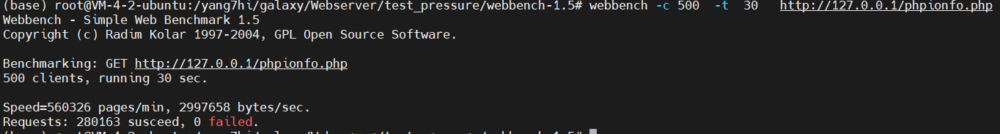

3. **锂电池包多故障诊断及其性能监测研究**：基于 Simulink 仿真及实际故障平台，设计多级特征和注意力引导的 Bi-GRU 复合模块进行锂电池故障诊断，同时开发了基于 QT 的在线电池包性能分析系统，实现了对电池组故障、SOC、SOH 等状态的监测。

## WebServer项目介绍

**WebServer** 项目是我在学习计算机网络和 Linux socket 编程过程中开发的一个轻量级服务器项目。整个项目的设计和实现集中体现了多线程网络编程的核心思想，采用了成熟的网络模型，并具备较强的扩展能力。

1. **网络模型**：
   - **主从 Reactor 模型**：该网络模型将网络事件的监听和处理分开，主 Reactor 负责监听事件，子 Reactor 负责处理不同的网络连接。这样的设计充分利用了系统资源，提高了并发处理能力。
   - **线程池方案**：为了进一步提高性能，采用了线程池模型，减少了线程频繁创建和销毁的开销，增强了对大量并发请求的处理能力。
2. **协议支持**：
   - **HTTP 协议**：服务器能够处理 HTTP 请求，支持基本的 GET 和 POST 请求，适用于静态资源的访问和交互式请求的处理。
   - **FTP 协议**：支持 FTP 文件传输协议，能够处理文件的上传和下载请求，适合简单文件传输需求。
3. **压力测试与性能优化**：
   - 在项目完成后进行了性能压力测试，最后将服务器部署在云端。使用 Webbench 进行测试时，服务器在 2 核 CPU 的环境下达到了较高的查询处理性能。
   - **读写 QPS（每秒查询率）**：在存储引擎操作中，QPS 达到了 30 万以上，表现出了较强的并发处理能力和稳定性。

WebServer 项目不仅加深了我对计算机网络编程的理解，也锻炼了我在 Linux 环境下的开发能力。未来，我计划进一步扩展其功能，增加更多协议的支持，并优化其性能，使其更适应大规模并发场景的需求。

## muduo集群聊天器项目简介

**Muduo集群聊天器项目简介**

Muduo集群聊天器项目是一个高并发、跨服务器的实时聊天系统，充分利用了现代网络库和多种开源技术，构建了高效、可靠的网络通信和数据处理平台。该项目通过 **Muduo 网络库** 提供高性能的网络 IO 支持，结合 **Nginx** 进行集群化部署，提升了并发处理能力，同时借助 **Redis** 和 **MySQL** 提供了高效的消息中间件和数据存储解决方案，使用 **JSON** 序列化作为通信协议，实现了消息的可靠传输。

1. **Muduo 网络库**：
   - 作为项目的网络核心，Muduo 网络库提供了高并发的网络 IO 服务，通过事件驱动模型进行多连接的高效处理，确保在大规模并发请求下的稳定性。
   - 项目通过 Muduo 实现了网络和业务逻辑的分离，便于系统的扩展和维护。

2. **JSON 序列化与反序列化**：
   - 项目使用 JSON 序列化和反序列化机制作为私有通信协议，在客户端和服务器之间传递结构化的数据。JSON 格式的可读性和灵活性为未来的协议扩展提供了便利。

3. **Nginx 负载均衡**：
   - 为了应对高并发访问，项目配置了 Nginx 基于 TCP 的负载均衡，分配用户请求到不同的服务器实例中，保证系统在高负载下的平稳运行，提升了系统的扩展性。

4. **Redis 发布-订阅机制**：
   - 项目利用 Redis 的发布-订阅功能实现跨服务器之间的消息通信，确保多个服务器能够实时同步用户消息，实现了分布式系统中的高效消息传递。

5. **MySQL 数据存储**：
   - MySQL 关系型数据库用于存储聊天记录和用户信息等关键数据，提供了持久化和结构化的数据存储方案，确保数据的完整性和一致性。

6. **数据库连接池**：
   - 项目通过实现数据库连接池机制，提高了 MySQL 数据库的并发访问能力，避免了频繁创建和销毁数据库连接带来的性能开销，从而提高了数据库的查询效率和整体系统的性能。

**项目特色与成果**：

- **高并发处理能力**：项目通过 Muduo 和 Nginx 的结合，能够有效处理大量并发连接，确保系统在高并发下依然具有优异的性能。
- **跨服务器消息通信**：Redis 发布-订阅功能的引入，使得聊天消息可以在多个服务器之间无缝传递，保障了用户之间的消息同步，提升了用户体验。
- **稳定的持久化存储**：使用 MySQL 和连接池技术，提高了数据的读写性能，确保了系统的高效运行。

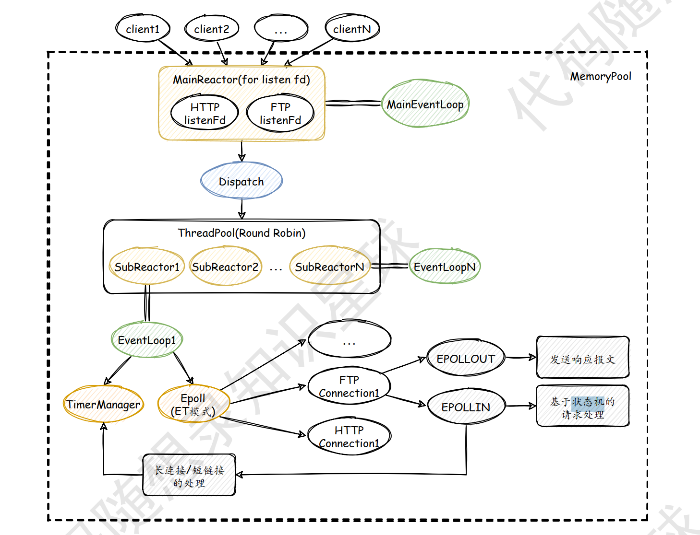

## 和普通的web服务器的不同改进之处

在 Web 服务器中引入了小顶堆，优化请求优先级处理或资源调度。

小顶堆是一种完全二叉树，满足以下性质：每个节点的值都小于或等于其子节点的值。这样，堆顶（根节点）总是最小的元素。

**优先队列**：小顶堆常用于实现优先队列，可以快速 **获取最小值** 并进行插入和删除操作。

**排序**：可以通过堆排序算法进行排序，先将数据构建为小顶堆，然后依次取出堆顶元素进行排序。

## 1.阻塞/非阻塞 同步/异步

阻塞和非阻塞、同步和异步都是描述IO的一个状态，一个典型的网络IO包含两个阶段：数据准备（阻塞和非阻塞）和数据读写（同步和异步）。

以一个套接字文件描述符==sockfd==举例，通过==recv()==从已连接的套接字中接受数据，传入==buf==。

- **阻塞模式**

  调用recv()时，数据若没有就绪，recv会阻塞当前线程；

- **非阻塞**

  调用==recv()==时，数据若没有就绪，立即返回==错误码EAGAIN（不同系统可能不同）==，表示操作没法完成，因为数据没准备好。线程可以继续执行其他操作，而不需要等待数据的到达。

  当数据就绪好了，可以再次调用==recv()==读取数据。

- **同步**

  ==recv()==**一直等待数据**，完全复制到缓存区buf，无法执行其他操作；

- **异步**

  允许应用程序在发起IO请求后，可以继续执行操作。当数据拷贝完成时，通过信号或回调==通知==应用程序。

  使用异步IO接口时，调用函数指定`sockfd`和目标缓冲区`buf`;

  操作完成时，sigio信号或者回调**通知**时候buf数据已经拷贝好了。

  ```cpp
  while (true) {
      int nfds = epoll_wait(epollfd, events, MAX_EVENTS, -1);
      for (int i = 0; i < nfds; ++i) {
          if (events[i].events & EPOLLIN) {
              ssize_t bytes_received = recv(events[i].data.fd, buf, sizeof(buf) - 1, 0);
              buf[bytes_received] = '\0';
              std::cout << "Received: " << buf << std::endl;
          }
      }
  }
  ```

## 2.0 Unix/Linux上的5种IO模型

1. **阻塞IO（Blocking I/O）**

   在阻塞IO模型中，当用户程序调用IO操作（如`recv()`）时，如果数据没有准备好，调用**会阻塞**，线程会等待数据准备好并完成数据拷贝。

   整个过程中，线程会一直等待，直到操作完成。

2. **非阻塞IO(Non-Blocking I/O)**

   在非阻塞IO模型中，当用户程序调用IO操作（如`recv()`）时，如果数据没有准备好，调用会立即返回一个错误（如`EAGAIN`），**而不会阻塞线程。**

   线程可以继续执行其他操作，并在适当的时候再次尝试IO操作。

3. **`IO多路复用`**

   使用一个进程来维护多个Socket连接。IO多路复用使用系统调用（如`select()`、`poll()`或`epoll()`）来监视多个文件描述符（如套接字）。

   当任何一个文件描述符就绪时，系统调用会返回，用户程序可以进行相应的IO操作。

   适合处理多个IO操作，避免了轮询多个文件描述符的开销，但**本质上仍然是同步IO**，因为在就绪事件通知后，用户程序仍需负责数据拷贝。

   **<a href="##epoll是同步的还是异步的">🔗epoll是同步的还是异步的</a>**  **<a href="##9.epoll|为什么使用epoll">🔗epoll，select，poll对比</a>**

4. **信号驱动IO（Signal-Driven I/O）**

   **异步通知，同步数据拷贝**。

   在信号驱动IO模型中，用户程序首先通过设置信号处理程序（如`sigaction()`）来 **注册信号处理函数**，并将套接字设置为非阻塞模式和信号驱动模式（使用`fcntl()`设置`O_ASYNC`标志）。

   当数据准备好时，内核会发送一个信号（如`SIGIO`）给用户程序，通知其可以进行IO操作。

5. **异步IO**

   **`完全异步`**

   在异步IO模型中，用户程序发起IO请求后可以**立即继续执行其他操作**。
   
   当IO操作完成（包括数据拷贝）时，内核会通知用户程序（通过信号或回调函数），此时数据已经准备好，用户程序可以直接处理数据。

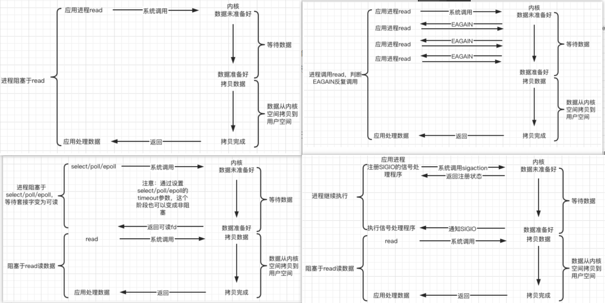**总结**

**同步IO（阻塞IO、非阻塞IO、IO多路复用、信号驱动的数据拷贝）**：

- **通知方式**：这些模型都使用==就绪事件通知方案==，即通知用户程序数据已经准备好。
- **数据拷贝**：用户程序需要负责将数据从内核缓冲区拷贝到用户缓冲区，或者将数据从用户缓冲区拷贝到内核缓冲区。
- **等待时间**：用户程序需要等待数据拷贝完成，这段时间是同步的。

**异步IO（异步/信号驱动的异步通知）**：

- **通知方式**：通知的是事件完成，即数据已经拷贝完毕，用户程序可以立即进行下一步处理。
- **数据拷贝**：由内核负责完成数据拷贝，用户程序不需要等待数据拷贝时间。
- **效率**：更高，因为用户程序可以在IO操作进行时执行其他任务，最大化利用CPU时间。

## 2.1 IO多路复用技术

一种高效的IO处理方式，允许单个线程同时管理多个IO通道，避免了创建多个线程的开销。网络编程中：使用一个进程来维护监听**多个Socket**的方式。

一个进程虽然任意时刻只能处理一个请求，如果每个请求事件的耗时控股之在1ms内，则1s就可以处理上千条请求，把时间拉长看，就是多个请求复用了一个进程，这就是多路复用。这种思想很类似与一个CPU并发多个进程，所以也叫**时分多路复用**。

Linux内核中提供了**`select/poll/epoll`**这三个多路复用的系统调用，进程可以通过一个系统调用函数**从内核中获取多个事件。**

**原理：**`select/poll/epoll`在获取事件时，先把所有的连接（文件描述符，如Socket连接）传给内核，将多个IO事件添加到一个事件集合中进行监听。再由内核返回产生了事件的连接，然后在**用户态**中再处理这些连接对应的请求。

## 2.2 IO多路复用技术|流程

1. 创建Socket文件描述符，并将需要监听的IO事件添加到事件集合中
2. 调用IO多路复用函数，将所有待处理事件的集合传递给函数
3. IO多路复用函数会`等待并监听`**所有传递的事件集合中的IO事件**，并自动挂起当前进程，直到有事件发生或超时
4. 当某个IO事件触发时，IO多路复用函数会返回该事件的文件描述符，并从事件集合中删除该事件
5. 处理完该事件后，将该事件重新加入事件集合中。循环2-5step

## 3.WebServer的作用

一个WebServer就是一个服务器软件。主要功能是通过HTTP协议与客户端（通常是浏览器）进行通信，来接受，存储，处理来自客户端的HTTP请求，并对其请求做出HTTP响应，返回给客户端其请求的内容或返回ERROR信息，最后实现了上万的并发连接。

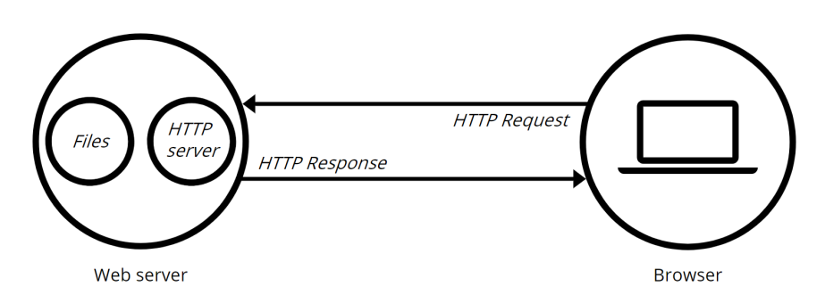

## 4.HTTP协议（应用层协议）

<a href="##HTTP | 超文本传输协议，Hypertext Transfer Protocol">HTTP汇总</a>

## 4.HTTP协议|http请求怎么解析的 平时常用的正则表示式

在Web服务器项目中，HTTP请求解析通常涉及以下步骤：

1. **接收请求**

服务器监听特定端口，接收来自客户端的HTTP请求。

2. **解析请求行**

请求行包含请求方法、URI和HTTP版本，例如：
```
GET /index.html HTTP/1.1
```
**正则表达式**：
```regex
^(GET|POST|PUT|DELETE|HEAD|OPTIONS|PATCH) (\S+) HTTP\/(\d+\.\d+)$
```

3. **解析请求头**

请求头包含多个键值对，例如：
```
Host: www.example.com
User-Agent: curl/7.64.1
```
**正则表达式**：
```regex
^([a-zA-Z0-9-]+): (.+)$
```

4. **解析请求体**

对于POST请求，请求体的解析依赖于`Content-Type`，常见类型有`application/json`和`application/x-www-form-urlencoded`。

## 4.HTTP协议|浏览器地址栏键入URL，按下回车之后会经历什么

1. 解析URL，生成发给WEB服务器的HTTP请求
2. 查询服务器域名对应的IP地址，如果缓存中有对应域名缓存，就直接返回；没有，向DNS服务器请求解析该URL中域名所对应的IP地址
3. 解析出IP地址后，就可以把HTTP的传输工作交给操作系统的==协议栈==；
4. 根据IP地址和默认端口80，和服务器建立TCP连接；
5. 浏览器发出读写文件（URL中域名后面部分对应的文件）的HTTP请求，该请求作为TCP三次握手的第三个报文数据发送给服务器；
6. 服务器对浏览器请求做出响应，并把对应的资源发送给浏览器
7. 完成以上过程后，数据已经到达浏览器端，接下来浏览器解析并渲染数据
8. 释放TCP连接。

> HTTP协议是基于TCP/IP协议之上的应用层协议，基于**请求-响应**的模式。HTTP协议规定请求从客户端发出，最后服务器端响应该请求并返回。  
>
> 协议栈上半部分是TCP/UDP协议，执行收发数据的操作；下半部分是IP协议，控制网络包的收发

## 5.日志系统

在这种多生产者、单消费者的日志系统中，确实需要精心设计缓冲区的同步机制，以确保并发性能。以下是实现思路的简要概述：

1. **缓冲区设计**：
   - 使用环形缓冲区（Circular Buffer）来存储日志信息，避免频繁的内存分配。
   - 设置一个**固定大小的缓冲区**，确保在高并发时能有效地管理空间。

2. **同步机制**：
   - 使用互斥锁（Mutex）保护对缓冲区的写入和读取操作，确保数据一致性。
   - 使用条件变量（Condition Variable）来实现生产者与消费者之间的通知机制。生产者在写满缓冲区时阻塞，而消费者在缓冲区为空时阻塞。

3. **多线程设计**：
   - 每个生产者线程独立写入缓冲区，并在写入完成后通知消费者。
   - 单个消费者线程持续从缓冲区读取数据并写入文件，同时保持与生产者的同步。

4. **日志等级管理**：
   - 在日志记录时，生产者可以根据不同的日志等级（如DEBUG、INFO等）选择性写入缓冲区。
   - 消费者则可以根据需要处理特定等级的日志。

5. **异常处理**：
   - 考虑到写文件时可能出现的错误，如磁盘空间不足，消费者需要有相应的异常处理机制。

通过这种设计，生产者与消费者可以并发执行，提高日志记录的效率，同时保持数据的一致性和完整性。

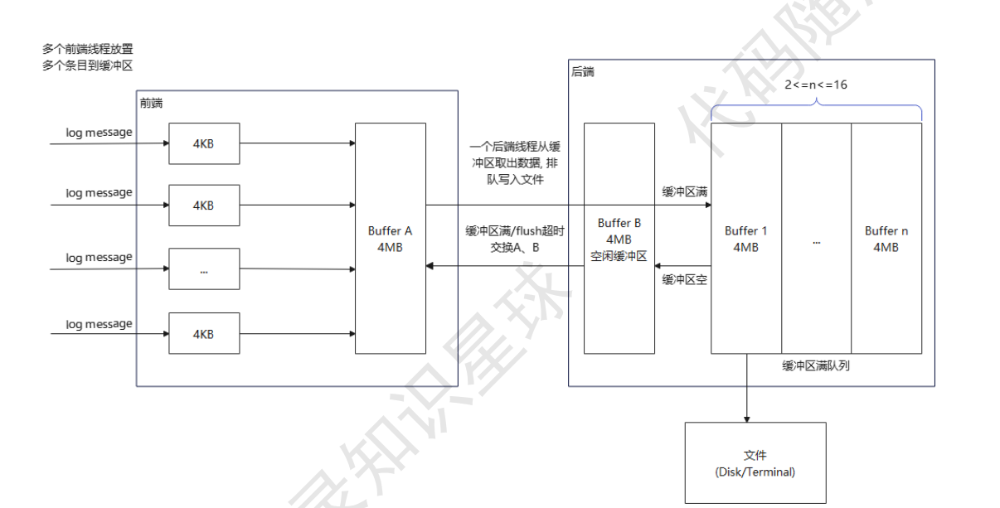

## 6.两种高效的事件处理模式|Reactor高并发

IO多路复用监听事件，收到事件后，根据事件类型分配给某个进程/线程。有多种的实现方式

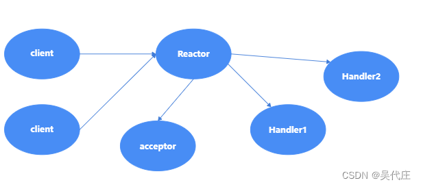

### Reactor模式核心组成部分

1. **Reactor**：负责监听和分发I/O事件，包括连接事件/读写事件。

2. **处理资源池**：可以是进程或线程，负责实际处理事件。

**方案**

- **单Reactor单进程/线程**：一个Reactor在单个进程或线程中处理所有事件。
- **单Reactor多进程/线程**：一个Reactor分发事件到多个进程或线程。
- **多Reactor多进程/线程**：多个Reactor分布在不同的进程或线程中，每个Reactor处理一部分事件。

其中Reactor负责监听和分发事件；Acceptor负责获取连接；Handler负责处理业务逻辑

### 单Reactor单进程/线程（单单，单线程模型）

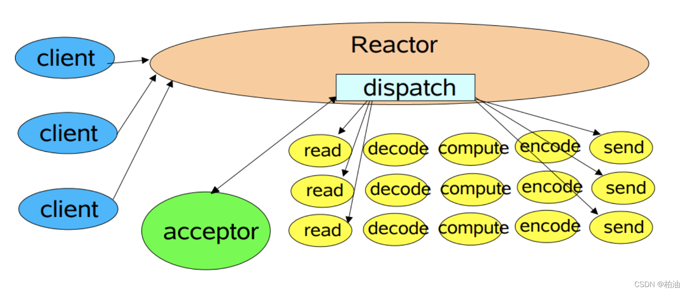

1. Reactor通过IO多路复用接口监听事件，根据事件的类型决定**分发**给Acceptor还是Handler处理；

2. 若是**连接建立**的事件，则交给**Acceptor**对象处理，Acceptor对象会通过accept系统调用来获取连接，并建立一个Handler对象来处理后续的响应事件；

3. 若**不是连接建立事件**，则交由**当前连接对应的Handler**对象来进行响应；

4. Handler对象通过r**ead->业务处理->send**的流程来完成完整的业务流程

- **优点**：实现简单，无需考虑进程间通信和多进程竞争。
- **缺点**：无法充分利用多核CPU；Handler在进行业务处理时候，整个进程无法连接其他事件。例如，长耗时业务，响应将会延迟。
### 单Reactor多进程/线程（单多，多线程模型）

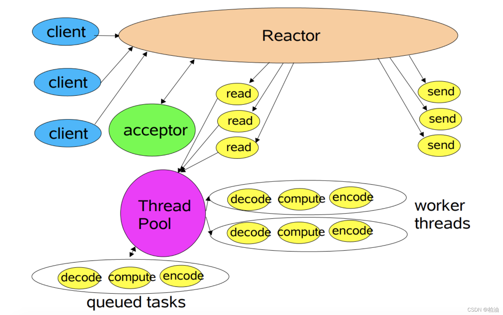

Reactor通过IO多路复用接口监听事件和**单Reactor单进程**（1-3）一致

4. Handler对象**`不再负责业务逻辑的处理，只负责数据的接受和发送`**。Handler对象通过 **read读取数据** 后，会将数据发送给**线程池中子线程里的`processor对象`**进行业务处理；
5. 子线程里的processor对象处理完后，会将结果发送给**主线程中的Handler对象**，再通过send方法将响应发给client。

- **优点**： 能充分利用多核CPU性能 
- **缺点**：一个Reactor承担所有事件的监听和响应，而只在主线程中进行。随间高并发场景中，无法及时处理新连接、就绪的 IO 事件以及事件转发等。

### 多Reactor多进程/线程（多多，主从多线程模型）

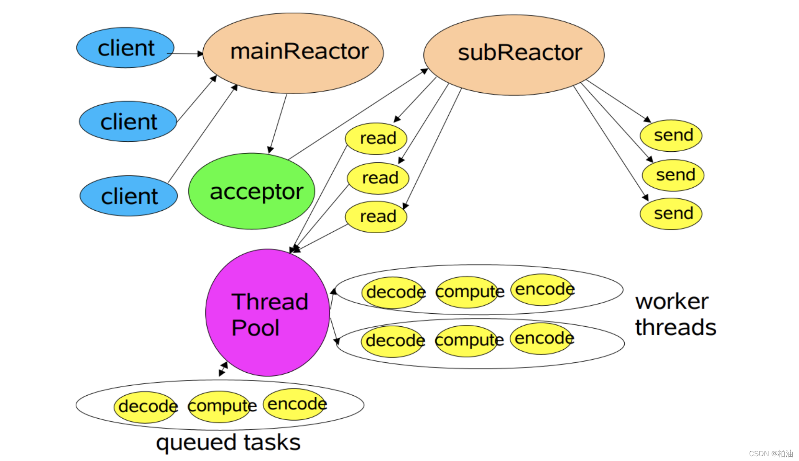

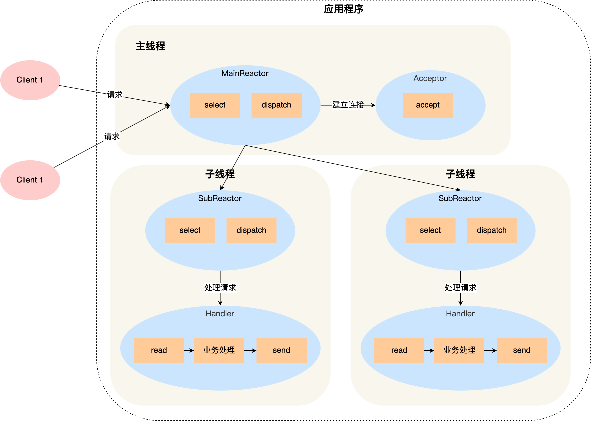

1. 主线程中的 **`MainReactor`** 对象通过IO多路复用接口(epoll) **监听连接建立事件**，一旦某个描述符上有事件发生（如可读、可写），通知主线程。具体来讲，收到事件后通过Acceptor对象中的accept获取连接，将新的连接分配某个子线程；
2. 子线程中的 **`SubReactor`** 负责后续的读写事件。每个子线程管理自己的一组连接，并且通过**创建** **`Handler`** 处理**数据的读写以及业务逻辑**；
3. 如果有新的事件发生，SubReactor通知当前连接对应的Handler对象来进行响应；
4. Handler对象通过 `read->业务处理->send` 的流程来完成完整的业务逻辑。

- 实现简单，主线程子线程分工明确，主线程子线程交互简单。

## 6.两种高效的事件处理模式|Reactor和Proactor的好处和坏处

Reactor 和 Proactor 是两种常用的 **`并发设计模式`** ，用于处理 I/O 多路复用，特别是在高性能服务器和网络编程中

- **Reactor 模式**

  **非阻塞同步网络模式**，感知的是就绪可读写的信号：主要用于同步 I/O 操作。它依赖于事件分发器（Event Demultiplexer），如 `select`、`poll` 或 `epoll`，来监视多个 I/O 事件并分发到相应的事件处理程序（Event Handler）。

  - 优点
    1. Reactor实现相对简单，对于耗时短的处理场景处理⾼效  
    2. 简单易懂。Reactor模式更简单易懂，容易实现和维护  
  - 缺点
    1. **单线程瓶颈** 在并发度很⾼场景，`单个线程负责监听和分发所有的IO事件`，可能会成为性能瓶颈。
    2. **同步 I/O 操作阻塞** 处理时间较长的任务可能会阻塞事件处理程序，降低系统响应速度。

- **Proactor 模式**

  **异步网络模式**，感知的是已完成的读写信号：主要用于异步 I/O 操作。它将 I/O 操作的处理从应用程序中解放出来，由**操作系统或 I/O 库完成**，**需要传入数据缓冲区的地址等信息，⽤来存放结果数据** 。当 I/O 读写操作完成时，操作系统会通知应用程序，并将结果传递给相应的事件处理程序。

  - 优点
    1. **异步 I/O 特性** 高并发和高负载情况下，异步 I/O 操作可以`避免阻塞`，提高 I/O 操作的并发度
    2. **处理长时间运行的任务** 如大规模数据传输和文件复制等操作。
  - 缺点
    1. **实现较为困难** 需要处理复杂的异步编程模型
    2. **小规模任务的处理效率略低** 需要进行线程切换和上下文切换，额外的开销可能会影响任务的处理效率

## 6.两种高效的事件处理模式|使用 Reactor 方案而不是Proactor？为什么不用异步方案？

- Linux 对 Proactor 支持不足，异步 I/O 支持不完善

  **异步 I/O 的局限性** Linux 虽然有 AIO（Asynchronous I/O）接口，这些接口主要用于本地文件系统，`不是在内核级别实现的真正异步 I/O`，网络socket就不适用。

- `epoll` 等高效 I/O 多路复用机制

  **内核支持** Linux 提供了高效的 I/O 多路复用机制，如 `epoll`、`select` 和 `poll`，这些机制在内核级别实现，能够高效地监视大量文件描述符（包括网络 socket）。这些 I/O 多路复用机制非常适合Reactor 模式

- CPU多核心和优秀线程调度算法也可能与异步操作的性能差不多

## 7.线程池|手写线程池

1. **主线程**：
   - 负责监听和处理I/O事件，使用`epoll_wait`监测可读事件。
   - 当发现某个文件描述符上有可读事件时，主线程会将相应的HTTP请求报文读取到该连接的读缓存中。
   - 将读取到的任务对象插入到线程池的任务队列中。
2. **线程池**：
   - 线程池中的线程负责从任务队列中获取任务，并处理请求逻辑。
   - 线程通过竞争锁资源来获取任务，从而完成报文解析。

```cpp
class ThreadPool {
public:
    ThreadPool(size_t numThreads);	// 构造函数，创建指定数量的工作线程
    ~ThreadPool();	// 析构函数，等待所有线程完成工作
    
    template<class F>	// 添加任务到任务队列
    void enqueue(F&& f);

private:
    // 工作线程执行的函数
    void worker();
    
    std::vector<std::thread> workers;                      // 工作线程
    std::queue<std::function<void()>> tasks;               // 任务队列
    std::mutex queueMutex;                                  // 互斥锁，保护任务队列
    std::condition_variable condition;                       // 条件变量，用于线程同步
    bool stop;                                              // 停止标志
};

ThreadPool::ThreadPool(size_t numThreads) : stop(false) {	// 创建并启动工作线程
    for (size_t i = 0; i < numThreads; ++i) {
        workers.emplace_back([this] { this->worker(); });
    }
}

ThreadPool::~ThreadPool() {
    {
        std::unique_lock<std::mutex> lock(queueMutex);
        stop = true; // 设置停止标志
    }
    condition.notify_all(); // 通知所有线程停止
    for (std::thread& worker : workers) {
        worker.join(); // 等待所有线程结束
    }
}

template<class F>
void ThreadPool::enqueue(F&& f) {
    {
        std::unique_lock<std::mutex> lock(queueMutex);
        tasks.emplace(std::forward<F>(f)); // 将任务添加到队列
    }
    condition.notify_one(); // 唤醒一个工作线程
}

void ThreadPool::worker() {
    while (true) {
        std::function<void()> task;
        {
            std::unique_lock<std::mutex> lock(queueMutex);
            // 等待任务或停止信号
            condition.wait(lock, [this] { return stop || !tasks.empty(); });
            if (stop && tasks.empty()) return; // 停止并且没有任务时退出
            task = std::move(tasks.front()); // 获取任务
            tasks.pop(); // 从队列中移除任务
        }
        task(); // 执行任务
    }
}
```

## 7.线程池|线程池和任务队列有没有做分离

**关系**：任务队列存储待处理的任务，而线程池管理执行这些任务的线程。任务被放入队列后，线程池中的线程从队列中获取任务并并发执行，确保资源的高效利用

**有的。**主要是为了提升资源的利用率和系统的响应能力，同时也有利于线程安全。**线程池负责生成和管理线程，任务队列用于存储任务**。线程池从任务队列中提取任务，到一个线程中去执行，有任务就执行，无任务阻塞线程休眠。

## 7.线程池|怎么利用信号量机制 判断线程的空闲状态 线程进程同步互斥（基于信号量机制）

1. **初始化，线程阻塞**

   线程池中的线程通过run方法从任务队列中提取任务，初始化信号量值为0。由于信号量的初始值为0，在尝试执行任务之前会执行一个等待（wait）操作，这会导致它们阻塞，直到有任务可用。

2. **任务提交**，**信号量增加，唤醒线程**

   线程将任务提交到任务队列，并调用线程池的`append`方法。这个方法将**任务添加到队列中**，执行post做一个**V操作**（通常对应于`sem_post`函数），增加+1信号量，`至少有一个等待的线程会被唤醒`。这个线程会从**阻塞状态转换到就绪状态。**

3. **执行任务**

   执行前P操作，减少信号量的值。使得**信号量-1**，然后从任务队列中取出任务执行。

4. **循环等：**

   如果信号量的值大于0，线程可以继续从队列中获取新任务；如果信号量的值为0，线程将再次执行等待操作，进入阻塞状态

## 7.线程池|信号量机制的作用

- **同步控制**：信号量用于控制线程池中线程与任务队列之间的同步，确保只有在有任务提交时，线程才会被唤醒执行任务。
- **线程空闲状态判断**：当信号量值为 0 时，说明没有任务可供执行，线程会阻塞，进入空闲状态；当信号量值大于 0，线程可以从任务队列中提取任务并开始处理。
- **互斥控制**：信号量机制有效地避免了多个线程同时竞争任务队列时的资源冲突，实现了任务调度的互斥控制。

## 7.线程池|为什么要使用线程池

假设一个 Web 服务器需要处理大量的客户端请求。如果每个请求都创建一个新线程来处理，会导致以下问题：

- 大量线程创建和销毁的开销会影响服务器性能。
- 系统资源可能会被过多的线程耗尽，导致服务器崩溃。

**`是什么?`**

- 线程池就是一个 pthread_t 类型的普通数组，通过空间换时间的方式，消耗硬件资源，换取运行效率。他是指一组线程资源的集合；

**1）减少线程创建和销毁的开销**  `创建和销毁线程`是⼀项开销较大的操作。线程池在应用启动时**预先创建一个固定数量的线程来处理请求**，而不是在每次需要时动态创建和销毁。这减少了系统在创建和销毁线程时的开销，提升了性能。

**2）提高系统资源利用率**  线程池可以通过配置 `最大线程数` 来限制**并发线程**数量，防止系统资源（例如内存和 CPU）被过多的线程耗尽，从而避免资源竞争和过载。

**3）提高响应性** 正式运行阶段，处理客户端请求时，线程池中的线程可以立即处理它们，而**不需要等待新线程的创建的动态分配**；线程池中的**线程**在完成一个任务后可以放回池中，被**复用**

### **核心参数**

对于 Web 服务器，核心参数主要包括以下几个方面，这些参数影响着服务器的性能、可扩展性和稳定性：

1. **最大并发连接数**

- **参数**: `max_connections`
- **建议值**: 根据硬件和应用需求设置，通常为 1000 - 2000（或更高），具体取决于服务器的能力和业务需求。

2. **线程池参数**

- **核心线程数 (corePoolSize)**: 
  - **建议值**: 根据 CPU 核心数设置，一般为 2-4 倍于 CPU 核心数。
  
- **最大线程数 (maximumPoolSize)**: 
  - **建议值**: 2-4 倍于核心线程数，适用于高并发场景。

- **任务队列 (workQueue)**: 
  - **建议值**: `LinkedBlockingQueue`（无界）或 `ArrayBlockingQueue`（有界，容量 200-500），具体取决于业务负载和内存消耗。

- **线程存活时间 (keepAliveTime)**: 
  - **建议值**: 60秒，适用于任务负载波动较大的场景。

3. **请求处理超时**

- **参数**: `request_timeout`
- **建议值**: 30-60秒，避免请求长时间阻塞。

4. **连接超时**

- **参数**: `connection_timeout`
- **建议值**: 5-10秒，设置较短以防止连接被长期占用。

5. **I/O 操作超时**

- **参数**: `io_timeout`
- **建议值**: 30秒，针对数据库、网络等 I/O 操作的请求超时。

6. **负载均衡参数**

- **参数**: `load_balancing_strategy`
- **建议值**: `round_robin` 或 `least_connections`，根据实际情况选择适合的负载均衡策略。

7. **缓存参数**

- **参数**: `cache_size`
- **建议值**: 根据访问量和内存情况设置，通常为服务器总内存的 20%-30% 用于缓存。

8. **日志级别**

- **参数**: `log_level`
- **建议值**: `ERROR` 或 `INFO`，具体取决于需求和系统性能影响。

9. **最大请求体大小**

- **参数**: `max_request_body_size`
- **建议值**: 1MB - 10MB，根据应用场景和上传文件需求进行调整。

10. **SSL/TLS 配置**

- **参数**: `ssl_protocols` 和 `ssl_ciphers`
- **建议值**: 使用现代加密协议和强密码配置，确保安全性。

11. **静态资源缓存**

- **参数**: `static_file_cache`
- **建议值**: 设置合理的缓存时间（如 1小时），以减少对后端服务器的压力。

12. **健康检查和自动重启**

- **参数**: `health_check_interval` 和 `auto_restart`
- **建议值**: 每 5-10分钟进行健康检查，设置自动重启阈值以确保服务稳定性。

这些核心参数可以根据不同的业务需求进行调整，以确保 Web 服务器在高并发情况下的稳定性和性能。

1. **任务队列大小**：根据每个任务的处理时间和系统资源进行调整，设置为10000，以便监控系统性能。
  
2. **线程池数量**：我设置了4
   - **CPU核心数**：通常线程池的线程数应与CPU核心数相同或稍多。对于CPU密集型任务，建议与CPU核心数相同，以避免线程竞争；对于I/O密集型任务，可以适当增加线程数量，以减少I/O等待时间。
   - **系统资源**：需考虑线程池对内存和CPU的需求，避免过多线程导致内存占用和CPU切换开销，或过少线程导致任务排队。选择线程池数量时应综合考虑这些因素，并根据实际情况优化。

## 7.线程池|线程池怎么保证线程安全

- 使用了互斥锁，通过对共享资源的加锁和解锁来保证并发访问的安全
- 使用信号量，可以用于实现多个线程的同步和互斥
- 还可以加读写锁，条件变量和原子操作来保证线程安全

## 7.线程池|涉及的接口总结

| **接口名称**        | **功能描述**                                       | **备注**                                    |
| :------------------ | :------------------------------------------------- | :------------------------------------------ |
| **构造函数**        | 创建线程池并指定线程数量和队列大小                 | 初始化线程池，指定线程池的参数              |
| **submit**          | 向线程池提交任务（可执行对象或函数）               | 用于提交任务并可返回执行结果（如 `future`） |
| **start**           | 启动线程池，开始处理提交的任务                     | 启动线程池中的所有工作线程                  |
| **wait** / **join** | 等待所有任务完成，阻塞当前线程                     | 用于优雅关闭服务器时等待任务执行完毕        |
| **shutdown**        | 优雅关闭线程池，停止接收新任务但继续处理已提交任务 | 停止接收新任务，继续处理队列中的任务        |
| **shutdownNow**     | 立即关闭线程池，停止所有任务并清空任务队列         | 强制关闭线程池，取消未处理任务              |
| **getQueueSize**    | 获取**当前等待处理**的任务队列长度                 | 用于监控当前的服务器负载                    |
| **getThreadCount**  | 获取**线程池中的线程数量**                         | 查看线程池的并发处理能力                    |
| **resize**          | 动态调整线程池中的线程数量                         | 根据服务器负载情况调整线程池规模            |
| **schedule**        | 定时执行任务，用于调度定时任务                     | 可选接口，适合定时清理或监控任务            |
| **isShutdown**      | 检查线程池是否已经关闭                             | 用于查询线程池的工作状态                    |

## 7.连接池|什么不足？针对高并发场景。请求较多，连接池会出现什么问题？

数据库连接池是一种用于管理数据库连接的机制，可以提高数据库访问的效率和性能，但在高并发场景下，连接池也可能面临一些不足和问题。

1. **连接池大小限制**

- **问题**：每个连接池都有一个最大连接数限制。当请求的连接数超过该限制时，新的请求将被阻塞或失败，导致系统性能下降。
- **影响**：在高并发场景中，如果连接池的大小配置不当（过小），可能会导致请求等待时间增加，从而影响用户体验。

2. **连接泄漏**

- **问题**：如果连接在使用后未被正确关闭或归还到连接池，可能会导致连接泄漏，使得可用连接数逐渐减少。
- **影响**：连接泄漏会导致连接池中的连接耗尽，导致后续的数据库请求无法获得连接，从而造成请求超时或失败。

3. **竞争条件**

- **问题**：在高并发场景下，多个线程或进程可能会争抢连接池中的连接资源，这可能会导致竞争条件。
- **影响**：如果连接池的实现不够高效，可能导致线程争用和上下文切换的开销，从而影响系统的整体性能。

4. **性能下降**

- **问题**：如果连接池的配置不合理，可能会导致性能下降。例如，连接的建立和释放开销，如果频繁创建和销毁连接，可能会抵消连接池的优势。
- **影响**：在高并发环境下，低效的连接池管理策略可能导致响应时间变长，影响系统的吞吐量。

5. **连接超时**

- **问题**：连接在长时间未使用后可能会被数据库服务器关闭。如果连接池未及时检测到这些无效连接，可能会导致后续请求使用无效连接。
- **影响**：当应用程序尝试使用已关闭的连接时，会导致错误，可能需要重新获取连接，从而增加额外开销。

6. **数据库负载**

- **问题**：在高并发场景中，连接池的请求数量可能会导致数据库的负载增加，特别是在处理复杂查询或写操作时。
- **影响**：如果数据库服务器无法处理过多的连接，可能导致性能瓶颈，进一步影响应用程序的响应能力。

**解决方案**

1. **合理配置连接池大小**：根据实际业务需求和数据库能力，动态调整连接池的最大和最小连接数。
2. **连接健康检查**：定期检查连接池中的连接，及时清除无效连接，避免使用已关闭的连接。
3. **实现连接释放机制**：确保每个使用的连接都在完成后正确关闭，并归还到连接池中。
4. **采用更好的连接池实现**：使用成熟的连接池框架来管理连接池，它们通常会有更好的性能和资源管理策略。
5. **负载均衡**：通过读写分离、数据库集群等方式，分散数据库负载，提高系统的整体性能。

## 8.有限状态机 (finite state machine)

有限状态机是一种计算模型，它由一组状态以及在这些状态之间的转移组成。在任何给定时间，有限状态机都有一个当前状态，并且基于输入和当前状态，它可以转移到另一个状态或保持在当前状态。HTTP协议的格式和结构之所以适合使用有限状态机进行解析。<a href="###HTTP | HTTP报文">HTTP报文</a>

1. **初始状态（START）**：状态机开始等待接收HTTP请求报文。
2. **请求行状态（REQUEST_LINE）**：当状态机接收到数据时，它首先尝试解析请求行。请求行包含请求方法（如GET、POST等）、URI（统一资源标识符，它指定了请求的资源位置和路径）、以及HTTP协议的版本号。状态机将分析这些组成部分，确保它们符合HTTP协议的规范。
3. **头部状态（HEADERS）**：解析完请求行后，状态机进入头部状态，开始解析请求头。请求头由多个键值对组成，每对之间用CRLF分隔。常见的请求头字段包括Host、User-Agent、Accept等，它们提供了请求的附加信息。状态机将逐行读取并解析这些头部字段。
4. **空行状态**：在请求头解析完毕后，状态机检测到一个空行（两个连续的CRLF），这表示请求头已经结束，请求体（如果有的话）即将开始。
5. **主体状态（BODY）**：对于需要请求体的请求方法（如POST、PUT），状态机进入主体状态并开始解析请求体。请求体可能包含表单数据、JSON对象或其他类型的数据。状态机将根据请求头中的Content-Type字段来确定如何解析这些数据。
6. **结束状态（END）**：一旦请求体被完全解析，或者对于没有请求体的请求（如GET请求），状态机将进入结束状态。在这个阶段，状态机将完成对整个HTTP请求报文的解析，并准备生成相应的响应。
7. **错误状态（ERROR）**：如果在解析请求行、请求头或请求体的过程中遇到任何不符合HTTP协议规范的错误，状态机将进入错误状态。在错误状态下，状态机会记录错误信息，并准备发送一个错误响应给客户端。
8. **处理完成（REQUEST_COMPLETED）**：在结束状态之后，状态机将准备并发送响应给客户端，并返回初始状态（START），等待接收下一个HTTP请求。

整个过程确保了HTTP请求的各个组成部分被逐步解析，并且在每个阶段都有机会处理错误并重新开始。

## 8.有限状态机|主、从状态机调用关系与状态转移过程

**从状态机负责读取报文的一行，主状态机负责对该行数据进行解析**，主状态机内部调用从状态机，从状态机驱动主状态机。

**主状态机**

三种状态，标识解析位置。

- CHECK_STATE_REQUESTLINE，解析请求行
- CHECK_STATE_HEADER，解析请求头
- CHECK_STATE_CONTENT，解析消息体，仅用于解析POST请求

**从状态机**

三种状态，标识解析一行的读取状态。

- LINE_OK，完整读取一行
- LINE_BAD，报文语法有误
- LINE_OPEN，读取的行不完整

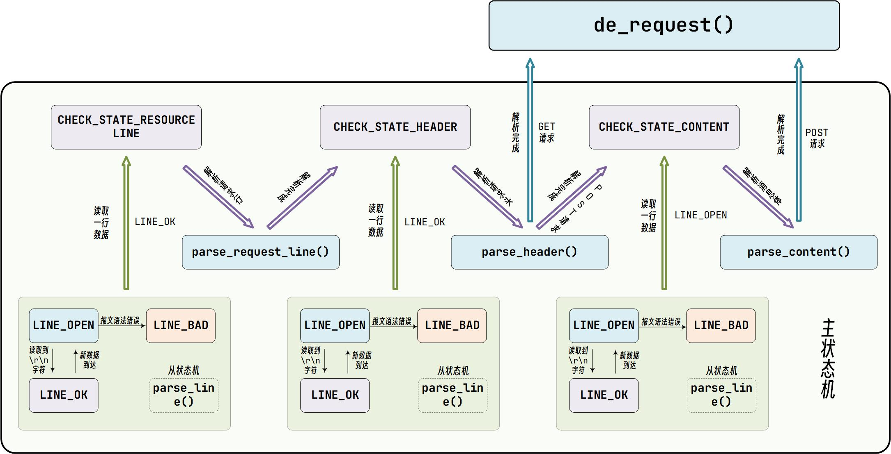

**从状态机逻辑**

在HTTP报文中，每一行的数据由\r\n作为结束字符，空行则是仅仅是字符\r\n。因此，可以通过查找\r\n将报文拆解成单独的行进行解析，项目中便是利用了这一点。

从状态机负责读取buffer中的数据，将每行数据末尾的\r\n置为\0\0，并更新从状态机在buffer中读取的位置m_checked_idx，以此来驱动主状态机解析。

- 从状态机从m_read_buf中逐字节读取，判断当前字节是否为\r

- - 接下来的字符是\n，将\r\n修改成\0\0，将m_checked_idx指向下一行的开头，则返回LINE_OK
  - 接下来达到了buffer末尾，表示buffer还需要继续接收，返回LINE_OPEN
  - 否则，表示语法错误，返回LINE_BAD

- 当前字节不是\r，判断是否是\n（**一般是上次读取到\r就到了buffer末尾，没有接收完整，再次接收时会出现这种情况**）

- 如果前一个字符是\r，则将\r\n修改成\0\0，将m_checked_idx指向下一行的开头，则返回LINE_OK

- 当前字节既不是\r，也不是\n

- 表示接收不完整，需要继续接收，返回LINE_OPEN


**主状态机逻辑**

主状态机初始状态是CHECK_STATE_REQUESTLINE，通过调用从状态机来驱动主状态机，在主状态机进行解析前，从状态机已经将每一行的末尾\r\n符号改为\0\0，以便于主状态机直接取出对应字符串进行处理。

- ==CHECK_STATE_REQUESTLINE==
  - 主状态机的初始状态，调用parse_request_line函数解析请求行
  - 解析函数从m_read_buf中解析HTTP请求行，获得请求方法、目标URL及HTTP版本号
  - 解析完成后主状态机的状态变为CHECK_STATE_HEADER


解析完请求行后，主状态机继续分析请求头。在报文中，==请求头和空行的处理使用的同一个函数，这里通过判断当前的text首位是不是\0字符==，若是，则表示当前处理的是空行，若不是，则表示当前处理的是请求头。

- ==CHECK_STATE_HEADER==
  - 调用parse_headers函数解析请求头部信息

  - 判断是空行还是请求头，若是空行，进而判断content-length是否为0，如果不是0，表明是POST请求，则状态转移到CHECK_STATE_CONTENT，否则说明是GET请求，则报文解析结束。

  - 若解析的是请求头部字段，则主要分析connection字段，content-length字段，其他字段可以直接跳过，各位也可以根据需求继续分析。

  - connection字段判断是keep-alive还是close，决定是长连接还是短连接

  - content-length字段，这里用于读取post请求的消息体长度

GET和POST请求报文的区别之一是有无消息体部分，GET请求没有消息体，当解析完空行之后，便完成了报文的解析。

但后续的登录和注册功能，为了避免将用户名和密码直接暴露在URL中，我们在项目中改用了POST请求，将用户名和密码添加在报文中作为消息体进行了封装。
为此，我们需要在解析报文的部分添加解析消息体的模块。

```cpp
while((m_check_state==CHECK_STATE_CONTENT && line_status==LINE_OK)||((line_status=parse_line())==LINE_OK))
```

在GET请求报文中，每一行都是\r\n作为结束，所以对报文进行拆解时，仅用从状态机的状态line_status=parse_line())==LINE_OK语句即可。

但在POST请求报文中，消息体的末尾没有任何字符，所以不能使用从状态机的状态，这里转而使用主状态机的状态作为循环入口条件。

- ==CHECK_STATE_CONTENT==

- - 仅用于解析POST请求，调用parse_content函数解析消息体
  - 用于保存post请求消息体，为后面的登录和注册做准备

## 9.**epoll** | 为什么使用epoll

### `select`：适用于少量文件描述符的场景，兼容性强（几乎所有系统都支持），但性能和扩展性有限。

- 使用固定长度的 `bitsmap` 来表示文件描述符集合。
- **文件描述符限制**：支持的文件描述符个数有限，在 Linux 中默认最大值为 1024（可以手动修改该限制），扩展性差。
- **触发方式**：采用**水平触发**（Level-triggered）。如果某个文件描述符就绪，且未被处理，则每次 `select` 调用都会重复通知该文件描述符。
- **性能问题**：通过线性结构存储和轮询遍历，时间复杂度 **O(n)**。。需要在用户态和内核态之间复制文件描述符集合，开销较大。属于同步通知机制。

### `poll`：突破了文件描述符数量的限制

- **动态数组**存储文件描述符集合，从而**突破了文件描述符个数的限制**。
- **触发方式**：同样为**水平触发**。当一个文件描述符就绪但未处理，`poll` 调用后仍会重复通知。
- **性能问题**：通过线性结构存储和轮询遍历，时间复杂度 **O(n)**。。需要在用户态和内核态之间复制文件描述符集合，开销较大。属于同步通知机制。

### `epoll`：最适合大规模、高并发的网络服务器开发

- `epoll` 是基于**事件驱动**机制（Event-driven）进行的异步通知。
- **性能提升**：`epoll` 在内核中维护了一个**就绪事件链表**。当某个 `socket` 有事件发生时，内核通过**回调函数**将其加入到就绪事件链表中，用户只需要调用 `epoll_wait()` 来获取已经准备好的事件，无需遍历整个文件描述符集合，效率大大提高。
- **数据结构管理**：使用内核中的 **红黑树** 数据结构来管理 **待检测的 `socket`** ，增删查的时间复杂度为 **O(logn)**。
- **文件描述符无数量限制**：相较于 `select`，`epoll` 无文件描述符数量限制，能够处理大量的文件描述符。并且，`epoll_ctl()` 只需注册一次 `socket`，每次调用时无需重新传入整个文件描述符集合，减少了用户态与内核态之间的多次拷贝。
- **触发方式**：支持**水平触发**和**边缘触发**（Edge-triggered）。尤其在**边缘触发**模式下，只有当 `socket` 状态发生变化时才会通知用户，避免了不必要的重复通知，进一步提升了处理效率。


### 总结对比

| 特性               | `select`                             | `poll`                               | `epoll`                                   |
| ------------------ | ------------------------------------ | ------------------------------------ | ----------------------------------------- |
| **数据结构**       | 固定大小 `bitsmap`                   | 动态数组                             | 红黑树（管理 `socket`）+ 链表（就绪事件） |
| **文件描述符限制** | 默认 1024（可更改）                  | 无限制                               | 无限制                                    |
| **触发方式**       | 水平触发                             | 水平触发                             | 支持水平触发和边缘触发                    |
| **时间复杂度**     | O(n)，需遍历所有描述符               | O(n)，需遍历所有描述符               | O(logn) 增删改 + O(1) 处理就绪事件        |
| **效率**           | 随着文件描述符增加而下降             | 随着文件描述符增加而下降             | 高效，特别是在高并发场景下                |
| **数据拷贝**       | 用户态和内核态之间每次都需要复制集合 | 用户态和内核态之间每次都需要复制集合 | 只需传入一次文件描述符，后续无需重复传递  |
| **使用场景**       | 适合少量文件描述符                   | 适合中等数量文件描述符               | 适合大规模并发和高频事件处理              |


  > `epoll_create` 创建一个` epoll`对象 `epfd`，
  > 通过 `epoll_ctl` 将需要监视的 socket 添加到`epfd`中
  > 调用 `epoll_wait` 等待发生事件`fd`资源
  >  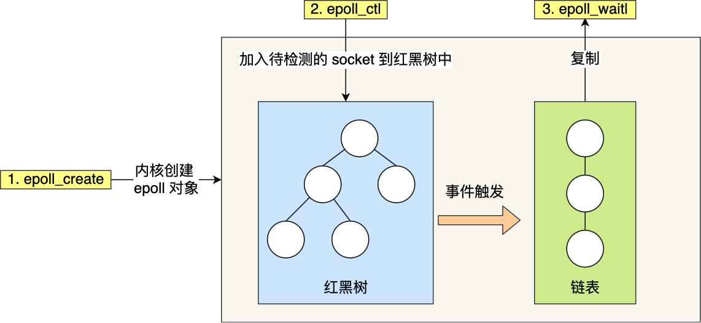
```cpp
int s = socket(AF_INET, SOCK_STREAM, 0);
bind(s, ...);
listen(s, ...)

int epfd = epoll_create(...);
epoll_ctl(epfd, ...); //将所有需要监听的socket添加到epfd中

while(1) {
    int n = epoll_wait(...);
    for(接收到数据的socket){
        //处理
    }
}
```

## 9.**`epoll`** | epoll如何减少拷贝和开销：

- **一次性注册**：`epoll_ctl()` 通过注册文件描述符到内核态，可以避免每次调用时都传递整个文件描述符集合。这与 `select` 和 `poll` 需要每次调用时从用户态传递文件描述符集合有显著区别。
- **就绪事件链表**：内核中使用事件驱动机制（通过回调函数）将就绪的事件添加到就绪链表中，调用 `epoll_wait()` 时只返回已准备好的文件描述符，避免了扫描整个文件描述符集合。
- **减少重复拷贝**：`epoll` 只在事件注册时拷贝文件描述符集合，之后的 `epoll_wait()` 只传递已发生事件的文件描述符，极大减少了用户态和内核态之间的拷贝开销。

## 9.**`epoll`** | epoll中可以无限承载socket的连接吗？创建socket时的返回值是什么

- epoll本身没有连接数的限制 但是内存是有限的，**1G的内存上能监听约10w个端口**
- 如果Socket创建成功，返回的是一个整数的文件描述符，用于后续的Socket操作。如果创建失败，则会返回`-1`，并且可以使用errno变量来获取具体的错误信息

## 9.**`epoll`** | 边缘触发ET和水平触发LT

epoll 支持两种事件触发模式，分别是**边缘触发（edge-triggered，ET）和水平触发（level-triggered，LT）**。

**LT（muduo采用）**：内核数据没读完，就会一直上报数据。**服务器端不断地从 epoll_wait 中苏醒，直到内核缓冲区数据被 read 函数读完才结束。**

- muduo为什么使用LT模式：不会丢失数据；照顾多个连接的公平性，低延迟处理；跨平台使用，ET一些系统不能使用

**ET**：内核数据只上报一次。**服务器端只会从 epoll_wait 中苏醒一次**。

## 9.**`epoll`** | EPOLLONESHOT | 解决竞态条件和潜在的数据不一致

LT只要存在事件就会不断的触发，ET只在从非触发到触发两个状态转换的时候才触发。

**存在问题：**多线程处理中，一个Socket事件到来，数据开始解析，这时候这个Socket又来一个相同的事件，在前一个解析未完成情况下，程序会自动调用另外一个线程或进程处理新的事件，造成了**不同线程和进程处理同一个socket事件**。

**EPOLLONESHOT解决：**将 socket 文件描述符和 `EPOLLONESHOT` 标志一起注册到 epoll 实例中。这样，当事件发生时，它只会被触发一次。在当前线程完成事件处理后，需要再次使用 `epoll_ctl` 与 `EPOLL_CTL_MOD` 命令来重新注册该 socket 文件描述符，以便它可以对新的事件做出响应。从而保证不会跨越多个线程。

## `fd`在系统中有限制吗？

**有限制的**。

1. 单个进程中默认是`1024`

   ```shell
   ulimit -n	# 查看当前进程的fd数量限制
   ulimit -n num	# 修改当前进程的fd数量限制
   ```

   进程中可以用系统函数修改

   ```cpp
   #include <sys/resource.h>
   struct rlimit {
       rlim_t rlim_cur;	// soft limit
       rlim_t rlim_max;	// hard limit
   };
   // get resource limit
   int getrlimit(int resource, struct rlimit *rlimit);
   // set resource limit
   int setrlimit(int resource, const struct rlimit *rlimit);
   ```

2. 操作系统对文件描述符也有限制，进程分配的文件描述符数量不能超过操作系统的限制，可以通过修改内核参数来调整阈值。文件描述符总是有数量的，取决于系统的配置和硬件资源。

   ```shell
   sysctl fs.file-max = 655360
   ```

## 一个服务端进程最多和多少个客户端进行连接？和fd的数量有关系吗？

文件描述符的数量与同时连接的客户端数量有关，因为每个客户端连接都需要⼀个文件描述符。但是fd并不是唯一影响同时连接客户端数量的因素。

**其他因素**  

- 内存：每一个连接都会消耗一定的内存，内存大小会限制同时连接的客户端数量
- 网络宽带：每个联机的数据传输需要网络宽带
- 处理器性能

## 10.WebBench|接口

- ParseArg(2)：解析命令行参数
- BuildRequest(1)：构造 URL 请求
- WebBench(3)：执行实际的压测

首先定义一个执行状态的变量，定义了打印使用说明和结果的函数。然后是两个核心函数 **` ConnectServer(2)` 、`Worker(3)`**。

- **`ConnectServer(2)`** :与URL所在服务器建立TCP连接；
- **`Worker(3)`** :在子进程中创建客户端和服务器的发送信息。

ConnectServer(2) 的实现就比较简单了，就是和 CSAPP ⼀样的几个系统接口的调⽤。 Worker(3) 则针对长连接和短连接进⾏不同的操作，短连接需要在每次收发完数据后即与服务器断开连接，然后再执⾏ConnectServer(2) ，而长连接则不用，最后在收到闹钟信号 is_expired 后，停⽌连接，并将当前⼦进程的结果发给⽗进程统计。

## 10.WebBench|访问请求原理

- 父进程fork若干个子进程，每个子进程 在用户要求或默认时间内 对wb循环发起实际访问请求。

- 父子进程通过管道进行通信，子进程通过 **管道写端** 向父进程传递若干次请求访问完毕后记录到的总信息

- **父进程** 通过 **管道读取** 子进程发来的相关信息

- 子进程在时间后结束，父进程在所有子进程退出后统计并给用户显示最后结果。退出

  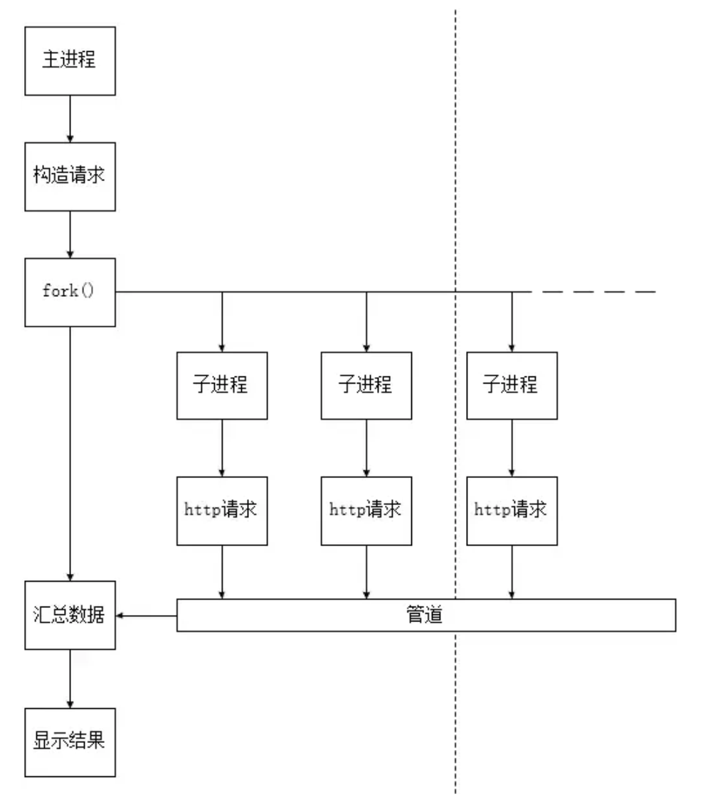

## 分布式服务器系统

单机应用无法满足需求，设计一个分布式服务器系统是必要的。分布式系统的目标是通过多台机器协同工作，来分摊负载、提高可用性和扩展性。然而，构建分布式服务器系统会引入复杂性，考虑以下几个关键问题：

- **负载均衡**：确保请求均匀分布，防止服务器过载。
- **数据一致性**：在分布式环境下权衡一致性与性能。
- **高可用性与容错性**：确保系统在故障时能够继续工作。
- **扩展性**：通过无状态服务、缓存、数据库分片等实现横向扩展。
- **安全性**：保证数据的安全传输和存储。
- **监控与日志**：为运维和调试提供全面的数据支持。

1. **负载均衡**

- **问题**：如何将大量请求均匀地分发到多台服务器上，避免某些服务器过载，而其他服务器空闲？

  - 使用负载均衡器（如 Nginx）在前端分配请求。

  - 负载均衡算法：轮询法、最少连接法、加权轮询法、IP 哈希等。

  - 动态负载均衡：根据服务器的当前状态（如 CPU、内存、请求数等）动态调整负载分配。

  - **关键考量**：确保负载均衡器是高可用的（通常配置为主备模式），以避免负载均衡器单点故障。

2. **数据一致性与分布式存储**

- **问题**：在分布式系统中，如何保证数据的一致性，尤其是当多个服务器可能会处理同一个数据时？
  - **分布式数据库**：如 MongoDB 或基于分区的 MySQL，来实现数据水平切分。

  - **CAP 理论**：在分布式系统中必须在一致性 (Consistency)、可用性 (Availability) 和分区容错性 (Partition Tolerance) 之间做权衡。

  - **最终一致性**：在一些场景下（如社交网络），可以接受短时间内数据不一致，但最终一致是需要的（如通过事件驱动架构进行异步同步）。

  - **事务管理**：如果强一致性要求高，可以使用分布式事务（如两阶段提交、三阶段提交），但会增加系统复杂性和延迟。


3. **水平扩展**

- **问题**：如何设计系统，使得当业务增长或并发增加时，可以通过增加服务器来扩展系统容量？

  - **无状态服务**：尽可能设计无状态的应用程序，这样每台服务器都能独立处理请求，并能轻松横向扩展。

  - **数据库分片（Sharding）**：将数据库按某种逻辑（如用户ID范围）进行分片，分布到不同的数据库实例中。

  - **分布式缓存**：使用 Redis、Memcached 等缓存系统，来减少数据库压力，支持水平扩展。

4. **缓存设计**

-  **问题**：高并发场景中频繁的数据访问会给数据库带来巨大的压力，如何减少数据库的负担？
  - **本地缓存与分布式缓存**：结合使用本地缓存（如 Ehcache）和分布式缓存（如 Redis），来缓存热点数据，减少数据库的直接访问。
  - **缓存一致性**：需要处理缓存与数据库之间的数据一致性问题（如缓存失效策略、Cache Aside 模式）。
  - **缓存雪崩与缓存穿透**：通过合理的失效策略和限流机制，避免缓存同时失效导致的数据库压力激增，或者频繁访问数据库中不存在的数据。
6. **高可用性与容错性**

- **问题**：如何保证系统在单个节点或服务失败时仍能继续提供服务？
   - **故障检测与自动恢复**：使用健康检查机制检测服务器状态，结合自动重启和故障转移机制（如 Kubernetes）。
   - **多副本与冗余**：通过数据库主从复制、多节点集群、服务冗余等方法来保证数据和服务的高可用性。
   - **熔断机制**：在微服务架构中，当某个服务出现故障或性能下降时，通过熔断机制（如 Netflix Hystrix）避免影响整个系统。
   - **限流与降级**：在高峰期或故障期间，实施限流和服务降级策略，保证核心服务的可用性。

6. **分布式事务与一致性**

- **问题**：如何保证在分布式环境中，多个操作跨不同服务器或数据库时的一致性？

   - **分布式锁**：使用 Redis、ZooKeeper 等工具实现分布式锁，确保同一时刻只有一个请求能操作某个关键资源。
   - **分布式事务**：使用分布式事务协议（如 2PC、3PC 或基于 Paxos 的共识协议）来管理跨服务的事务，但这些协议会影响性能。
   - **最终一致性**：在高并发系统中，往往需要在性能和一致性之间权衡，许多系统会选择最终一致性，而非强一致性。

7. **日志与监控**

- **问题**：如何在分布式环境中有效监控系统的运行状态，快速发现问题？
  - **集中式日志管理**：使用 ELK（Elasticsearch, Logstash, Kibana）或 Graylog 等工具收集并分析多服务器日志。
  - **分布式追踪**：使用分布式追踪工具（如 Jaeger、Zipkin）来追踪和分析跨服务请求的耗时情况。
  - **监控与报警**：使用 Prometheus、Grafana 等监控工具，对系统性能和资源消耗进行实时监控，并设置报警机制。


8. **安全性**
- **问题**：分布式系统中如何保证数据和通信的安全？
  - **认证与授权**：实现分布式身份认证和授权机制（如 OAuth、JWT）。
  - **数据加密**：确保数据传输过程中使用 HTTPS，敏感数据在存储时使用加密。
  - **防火墙与入侵检测**：配置网络级别的防火墙、DDoS 防护系统、入侵检测系统 (IDS) 以确保系统安全。


9. **数据同步与消息队列**

- **问题**：如何处理跨服务间的数据同步问题，尤其是在各服务之间传递消息时？
     - **消息队列**：使用消息队列（如 Kafka、RabbitMQ）来实现服务间的异步通信，解耦服务并提高系统的吞吐量。
     - **事件驱动架构**：通过事件驱动的方式，保证服务之间的状态变化可以及时传递和同步。
     - **数据同步与复制**：跨数据中心或跨服务器同步数据，使用数据库的主从复制、日志复制等技术。

## 负载均衡

分配网络或者应用的流量到==多个服务器==上，优化资源利用，提高响应速度和增加系统可靠性。

Nginx 默认实现了 **轮询** 和 **最小连接数** 两种负载均衡算法，并支持通过配置实现 **加权轮询** 和 **IP 哈希**。

**见的负载均衡算法包括以下几种：**

是的，常见的负载均衡算法包括以下几种：

1. **轮询（Round Robin）**：
  
   - **描述**：将请求按顺序轮流分配到每个服务器上。每个服务器在处理完一个请求后，下一个请求就会分配到下一个服务器。
   - **优点**：简单易实现，适用于服务器性能相近的场景。**缺点**：不考虑服务器的实际负载或性能差异。

   ```nginx
   upstream backend {
       server backend1.example.com;
       server backend2.example.com;
       server backend3.example.com;
   }
   ```
   
2. **随机（Random）**==nginx不支持==：
  
   - **描述**：随机选择一台服务器来处理每个请求。这种方法简单且具有一定的负载均衡效果。
   - **优点**：实现简单，负载均衡效果依赖于随机性的良好分布。**缺点**：可能会导致某些服务器过载，而其他服务器闲置。

3. **最小连接数（Least Connections）**：
  
   - **描述**：将请求分配给当前连接数最少的服务器。这有助于确保负载均衡时各服务器处理的请求数量相对均衡。
   - **优点**：更能反映服务器当前的负载状态。**缺点**：需要实时跟踪每个服务器的连接数，可能会增加开销。

   ```nginx
   upstream backend {
       least_conn;
       server backend1.example.com;
       server backend2.example.com;
       server backend3.example.com;
   }
   
4. **加权轮询（Weighted Round Robin）**：
   - **描述**：与轮询类似，但每台服务器被赋予一个权重，权重高的服务器会处理更多的请求。
   - **优点**：可以根据服务器的实际能力调整负载分配。**缺点**：需要配置权重参数，可能不适用于服务器能力变化频繁的场景。
   
   ```nginx
   upstream backend {
       server backend1.example.com weight=3;
       server backend2.example.com weight=1;
       server backend3.example.com weight=2;
   }
   ```
   
5. **加权最小连接数（Weighted Least Connections）** ==nginx不支持==：
  
   - **描述**：在最小连接数的基础上考虑服务器的权重，权重高的服务器即使连接数少，也可能会处理更多的请求。
   - **优点**：结合了最小连接数和加权策略的优点，适用于能力差异大的服务器集群。**缺点**：配置复杂，需要合理设定权重。

6. **IP 哈希（IP Hash）**：
  
   - **描述**：根据客户端的 IP 地址计算哈希值，将请求分配到特定的服务器上。相同的 IP 地址会被分配到同一台服务器，从而实现会话保持。
   - **优点**：实现会话保持，确保同一客户端的请求始终由同一台服务器处理。**缺点**：如果服务器数量变化或 IP 地址分布不均，可能会导致负载不均。
   
   ```nginx
   upstream backend {
       ip_hash;
       server backend1.example.com;
       server backend2.example.com;
       server backend3.example.com;
   }
   ```

## 在服务端接受accept()之后，socket就是一直可读吗？就是调用read()函数一直可以读吗？会阻塞吗


## Qt信号槽机制的优势和不足

优点：类型安全，松散耦合。缺点：同回调函数相比，运行速度较慢。

---

## 问题01|使用优先级队列优化定时器

**描述：**优先级队列来优化定时器时候，初步构思是使用标准模板库（STL）中的`priority_queue`实现。调整定时器adjust_timer操作的时候，相应需要修改保存的定时器指针内部的expire_time的值。但是这并**不会触发自动排序。**

**原理**：`priority_queue`不提供直接修改元素值的接口，后面考虑这是因为**`priority_queue`是基于堆实现的**，允许访问或移除队首元素元素，同时排序依赖于元素的值，而直接修改元素值不会触发重新排序。

**解决方法：**

1. **使用 `vector` 实现小顶堆**：构建一个自定义的小顶堆，通过 `vector` 来存储定时器。定时器以小顶堆的形式存储，确保堆顶始终是过期时间最小的定时器。

2. **使用 `unordered_map`**：维护一个哈希表，将定时器与其在 `vector` 中的索引对应起来，以便快速查找。
3. **调整定时器**：
   - 通过哈希表找到定时器在 `vector` 中的位置。
   - 修改定时器的过期时间。
   - 将该元素移动到合适的位置，使用“上浮”或“下沉”操作来保持小顶堆的性质。当调整定时器的过期时间时，会调用 `bubbleUp` 或 `bubbleDown` 方法。这些方法通过比较节点的过期时间，维护小顶堆的性质

## 问题02|使用`pthread_create`创建线程

**描述：**使用 **pthread_create** 创建线程时，**如果线程函数是类的一个非静态成员函数，会遇到编译错误**

**原理**：**`pthread_create`**函数要求传入的线程函数是一个普通函数，其函数指针类型为`void*(*)(void*)`。这意味着线程函数只能接受一个`void*`类型的参数，而不包括任何额外的参数（如`this`指针）。

- `pthread_create`接受参数包含：指向新线程的标识符指针、线程属性的指针、线程函数的地址和传递给线程函数的参数。

- **线程函数的要求：`pthread_create`要求传入的线程函数是一个普通函数。该函数指针必须接受一个`void*`类型的参数，且该函数返回类型必须是`void*`。**

- **非静态成员函数**的问题：

  **隐含的`this`指针**：非静态成员函数与普通函数不同，因为它们包含一个隐含的`this`指针，指向调用该函数的对象实例。

  **函数指针不兼容**：由于非静态成员函数需要一个额外的`this`指针参数，因此无法直接转换为`void*(*)(void*)`类型的函数指针。编译器会期望得到一个`this`指针，这导致了与`pthread_create`要求的函数指针类型不匹配，从而导致编译错误。

**解决方法**：

1. 声明线程函数为**静态成员函数**：静态成员函数不隐含`this`指针

```c++
int pthread_create(pthread_t *thread, const pthread_attr_t *attr, void *(*start_routine)(void *), void *arg);
```

```cpp
// 线程函数，必须是静态的，因为它将被pthread_create调用
static void* threadFunction(void* arg) {
    // 这里可以执行一些线程任务
    std::cout << "Thread with ID " << pthread_self() << " is running." << std::endl;
    return nullptr; // 线程函数应返回void*
}

int main() {
    pthread_t thread_id;
    // 创建线程
    if (pthread_create(&thread_id, NULL, threadFunction, NULL) != 0) {
        std::cerr << "Error creating thread" << std::endl;
        return 1;
    }
    // 等待线程结束
    pthread_join(thread_id, NULL);
    std::cout << "Thread with ID " << thread_id << " finished." << std::endl;
    return 0;
}
```

2. 使用普通函数
3. 使用lambda表达式：捕获对象指针并在其中调用非静态成员函数。

## 问题03|解决MySQL `mysql_real_connect` 发生段错误 (核心已转储)

**描述：**在使用Nginx进行负载均衡，并通过Redis集群服务器进行通信的方案中，我们遇到了`mysql_real_connect`方法引发的段错误。Redis中使用独立线程接收订阅通道消息

**Nginx负载均衡 + Redis集群服务器通信**

   1. **Nginx负载均衡**：

      - Nginx作为反向代理服务器，负责将客户端请求分发到不同的后端服务器，以实现负载均衡和高可用性。
      - 通过配置Nginx，可以将请求分发到多个应用服务器，提升系统的处理能力。

   2. **Redis集群服务器通信**：

      - Redis作为高性能的内存数据库，用于在集群服务器之间进行通信和数据共享。

      - 通过Redis的发布/订阅机制，实现消息的广播和处理。

**解决方法**

在调用`mysql_real_connect`时，程序发生段错误并生成核心转储。这通常是由于指针或内存管理问题引起的。

1. **确保`conn_`指针已正确初始化**：
   - 在调用`mysql_real_connect`之前，必须确保`conn_`已经通过`mysql_init`正确初始化。
2. **检查字符串参数的有效性**：
   - 确保传递给`mysql_real_connect`的字符串参数（例如`server.c_str()`, `user.c_str()`, `password.c_str()`, `dbname.c_str()`）是有效的。

  3. **增加错误检查和日志**：
     - 在调用`mysql_real_connect`之前和之后增加详细的日志输出，以便更好地理解问题发生的位置。


**试图访问`reply->element[2]`和`reply->element[2]->str`，但是`reply`可能为`nullptr`，或者`reply->element`数组没有足够的元素**

1.    增加了对`redisReply`对象及其成员的检查：

```cpp
// 在独立线程中接受订阅通道的消息
void Redis::observer_channel_message()
{
    redisReply *reply = nullptr;
    while (REDIS_OK == redisGetReply(this->subcribeContext_, (void **)&reply))
    {
        if (reply != nullptr)
        {
            if (reply->type == REDIS_REPLY_ARRAY && reply->elements >= 3)
            {
                if (reply->element[2] != nullptr && reply->element[2]->str != nullptr)
                {
                    // 给业务层上报通道发生的消息
                    notifyMessageHandler_(atoi(reply->element[1]->str), reply->element[2]->str);
                }
            }
            freeReplyObject(reply);
        }
    }
    cerr << ">>>>>>>>>>>>> observer_channel_message quit <<<<<<<<<<<<<" << endl;
}
```

   > Redis回复的类型包括：
   >
   > 1. **`REDIS_REPLY_STRING`**：回复是一个字符串。
   > 2. **`REDIS_REPLY_INTEGER`**：回复是一个整数。
   > 3. **`REDIS_REPLY_ARRAY`**：回复是一个数组，通常用于订阅消息。
   > 4. **`REDIS_REPLY_NIL`**：回复为空。
   > 5. **`REDIS_REPLY_STATUS`**：回复是一个状态字符串（如命令执行成功的信息）。
   > 6. **`REDIS_REPLY_ERROR`**：回复是一个错误消息。

   **在处理订阅消息时，Redis的回复通常是一个包含三元素的数组：**

      1. 消息类型（如 "message"）
      2. 频道名称
      3. 消息内容