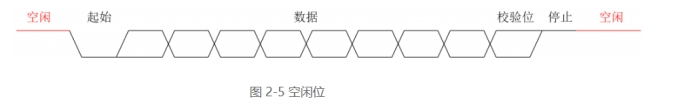
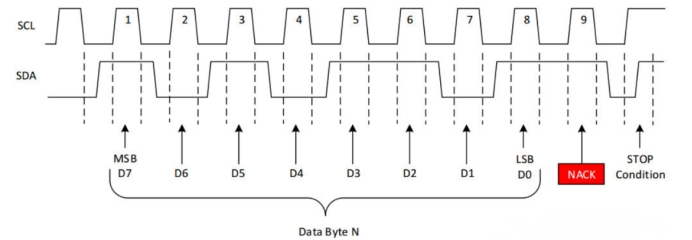
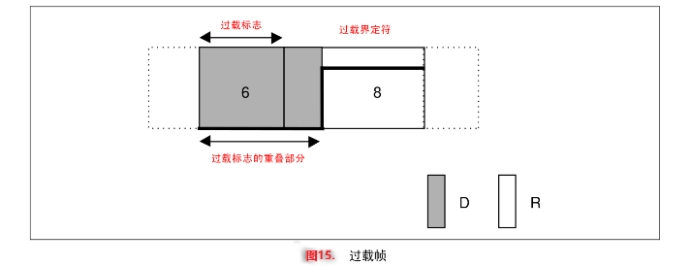

[TOC]

**HTTP是什么样子的模型**

 HTTP是基于请求-响应的模型。

http协议规定，请求从客户端发起，最后服务器应该处理请求并且返回。也就是说肯定要从客户端开始建立通信的，服务端没有接收到请求之前不会响应。

**http协议是无状态协议吗？特点？怎么解决？**

 无状态协议对于事物处理没有记忆能力，缺少状态意味着后续如果要处理前面的信息，是没有办法的。HTTP协议是无状态协议，自身对于请求和响应之间的通信状态不进行保存的。

 解决方式：Cookie机制。比如登录网页后记住账号密码，下次登录不用输入也不是http的功劳，而是cookie记住了。

 解决方式：session机制

**cookie机制和session机制的区别**

 存储位置：cookie存储在客户端(浏览器)中，session存储在服务器端

 数据存储:cookie以键值对的形式存储数据，大小一般限制为4kb。session可以存储任意数据，大小由服务器决定。

 持久性：cookie可以设置有效期。持久性的在浏览器关闭后仍然存在，会话类型的在浏览器关闭就消失。session在会话期有效，关闭浏览器或者关闭会话则消失。也可以要通过服务器来设置

 安全性：cookie存储在浏览器，容易收到攻击。session存储在服务器端，相对比较安全。

 用途：cookie一般存储在客户端访问的小数据，比如用户偏好，id等。session适合用在服务器端维护的重要会话数据，比如用户登录状态、购物车内容。

**http协议中的302状态**

返回状态码为302表示临时重定向，表示资源被转移到了另外一个人URL。这种情况下，服务器返回的头部信息中会有一个location字段，内容就是重定向到的URL。

重点：

 302表示的是临时重定向，资源会在某个时间点返回原来的URL。

 客户端行为：现在的浏览器会自动处理302响应，并且自己重定向到新的URL

 SEO考虑：对于搜索引擎优化(SEO)而言，302表示资源的转移为临时的，搜索引擎并不会把权重给新的URL。如果重定向为永久的，用301更合适。

**HTTP协议的请求方式**

HTTP1.0定义了三种请求方法： GET, POST 和 HEAD方法

HTTP1.1新增了五种请求方法：OPTIONS, PUT, DELETE, TRACE 和 CONNECT

 GET: 通常用于请求服务器发送某些资源

 POST: 发送数据给服务器

 PUT: 用于新增资源或者使用请求中的有效负载替换目标资源的表现形式

 PATCH: 用于对资源进行部分修改

 DELETE: 用于删除指定的资源

 HEAD: 请求资源的头部信息, 并且这些头部与 HTTP GET 方法请求时返回的一致. 该请求方法的一个使用场景是在下载一个大文件前先获取其大小再决定是否要下载, 以此可以节约带宽资源

 OPTIONS: 用于获取目的资源所支持的通信选项

 CONNECT: HTTP/1.1协议中预留给能够将连接改为管道方式的代理服务器

 TRACE: 回显服务器收到的请求，主要用于测试或诊断

**http的请求报文是什么样子的**

请求报文由四部分组成。

 请求行：

 方法字段：比如get，post，put等

 URL字段：统一资源标识符，指定资源的位置。比如/index.html

 http协议版本:使用空格分开。比如HTTP/1.1

 请求头部：每个字段由关键字和值组成，使用：分开。提供了关于请求的额外信息：host目标主机和端口、User-Agent用户代理软件的信息，通常是浏览器类型及版本、操作系统等

Accept:服务器可以根据 Accept 字段返回客户端能处理的内容类型，比如 JSON、XML、HTML 等。

Host: www.example.com

User-Agent: Mozilla/5.0 (Windows NT 10.0; Win64; x64) AppleWebKit/537.36 (KHTML, like Gecko) Chrome/58.0.3029.110 Safari/537.36

Accept: text/html,application/xhtml+xml,application/xml;q=0.9,image/webp,image/apng,**/**;q=0.8

 空行:分隔符。用于分隔请求头部和请求实体。

 请求体：post，put等请求携带的数据

**http的响应报文是怎么样的：**

响应报文通常分为四部分。

 响应行。由协议版本、状态码、和状态码的造成原因组成。比如：HTTP/1.1 200 OK

 响应头：包含一系列关键字/值对，提供关于响应的额外信息。常见的有响应的生成日期和时间：Date: Sat, 03 Aug 2024 12:28:53 GMT。服务器软件的信息：Server: Apache/2.4.1 (Unix)

响应体的数据类型：Content-Type: text/html。等等

 空行

 响应体：服务器响应的数据。比如：

<html>

<body>

<h1>It works!</h1>

</body>

</html>

**响应码介绍：**

 2xx成功，比如200 OK：请求成功，服务器已成功处理请求。

 3xx重定向，比如301 Moved Permanently：请求的资源已永久移动到新位置。302重定向

 4xx客户端错误：400 Bad Request：服务器无法理解请求，由于语法格式错误。

 401 Unauthorized：请求需要用户认证。

 403 Forbidden：服务器拒绝请求，客户端无权访问资源。

 404 Not Found：请求的资源未找到。

 5xx服务器错误，500 Internal Server Error：服务器内部错误，无法完成请求

**GET和POST的区别：**

两个概念：

 安全：是指只读特性，就是使用这个方法会不会对服务器状态有影响

 幂等：同一个请求执行多次和执行一次的效果是完全相同的。

 最大区别应该是GET是请求服务器的资源，不会对资源有影响。post是提交资源到服务器，会导致服务器上的资源有所变化。

 参数的传递方式：

 get的请求参数(即查询字符串)被附加在URL后面，通过URL传递，比如http://example.com/page?name=value，会显示在浏览器地址里面

 post请求参数放在请求实体中，通过http请求的正文发送，不会显示在URL里面，更为的安全。

 数据长度的限制：

 get参数放在URL长度种，会被浏览器和服务器限制，一般最长为2048字符左右。

 post长度没有明确限制，可以传输大文件

 缓存：

 get可以被缓存，因为其是幂等的，多个get返回相同的结果。

 post不可以被缓存，因为其会改变服务器的资源。

 可见性

 GET参数在URL中可见，所以敏感数据不应该用GET。

 post参数在实体中，更为的安全，但是也不是很安全，同https加密传输才对。

 特性

 get：安全、幂等

 post：不安全，不幂等

**http协议的特点：**

 http连接：限制每个连接只处理一个请求，服务端完成客户端请求后就断开连接。(传输速度块，减少不必要的连接，但也意味着每一次访问都需要重新连接，效率低。可以通过设置头信息的Connection:keep-alive来实现不断开)

 http无状态：对处理过的事务没有记忆。可以通过cookie，session机制解决

 客户端/服务端模型：

 简单快速

 灵活：可以传输任何类型数据

**http和https有什么区别？为什么还要https？**

 https有ca证书，http没有

 http是超文本传输协议，信息是明文传输。https则是具有安全性的ssl加密传输协议。

 http默认是80端口，https默认是443。

 https是安全版的http，http使用明文进行传输，对于一些敏感信息的传输就很不安全。

**http的请求头的Connection: keep-alive的目的和作用**

之前也说到过，http处理完一次请求后就会断开连接，想要再次请求就必须重新创建连接。而创建连接的过程中需要消耗资源和时间，所以引入了重用连接的技术。

在http请求头部加入一个**Connection: keep-alive**来高速服务器请求响应完毕后不要关闭，这个连接还需要使用。

 

**TCP/UDP相关**

**TCP是什么？**

TCP的全程Transmission Control Protocol，传输控制协议，用来确定计算机连接到网络以及和网络之间的数据传输规定。

特点：

 确保连接的建立和数据包的发送

 支持错误重传机制

 支持拥塞机制，能在网络堵塞的情况下延迟发送

 提供错误校验和，鉴别有害数据包

**TCP/IP两者的关系：**

 TCP负责确保数据包传输过程中的可靠性、完整性和顺序。

 ip负责将数据从源设备传输到目的设备，处理的是两者地址的寻找和实际的数据传输。

总的来说：IP层接收由更低层发来的数据包，并把该数据包发送到更高的TCP层；相反，IP层也把从TCP接收来的数据包传送到更低层。

**TCP/ip以及TCP/udp**

为什么一般都提及到tcp/ip但是不怎么说udp/ip？

 首要明确udp/ip也是存在的一种方式，并不是不存在

 应用场景问题：tcp/ip提供了可靠的数据传输服务，应用的场景很多。但是udp不可靠性能高的的应用场景较少。

**TCP的三次握手和四次挥手**

 三次握手用于连接服务器和客服端

 第一次握手：客户端发送一个SYN包(同步包，有客户端序列号)给服务器。此时客户端进入SYN_SEND状态，等待服务器的确认。服务器接收到这个SYN包，此时服务端知道客户端的发送正常，服务端的接收正常。

 第二次握手：服务器收到SYN包(有客户端序列号)后会先确认，然后发送一个ACK包，值等于客户端序列号+1。然后再发送自己的SYN包。所以这一步是返回一个SYN+ACK包。并且服务器进入SYN_RECV状态。客户端接收SYN+ACK包,此时客户端知道了客户端的发送和接受正常，服务端的发送和接收正常。

 第三次握手：客户端返回一个ACK包表示收到了服务器的SYN包，这个ACK包=服务器序列号+1。服务器接收到这个ack包以后，服务端知道了服务端的发送正常，客户端的接收正常

需要三次握手的目的就是，服务端和客户端都必须知道四个事情，自己的发送和接收正常，另外一方的发送和接收也正常。

ack包的作用:假设第二次握手出现问题。那么第三次握手的时候，客户端确认ACK包的时候就会发现值并不是客户端的值+1，表示出错。

 

 为什么要三次握手，而不是二次就结束，最后还要确认？

主要就是为了防止重复的连接，比如：

客户端的第一个SYN包请求过程因为网络问题阻塞了。过了一会又重新发起一个，此时正常了，2次握手后正常连接，传输数据，断开连接。

这个时候第一个SYN包又来了，经过第一次、第二次握手就又连接上了，但是这个是无效连接。

如果是三次的话：经过一次握手，两次握手这部分都是一样的，第三次握手的时候，客户端通过接收到的syn-arc包这是自己之前发送的无效连接请求了，就不会确认，第三次回复一个不连接，不会造成无效连接。

 四次挥用于释放连接

 

 第一次挥手：假设是客户端想要结束连接，发送一个FINISH(FIN)包给服务器，此时客户端不会发送数据给服务端了。但是可以接收服务端数据。

 第二次挥手：服务器接收FIN包，告诉上层停止连接的需求，并且返回一个ack确认包。客户端收到ack包后等待数据传输完毕

 第三次挥手：服务端数据发送完毕以后，服务端发送一个FIN连接关闭报文，等待客户端确认。

 第四次挥手：客户端收到服务端的FIN包以后发送确认的ACK包，服务器收到ACK包以后释放，完成关闭。但是客户端需要额外等待2倍的MSL时间后才释放客户端。

 服务端的完全关闭连接要比客户端早一点。

 为什么客户端不能直接关闭，还要等待2倍的MSL时间？

   因为客户端要确保发送的ACK包能够被服务端正确接收，如果没有正确接收，服务端会重新发送FIN包请求断开。这个时候等待的2倍MSL时间内就可以接收到服务端的再次发送。

   这也是为什么服务端关闭要更早，因为服务端发送完确认后直接关闭，而客户端还要等待一点时间。

 为什么断开连接需要四次

   因为确认和数据传输是分开确定的，服务端能够及时的告诉客户端同意断开连接，但是并不能直接停止数据的传输。只有数据传输结束后才能通知客户端断开连接。

 连接建立后，如果客户端出现故障了怎么处理？

  TCP设置了保活计时器，如果没有在时间内收到客户端的数据，服务器会每隔75s发送一个探测报文，10个报文后仍然没有回复，就断开连接。

**TCP和UDP区别：**

 

 两者都属于OSI模型中的传输层。

 TCP：面向连接的字节流传输方式，可靠。适合文件传输、邮件传输、聊天消息等。需要三次握手连接和四次挥手断开连接。不支持广播。

 字节流：可以发送任意长度，没有明确边界。

 连接什么意思：在数据传输前，tcp需要进行三次握手，确保数据的可靠传输和到达。

 UDP：面向无连接的数据段传输方式，不可靠。适合视频流、直播流等。速度快。

 数据报文段：数据作为独立报文段，每个报文有明确边界。每个报文拥有源地址、数据、目标地址等信息。

 面向不连接：数据发送前不需要连接，数据报文可以直接发送到目标地址。因为报文里面有地址信息。

 TCP会按照特定的顺序重排数据包，UDP数据包没有固定的顺序，相互独立。

 TCP传输数据较慢，UDP较快。

 TCP头部有20字节，UDP8字节。

 TCP发送会确认，并且会错误校验，可以进行错误恢复。UDP发送不确认，也会错误检查，但是是直接丢弃错误数据

 TCP是可靠的，会确保数据传输到目的地。udp不能确保数据一定传输到。

**TCP拥塞控制**

什么是拥塞：对网络某一资源的需求超过了该资源所能提供的可用部分，网络性能变差，就是网络拥塞。

 TCP拥塞控制的基本过程和关键算法

 慢开始算法

 拥塞避免算法

 快重传和快恢复

 超时处理

 假定：数据是单向发送。接收方有足够的缓存，所以发送方的发送串口取决于拥塞程度即可。

 

 

 发送方维护一个拥塞窗口变量cwnd，只取决于网络的拥塞状态，并且动态变化。

 窗口变化元素：不出现拥塞就变大，出现拥塞就缩小一点

 判断是否出现拥塞的标准：有没有按时收到确认报文。也就是发生重传，判断为发生拥塞。

 发送方把拥塞窗口cwnd作为发送窗口swnd

 实际例子

 

 

 首先是慢开始阶段：并不是指拥塞窗口增长速度慢，而是输入较少

 拥塞避免算法阶段：拥塞窗口也就是发送窗口只能线性增加，也就是缓慢的增加。

 如上图所示：如果发送方超时重传，网络发生拥塞，发送方会重新开始慢开始算法，拥塞窗口调整为1。

 但是有个问题就是如果个别报文在网络中并不是因为拥塞丢失，但是被判断为拥塞丢失，重新进入慢开始会降低传输效率。

 快速重传机制

 

首先理解这个图里面的内容：

 按照正常的发送接收过程，每次接收到一个数据包之后都需要发送一个ack包，包指向接收数据的下一个数据，也就是说我想接收下一个数据。

 M3数据丢失后，并不影响接收方接收后面的数据，仍然会接收后存放在缓存区，但是并不会确认，所以不会发送确认ack。发送的是重复确认M3，这图有点问题。

 接收方接收到三次重复确认的ack包之后开始重新传递相关数据。

 接收方只有接收到了丢失的数据后，重新发送ack包，确认之前缓存的和重新接收的所有数据。

 快恢复机制

在发送方接收到三个重复确认后，知道是丢失了个别报文，而不是发生拥塞，于是执行的是快恢复算法。也就是发送窗口不是进入慢开始阶段。

 

 

 

 

 

**MODBUS通信协议：**

 属于OSI模型中的应用层

 modbus协议的类型：RTU、ASCII、TCP三种。

**通讯过程**

 主从通讯方式：线上主机和从机只能有一方在操作数据

 规定波特率：主机、从机没有时钟线，所以必须要设置一样的波特率才能准确读取数据

**帧结构：**

帧结构=地址+功能码+数据+校验

 地址：1/2个字节

 功能码：一个字节

 

线圈就类似于开关，一个位表示一个开关。03、06、10用的最多

寄存器就是存放数据的寄存器。

 数据：n个

 校验:RTU用CRC16校验、TCP使用CRC32

**通讯过程：**

主机发送，从机回复。

 03主机发送：

 

 读取0x0000地址处的保持寄存器的值。一个寄存器地址需要2个字节=16位来表示，modbus中通常都是高位在前，低位在后。

 读取数量为0002个寄存器的值。

 03从机返回：

 

 地址和功能码都是返回的和主机发送的一致。

 返回字节数：返回数目=寄存器的数目x2.

 data1第一个寄存器的高位，data2第一个寄存器的低位，组成寄存器的值0x000a，十进制的10。一个寄存器需要16位来表示=2个字节

 data3和data4一致

 06主机发送

 

 06仅针对一个寄存器

 06从机返回

和主机发送一致

 10主机发送

 

 根据发送的寄存器地址0x0000，需要写的寄存器数量0x0002，表示从0x0000开始写2个寄存器

 字节长度：表示写入的字节数目=寄存器个数x2

 第一个寄存器写入0x0c02，第二个寄存器写入0x1245

 10从机返回

 

 从机并不返回具体写入了什么值，只返回从哪个寄存器开始，写了几个寄存器的值。

 这里表示从0x0000开始，写了0x0002个寄存器的值。

**错误检测机制**

 循环冗余校验：CRC16，CRC32。项目里面用的是CRC16校验码。接收端接收到数据后也会计算一个校验码，如果和发送过来的校验码不同，那么说明发生错误，忽略该数据。

 ack确认码。从设备在成功处理请求后，会返回一个 ACK（确认）消息，表示已正确接收并处理了主设备的请求。对于功能码（Function Code）有效的请求，从设备会返回相应的数据或状态。

 超时重传设置。接收端没有在规定时间内接收到完整帧，会认为错误并且忽略该帧。发送端长时间没有接收到确认，会重发请求。

**UART协议**

 UART协议在物理层是简单的0/1逻辑，这就使得它可以用多个电压区别方式来实现。最常见的是开发板的TTL，还有RS232,RS485这些标准。//需要补充一下几个标准之间的电平差异，232和485的电平转换。

 UART是支持全双工通信的协议，一根线可以完成收/发其中一个功能，两根线就可以完成全双工通信。

 

**UART协议规范**

 

 空闲位

 

2个数据帧之间以高电平表示空闲，空闲时间越长表示数据间隔时间越长，单位时间内传输的数据越少

 起始位

 

 

接收端一直检测电平信号，当从空闲状态转为起始状态，也就是高到低，并且持续1个bit位的时间//这就需要考虑到波特率了，不同波特率对应的1个bit时间不同。意味着开始信号。

 数据位

 

 

使用校验位，数据长度为5到8位。不使用则5到9位。数据低位在前。

低位在前的含义：比如要发送的数13=1110，那么发送的顺序实际是0111。接收到的顺序也是0111，后续需要对接收到的数据重构，重新获得1110。

5位数据是为了兼容一些以前的标准，一般是8位，8位可以覆盖全部的ascii码。

 校验位：

 

判断接受过程中数据是否有错误。一般为是奇偶校验位。

 奇校验位：如果数据中1的个数为奇数，那么这个校验位写1，使得总数为偶数。

 偶校验位：如果数据中1的个数为偶数，那么这个校验位写1，使得总数为奇数。

发送的时候根据数据计算校验位，接收端根据接收到的数据计算校验位，如果不符合，表示出问题。

问题：奇偶校验位只适合检测一个bit的错误，1101到1111，他能检测出来，1101 到1110他就无法检测，因为1的个数没有改变。

 

 停止位

 

停止位表示一帧数据的结束，实际是持续一段时间的高电平，1bit，1.5bit，2bit的持续时间。

 

**通信双方通信的时候必须约定好的东西：**

 每一个数据位的时间长度T。波特率=1/T，所以和波特率的设置有很大的关系。。

波特率：每秒接收到的码元个数，不是bit位数，每个码元可以包括1bit或者多个bit。

比特率：每秒可以接收到的bit位数，通常比特率是波特率的整数倍，看波特率的码元包含几个bit。

 

如果没有约定好波特率，接收方会按照错误的方法接受数据。

 结构中每一项的具体位数

 是否有校验位以及校验位的机制

**同步传输和异步传输：**

 同步传输：同步传输需要依靠时钟信号，把数据字节组合起来按照帧的形式发送，速度较快。

 异步传输:  不需要时钟信号，但是接收和发送方需要按照规定的速度读取数据，也就是有着相同波特率。数据按照字节传输，速度慢。

**RS232和RS485通讯接口：**

 

 

**RS232**

 rs232采取不平衡传输方式，也就是单端通讯，使用正负电压表示二进制数据，不是高低电压。

一般是+12 -12这样子。

 rs232适合本地设备之间的通信，距离一般不超过20m。

 rs232只允许一对一通信

 线路是单线路的半双工，需要2根线才能达到全双工

 信号电平对地参考，抗干扰能力弱。

**RS485**

 rs485采取平衡传输，也就是差分传输.使用成对的信号线(差分线)来发送信号。一根线发送数据，一根返回电流。

   电气特性；不是通常的0/1来表示高低电平，而是两根线之间的电压差。如果 A 线比 B 线电压高，表示逻辑 "0"；如果 B 线比 A 线电压高，表示逻辑 "1"。

一般是+5  -5

 rs485传输距离为几十米到上千米。

 rs485接口在总线上允许最多128个收发器。

 rs485使用差分电平表示数据，必须要2根线实现半双工。需要4根线，2根发送，2根接收，才能达到全双工。

 差分传输抗干扰能力强

**USART协议：**

usart是一种和uart协议十分类似的协议，支持同步传输和异步传输两种方式。在同步传输的模式下需要设置额外的时钟线。

**IIC通信协议：**

半双工、主从、同步协议。

**总线结构**

 

 所有设备引脚都需要为开漏输出模式(OD),然后通过上拉电阻连接到总线上，实现设备之间的线与。

IIC设备使用开漏结构或者说开漏输入的原因：

 实现线与。

开漏结构使得晶体管可以实现拉低，但是无法实现拉高，拉高必须要通过上拉电阻。

当所有的设备都为高的时候，那么总线呈现高。

当其中有一个设备为低的时候，总线呈现为低，因为高电平会被低的覆盖。这就是线于，意思就是总线状态由使用总线的设备控制。

 所有设备都有7位或者10位的地址，7位最常见，高四位由厂家定义，低三位自己设定。

 漏极开路/集电极开路的缺点是对于一个距离长的数据线，信号传输速率得不到有效保证。更长的走线对于输出驱动器表现为更大的容性负载，等效容性负载C和信号线的上拉电阻R构成RC振荡器。RC越大，意味着反射和振荡越强，从而影响总线的信号完整性。这也是I2C规范对总线电容值约束在400pf以内的原因。

**为什么stm32的芯片在IIC设备时不使用内部自带的上拉电阻**

 内部的上拉电阻太大，会影响时钟频率。

 外部较小的电阻可以减小总线的电容总值，减少对 时钟频率的影响

 外部电阻阻值较小，可以提供更强的驱动能力，驱动更多的设备。

 IIC总线要求规范用外部上拉电阻。使用外部电阻可以更好的调节，更好的兼容。

 外部上拉电阻为4.7k欧，较小

**工作时序：**

 数据有效性

 

 SCL为高的时候，允许对数据的读取。比如主设备在这个时候读取SDA线上的从设备的数据。

 SCL为低的时候，允许SDA数据的改变。比如一个数据被主设备读取完毕，从设备需要准备第二个数据，在这个时候允许改变SDA线上的数据。

 开始和结束

 

SCL为高，SDA从高到低是开始。

SCL为高，SDA从低到高是结束。

 重复开始信号

一个周期结束后不给停止信号，而是一个时钟周期内再次给开始信号。

 字节格式

 

 

SDA数据线上是高位数据在前，低位数据在后，8位(一个字节)数据传输完毕后必须跟着ACK应答信号。

 数据传输过程：2张图都是

 

 

 无论是读还是写，主机都要先发送设备的地址，然后设备都需要回复ACK应答信号。

 应答信号ACK由接收方传递给发送方，告诉发送方数据接收完毕，可以继续发送数据。

 主机产生这个过程中所有的始终SCL，包括应答信号所用的第九个时钟

 发送方在第九个时钟的时候释放SDA的控制权，因为要接受接收方的回复信号

 ACK为接收成功，低电平，NACK为接收失败，高电平。

例子：

主机发送数据，从机接收时，ACK信号由从机发出。当在SCL第9位时钟高电平信号期间主机等待回复信号，如果SDA仍然保持高电平则表示接收失败，则主机可以直接产生STOP条件终止传输或者继续ReSTART开始一个新的传输。

**完整的iic时序图**

 

首先是传输地址，读还是写，然后是应答信号。

数据传输部分就是如下，传输完毕回复应答信号。不停止的话就是一直传输。

 

**IIC数据传输的实质**

主机把要发送的数据放到SDA数据线上，时钟到了之后从机会自动读取数据线上的数据，直到8位数据传输完毕。第九位应答位的时候，应该是从机放数据，主机读取。

**IIC协议影响速度的因素**

 时钟频率：通信的速率主要由主设备生成的时钟信号SCL决定。常见的包括标准模式100khz、快速模式400khz、快速模式+1Mhz、高速度模式3.4mhz

 主设备和从设备的硬件设计决定了其能够支持的最大时钟频率。

 总线上的电容负载。电容会影响上升和下降的时间，电容变大导致信号变慢，限制了时钟频率。设备数量、连线长度、PCB设计都会影响电容。

 上拉电阻：较大的上拉电阻会变大总线的上升时间，从而影响时钟频率。

 

**硬件IIC和软件IIC的区别**

 硬件IIC需要依靠处理器中专门的IIC外设模块。优点：不占用CPU。缺点就是必须要额外的硬件资源。

 软件IIC灵活性较高，可以把普通的GPIO通过变成的方式实现IIC协议。优点：不需要专门的iic外设模块。缺点：时序完全由软件控制，时序精度和可靠性较低。代码编写负责复杂。

**IIC的仲裁机制**

 什么时候发生仲裁

IIC是一个支持多主机多从机的通讯协议，当多个主机检测到总线空闲，那么就想要发送数据，两个主机发送的时间间隔很短。这就导致主机无法检测到总线上的电平变化，误认为总线空闲。

 仲裁怎么处理

仲裁是通过SDA线来完成。

IIC实现了线与，因此低电平是显性电平，可以让总线为低。

A发送1011 B发送1001，到了第三位B发送低，拉低了SDA。此时A发现自己发送的高电平和数据线此时为低是冲突的，那么A就退出仲裁，B使用总线。并且A之前发送的数据是不会被从设备获取的。

 时钟同步

时钟同步只会发生在仲裁时。

 

空闲的时候scl被上拉电阻拉高。通信后主机的scl就会接入到总线的scl。clk1和clk2是两个主机的scl。因为不用的主机配置的IIC速率可能不一样

 CLK1率先变为低电平，由于线与特性CLK2也变成低电平。

 但是CLK2的低电平时间更长（时钟周期更长，CLK1的周期更短），即使主机1内部的CLK1已经变成高电平，SCL的实际电平仍然和CLK2保持一致。此时，主机1将会检测到这一情况，并从此时开始计数（计算低电平持续的时间，即下图中的wait state，稍后用）

 CLK2迎来高电平之后，主机1内部的wait state结束，因为两者都为高，因此SCL总线进入高电平，两个主机内部都会开始对高电平持续的时间进行计数。

 随后，CLK1会比CLK2先回到低电平（此时CLK1的周期仍然比CLK2更短）。

 现在，CLK1以及获得了需要延长的低电平时间，CLK2也获得了需要减短的高电平时间（都是通过刚才的计数获得的），两个主机会根据之前的计数重新调整自己的时钟周期，从而完成时钟同步。

时钟同步低电平时间取决于低电平时间长的那个，高电平时间取决于短的那个。

**面试内容提炼**

 任何期间既可以作为主机也可以作为从机，但是同一时刻只允许有一个主机

 主设备发送一段数据后，从设备需要回复一个ack

 设备选择由地址决定，8位，减去一位广播地址，所以一共7位的地址。地址0x00是广播地址不可以使用。所以一共127个设备最多。

**SPI通信协议**

全双工、主从、同步。

**总线结构：**

 

 使用推挽输出连接，因为SPI协议不需要依靠拉低什么线来实现设备的选择，他是通过片选信号。

**数据传输：**

 SPI协议通过CS片选信号来确定和哪个设备通信，所以数据流里面并不需要发送设备地址。

 关于SPI协议的数据回环：

 为了测试通信是否成功，主设备发送一个数据给次设备，次设备回复接收到的这个数据，那么数据是一致的

 独立的数据交换：主设备发送命令字节给从设备，从设备返回状态或者数据。这2个数据肯定是不同的

 寄存器访问：主设备发送读取命令数据，从设备返回相对应的数据。这2个数据也是不同的

 SPI协议没有IIC类似的开始和停止信号，完全是取决于CS片选信号的拉低和拉高。

 模式选择

 CPOL=0，空闲时为低。CPOL=1，空闲时为高。

 CPHA=0，数据采样时在时钟的第一个边沿(上边沿)。CPHA=1，数据采样的时候在时钟第二个边沿(下边沿)。

 

关于最后对于数据采样和移位的描述。数据的采样可以理解为获取数据，移位可以理解为移出获取到的数据，准备新的数据。

主设备发送数据和从设备获取数据的关系：实际上是从设备在收到时钟后获取数据，主设备并不会发送数据，只是把数据放到MOSI线上。

主设备接收数据和从设备获取数据的关系：实际上是主设备在收到时钟后读取MISO总线上的数据，从设备会把数据放到MISO总线上。

 00模式

 

第一个上升沿来之前MOSI和MISO就需要准备好数据。

上升沿（前沿）：主设备读取MISO线上的数据实现主收从发从设备读取MOSI线上的数据，实现主发从收。

高电平的时候:处理接收到的数据，存到内存或者某些存储器。上升沿到高电平是一个连贯的过程，没有这个割裂的。

下降沿(后沿)：准备下一次的数据。并不是说下降沿就可以准备好，而是从下降到低电平持续期间准备好。

 01模式

 

 10模式

 

 11模式

 

**硬件SPI和软件SPI**

硬件SPI和软件SPI的优缺点其实是一致的。这里主要看下软件SPI的实现过程。以stm32的代码为例子。通信的主设备控制着时钟，根据时钟的上升沿或下降沿(取决于模式设置)发送和接收数据。

 设备的选择和挂起

设备的选择和挂起在原理上看来就是CS引脚的拉低和拉高，使用自带的写管脚的函数写低和写高就行。

 数据接收和读取

 

主设备发送数据和主设备读取数据是同时发生的。这个函数主要实现的就是发送和读取的功能。

 发送：发送只需要设置好发送总线MOSI需要发送高或者低就行，当SCK的时钟来的时候，从设备会自己读取。所以说上面虽然没有明面上设置时钟，但是从设备检测到下面的时钟出现的时候会自己读取数据。

 接收：只需要设置一个8位的变量移位接收MISO总线上的数据即可。

 

而发送和接收函数也只是调用transfer函数，只不过在开始前选择从设备即可。但是发送和接收函数只是使用了其部分功能。

 发送和接收是可以同时实现的，单独调用transfer就行

 但是在实际应用中基本都分离为2个函数来实现，因为这样子代码更加的清晰和好理解。

## can通信协议

异步的半双工协议。

**两个分类：**

 闭环的结构

 

通过120欧的电阻使得信号线形成回路。是高速、短距离的设计方式。

 

 开环的结构

 

通过2.2k欧的电阻链接，是低速长距离的设计。

**信号表达：**

和RS485一样，can协议使用双绞线差分方式表示数据。通过H和L的电平差表示数据0/1。

 

显性表示1，隐性表示0。

高速低速的具体判别方式不同

 

**位时序措施**

异步通信，所以收发双方必须约定好对应的波特率。can协议还设计了位同步机制来吸收波特率带来的误差、吸收误差。

 

总线电平:经过差分计算出来的实际高低电平。

把每一个bit分为大致的四个段：

 同步段ss

 传播时间段pts

 相位缓冲段1psb1

 相位缓冲段2pbs2

stm32下传播时间段和相位缓冲段1合并为一个bps1。

xxxx同步措施

**帧的类型****：**

 

 数据帧：

节点发送的包含id和数据的帧。发送单元向接收大员传送数据的帧。

 

以标准格式为主。

 起始位：1个显性：0

 仲裁位：11位标识符+远程传输请求位

 控制位：6位，数据长度代码和2个保留位

 数据段：8位

 CRC校验位：16位

 ACK段：2位

 帧结束EOF：7个隐性位

 遥控帧

接收单元向发送放发送的请求帧，要求发送方发送指定标识符id的数据帧

 

 起始位：1位，显性0

 标识符：11位

 RTR位：1表示这是请求

 控制位：6位

 CRC校验位：16位

 应答位：2

 结束位：7位

 **错误帧**

检测到错误的时候发送，用以通知其他节点出现错误，不要接收数据

 

 主动错误：错误计数器小于一定的值，节点发送主动错误帧。6个显性位(0)，会强制覆盖总线上其他的传输，总线通信被打断。可以立即恢复正常传输

 被动错误:错误计数大于一定的值，节点发送被动错误。6个隐性位，不会覆盖总线上的其他传输，总线通信继续。发送错误帧后仍然可以接收，但发送方会受到限制

 错误界定符：表示错误帧结束的字段，确保错误发生后能恢复使用。8个隐性位。

 **过载帧**

 

接收单元已经接受了数据，需要时间处理，可以发送过载帧延缓下一个帧的时间。

 主动过载标志：6个显性位。强制占据总线，通知其他节点延迟数据

 过载界定符：8个隐性位，表示结束。允许下一帧的开始。

 帧间空间

作用：确保帧之间的分隔，防止帧数据重叠。提供节点间的时间同步和检测错误的时间间隔。数据帧、遥控帧灯帧发送完成后自动生成帧间空间。

 

图有问题应该还有结束界定符。

 结束定界符：7个隐性位，表示前一个帧的结束

 位间隔段：起码三个位

 如果总线继续空闲，位间隔会一直变长

 

**仲裁过程****：**

依靠仲裁位。

 当多个节点同时开始发送数据时，它们会同时发送各自的仲裁位。

 每个节点在发送自己的ID位时，也会监听总线上的信号。如果一个节点检测到总线上的信号与它发送的信号不一致（即发生了位冲突），这意味着另一个节点正在尝试发送一个具有相同ID但更高优先级（ID值更小）的帧。

 在位冲突的情况下，检测到冲突的节点会停止发送，并进入错误处理程序，然后等待直到总线再次空闲，然后重新尝试发送。

 没有检测到位冲突的节点将继续发送其帧，因为它具有更高优先级或没有其他节点同时发送。

**实时性高****：**

 优先级机制。数据帧里面的标识符可以表示当前数据的优先级，高优先级可以抢占低优先级的帧。

 支持时间触发通信。虽然can通信仍然是以事件驱动的，也就是事件发生后传递数据。但是也支持时间触发，在规定的时间内发送数据。

**稳定性强：**

 强大的错误检测机制。支持CRC检测，ack检测，位检测。

 错误帧。检测到错误发送错误帧通知节点去除掉错误数据。

 自动重传。没有收到确认ack会自动重传数据。

 多主机架构。一个节点的故障不会影响导致整个系统的瘫痪。

 刚干扰能力强。双绞线差分方式传输信号。

**为何比RS485更加的合适**

虽然485同样使用了双绞线的差分传输方式，但是有如下不足：

 485只定义了物理层的电气特性，没有强大的错误检测机制，需要用户自己设计。can则是完整的协议

 多主机能力。485只支持一个主机，如果主机错误则系统全部故障。

 485不具备优先级调度能力，所有节点通信是平等的。

**全双工和半双工理解**

 半双工意味着同一时刻只可以发或者只可以收。常见的有，IIC、modbus，rs485(一般2根线实现差分电压传输数据，也可以加线配置为全双工的)

 全双工意味着可以同时发和收。有SPI，UART，USART.//串口有tx和rx引脚，是全双工的。RS232。can

**设计通信协议需要考虑的点**

 

## 总结

 

 IIC是其中传输距离最短的通信协议，收到电容、信号衰减等影响，一般就是1米到几米之间。

   SPI和IIC类似，都是较为近的传输距离，一般1米到几米之间。并且SPI用的是星形拓扑结构。

 图中对于串口协议的描述并不是很准确，开发板常用的tll串口通信一般就几米以内。RS232最远15米，RS485最远可以到1200米。

 串口是异步，其余两者为同步。

 异步通信不依靠时钟线，接收方和发送方有着自己的时钟。所以没有办法控制何时发送数据，也无法控制接收数据的速度，所以两者必须控制好一样的波特率。

 SPI和IIC则为同步，依靠单独的数据线和单独的时钟线，实现收发的完美同步。

 SPI和IIC通讯方式很不同，IIC依靠发送设备地址确定设备，依靠电平变化确实开始和结束。SPI只需要通过CS信号就可以确定设备，确定开始和结束。

 SPI适合高速的传输场景（几十Mbps级别的），IIC则较慢。

 IIC更适合多设备连接，最多127个，2^7-1,第一个地址给广播用去了。SPI不适合多设备了，每个设备都需要一个片选信号，受限于IO的数量。