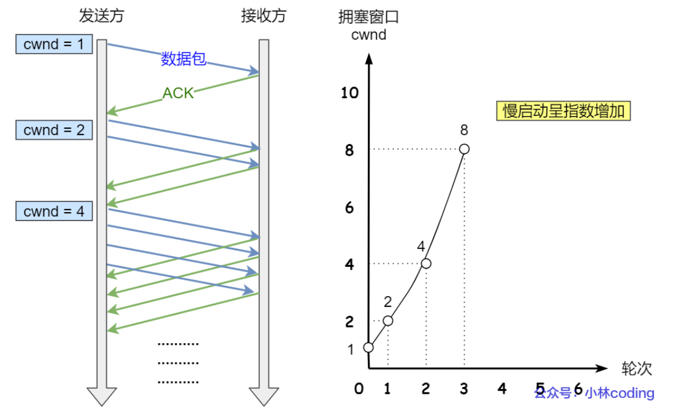
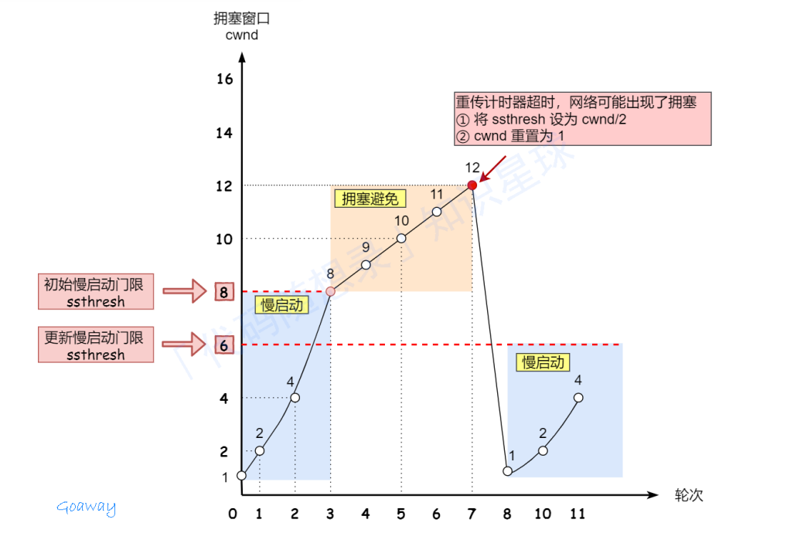
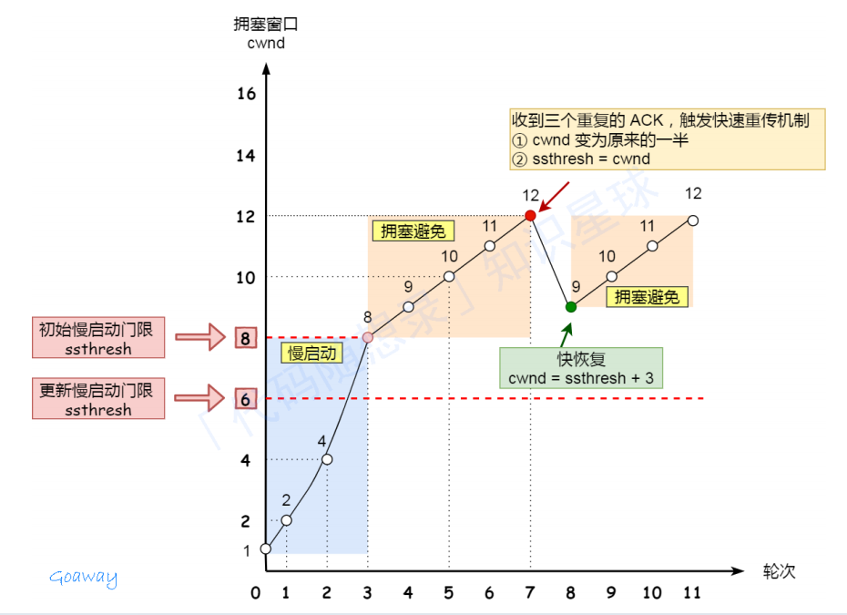

# `计算机网络`

[TOC]

## HTTP|超文本传输协议，Hypertext Transfer Protocol

基于TCP/IP协议之上的应用层协议，基于请求-响应模型

## HTTP|HTTP报文

### HTTP请求报文

**其主要由请求行、请求头、请求体构成** 

1. **请求行（Request Line） | 请求方法URI协议版本号**

   - 请求方法：GET、POST、PUT、DELETE、PATCH、HEAD、OPTIONS、TRACE

   - **URI**：统一资源标识符，指定所请求的资源位置。<协议>://<主机>:<端口><路径>?<参数>
     - 区别URL：统⼀资源定位符， URL是URI的⼀种特殊形式，它不仅标识资源，还提供了资源的位置信息，即如何定位和获取资源。  

   - 协议版本号：HTTP版本号

2. **请求头（Request Headers）**

   包含请求的附加信息。由 `key : value ` 组成，它可以包含很多不同的字段，用于告知服务器有关请求的详细信息。

   **一些常见的==请求字段==包括：**

   - ==Host==：指定服务器的主机名和端口号

   - ==User-Agent==：表示客户端的用户代理

   - ==Accept==：指定客户端可以接受的响应的MIME类型

   - Connect-Type：指定请求主体的MIME类型

   - Authorization：用于进行身份验证的凭据

     ```http
     GET /api/v1/resource HTTP/1.1
     Host: www.example.com
     User-Agent: Mozilla/5.0 (Windows NT 10.0; Win64; x64) AppleWebKit/537.36 (KHTML, like Gecko) Chrome/91.0.4472.124 Safari/537.36
     Accept: application/json, text/plain, */*
     Content-Type: application/json
     Authorization: Bearer <your_access_token>
     ```

3. **空行（Blank Line）**

   空行是请求头部和请求主体之间的空行，用于分割请求头部和请求主体

4. **请求体（Request Body）**

   承载多个请求参数的数据，请求主体是可选的，通常在发送POST、PUT等请求时包含请求的实际数据。

   

### HTTP响应报文

响应报文是服务器向客户端返回的数据格式，用于传达服务器对客户端请求的处理结果以及相关的数据。包括状态行、响应头、响应体。

1. **状态行(Status Line)** 

   - HTTP协议版本：一般为HTTP/1.1
   - HTTP状态码 
   - 状态信息:对状态码的简要描述  

   ```http
   HTTP/1.1 200 OK
   ```

2. **响应头部(Response Headers)** 

   类似请求头，以键值对形式提供响应的附加信息。告知客户端有关请求的详细信息。

   **一些常见响应头部字段：**

   - Content-Type：指定响应主体的MIME类型
   - Content-Length:指定响应主体的长度（字节数
   - Server：指定服务器的信息
   - Location：在重定向时指定新的资源位置
   - Set-Cookie：在响应中设置Cookie

   ```http
   HTTP/1.1 200 OK
   Content-Type: text/html; charset=UTF-8
   Content-Length: 3145
   Server: nginx/1.18.0
   Location: http://www.example.com/redirected-page
   Set-Cookie: userSession=abc123; Max-Age=3600; Path=/; HttpOnly
   
   <html>
   <head>
       <title>Example Page</title>
   </head>
   <body>
       <h1>Welcome to Example.com</h1>
       <p>This is a sample page.</p>
   </body>
   </html>
   ```

3. 空行(Empty Line):分隔响应头部和响应主体  

4. **响应主体(Response body)**

   包含服务器返回给客户端的实际数据。例如，当请求⼀个网页时，响应主体将包含HTML内容。响应主体的存在与否取决于请求的性质以及服务器的处理结果。

> MIME（Multipurpose Internet Mail Extensions，多用途互联网邮件扩展）是一种标准，最初设计用于定义电子邮件消息的格式，包括消息的类型、编码方式以及消息的其它属性。MIME 使得电子邮件能够支持文本以外的多种数据格式，如图像、音频和视频等。

## HTTP|HTTP状态码

1. **1xx（信息性状态码）**：接收的请求正在处理。

- 100：继续。客户端继续其请求

- 101：切换协议。服务器根据客户端的请求切换协议。只能切换到更高级的协议。例如，切换到HTTP的新版本


2.  **2xx（成功状态码）**：请求正常处理完毕。200、204、206
    - 200：客户端请求成功
    - 204：服务器成功处理了请求，无返回内容
    - 206：服务器成功处理了部分GET请求，服务器返回的body数据是资源的一部分

3.  **3xx（重定向状态码）**：表示需要后续操作以完成请求。301、302、304
    - 301：永久重定向
    - 302：临时重定向
    - 304：（未修改）上次请求后，请求网页没被修改

4.  **4xx（客户端错误状态码）**：400、403、404
    - 400：请求报文语法有误，服务器无法识别  
    - 401：请求需要认证
    - 403：请求的资源禁止被访问
    - 404：服务器无法找到对应资源

5.  **5xx（服务器错误状态码）**：500、501、502、503、504、505  
    - 500：服务器内部错误
    - 503：服务器正忙
    - 504：充当网关或代理的服务器，未及时从远程服务器获取请求
    - 505：服务器不支持请求的HTTP协议版本，无法完成处理


## HTTP|请求报文的`请求方法`

1. **GET：获取资源**，不对服务器产生影响（安全、幂等）
2. **POST：发送数据**，**例如提交表单数据、上传文件等，会影响服务器，服务器可能动态**创建新的资源（资源不存在时，区别PUT）或更新原有资源**（不安全、不幂等）
3. HEAD：类似GET，**仅要求服务器返回头部信息**，不返回实际的资源内容。 
4. PUT：用于更新服务器上的资源或创建**新资源**  
5. DELETE：请求服务器**删除指定的资源**。  
6. TRACE：**测试**。要求目标服务器返回原始的HTTP请求内容  
7. PATCH：对资源进行**部分更新**
8. CONNECT：用于代理服务器
9. OPTION：获取服务器支持的HTTP方法列表，以及针对指定资源支持的方法

- **安全：**请求方法不会破坏服务器资源
- **幂等：**多少次相同操作，结果不变

|          |                 GET                  |                          POST                          |
| :------: | :----------------------------------: | :----------------------------------------------------: |
|   基本   |        获取资源，不影响服务器        | 提交数据，影响服务器，可能动态创建新资源或更新原有资源 |
| 参数传递 | 写在URL中，数据量小，只接受ASCII字符 |        写在请求体中，无长度限制，无数据类型限制        |
| 协议版本 |               HTTP1.1                |                        HTTP1.1                         |
| 编码方式 |             只能URL编码              |                    支持多种编码方式                    |
| 安全幂等 |              安全、幂等              |                     不安全、不幂等                     |
| 时间消耗 |            一个TCP数据包             |  两个TCP数据包，先发送Header，响应，浏览器再发送data   |
| 缓存机制 |       可以被缓存，浏览器可回退       |                       不会被缓存                       |

## HTTP|1.0，1.1，2.0和3.0的区别

**HTTP/1.0**

- 每个请求建立一个新的 TCP 连接，效率较低。
- 默认短连接，缺乏持久连接，导致开销大。
- 不支持请求管道化（即同时发送多个请求）。

**HTTP/1.1**

- **持久连接**：默认情况下使用持久连接（Connection: keep-alive），减少了连接建立的开销。
- **请求管道化**：支持在一个连接上同时发送多个请求，虽然仍有顺序限制。
- **缓存控制**：引入了更复杂的缓存机制和状态码（如 206 Partial Content）。
- **带宽优化**：支持范围请求（Range Requests），允许部分内容下载。

**HTTP/2.0**

- **二进制协议**：与文本协议（如 HTTP/1.x）不同，HTTP/2 使用二进制格式，提高了传输效率。
- **多路复用**：允许在一个连接上并行处理多个请求和响应，消除了队头阻塞问题。
- **服务器推送**：服务器可以主动推送资源到客户端，减少延迟。
- **头部压缩**：通过 HPACK 算法压缩头部信息，减少传输数据量。

**HTTP/3.0**

- **基于 QUIC**：HTTP/3 使用 QUIC 协议，基于 UDP，而不是 TCP。这提高了连接建立速度和传输效率。
- **更好的抗丢包能力**：QUIC 在丢包情况下表现更好，可以更快恢复，减少延迟。
- **多路复用和流控制**：类似于 HTTP/2，但在 QUIC 中实现，进一步优化了性能。

**总结**

- **HTTP/1.0**：基础版本，效率低，连接开销大。
- **HTTP/1.1**：引入持久连接和管道化，改进了性能。
- **HTTP/2.0**：采用二进制协议和多路复用，显著提高传输效率。
- **HTTP/3.0**：基于 QUIC，优化了连接速度和抗丢包能力。

## HTTP|HTTPS区别

- HTTP协议传输的数据都是未加密的，也就是明文传输，存在安全风险的问题。HTTPS在TCP和HTTP网络层之间加入了SSL/TLS安全协议，使得报文能够加密传输。
- HTTP连接较为简单，TCP三次握手之后就可以进行HTTP报文传输，而HTTPS在握手之后，还要进行SSL/TLS握手，才可以进行传输；
- 默认端口：http-80  https-443
- HTTPS需要向CA（证书权威机构）申请数字证书，来保证服务器的身份是可信的

## HTTP|HTTPS怎么保证安全的，保证的是哪部分安全

HTTPS 在 HTTP 与 TCP 层之间加入了 SSL/TLS 协议，以确保传输的数据在⽹络上的安全性HTTPS保证了三个主要方面的安全

- 信息加密：HTTPS 使用 **混合加密机制**，对称加密用于数据本身加密解密，非对称加密用于安全地交换密钥。确保第三方无法被解惑或窃听；
- 校验机制：HTTPS 使用 **消息摘要算法** 来确保数据的完整性，以检测数据是否在传输过程中被篡改；
  - 摘要算法：哈希函数，由内容推出唯一哈希值，哈希值无法反推内容。
- 身份认证：HTTPS 使用 **数字证书** 来验证服务器的身份。这些证书由受信任的第三方机构签发。

## TCP/IP四层模型 | OSI七层模型

OSI 模型是广泛用于教学和概念解释的标准模型。它详细描述了每一层的功能，因此在解释具体协议时，使用 OSI 模型能提供更清晰的分层概念。


- 应用层：主要为应用程序提供服务，工作在用户态，以下几层工作在内核态；
  - 应用层：负责给应用程序提供统一的接口：HTTP、FTP、DNS
  - 表示层：负责把数据转换到兼容一个系统的格式：LPP轻量级会话协议。**数据格式的转换、加密和解密等操作**
  - 会话层：负责建立、管理和终止表示层实体之间的通信会话：LDAP轻型目录访问协议

- 传输层：包含**TCP和UDP协议**，负责建立、管理和维护**端到端的连接**；SCTP
- 网络层：路由和寻址，负责IP的选择和路由的选择；ICMP、**`IP`**
- 网络连接层：也可以分为数据链路层和物理层，主要为网络层提供链路级别的传输服务，负责在以太网、WIFI这样的底层玩咯上发送原始数据包。
  - 数据链路层：负责数据的封帧和差错检测，以及MAC寻址：ARP协议。以太网（Ethernet）协议属于数据链路层的协议
  - 物理层：网络中比特流的传输，通过物理介质传输0和1


## TCP|TCP三次握手

1. 一开始，客户端和服务端都属于 **`close`** 状态。先是服务端主动监听某个端口，处于 **`listen`** 状态

2. 客户端随机初始化一个序列号`clinet_isn`，将此序号至于TCP首部的序号字段中，同时把`SYN标志位`置为`1`，表示`SYN报文`。接着把第一个SYN报文发送给服务端，表示向服务端发送连接，该报文不包含应用层数据，之后客户端处于 **`SYN-SENT`** 状态；

3. 服务端收到客户端的`SYN报文`后，首先服务端也会随机初始化自己的序列`server_isn`，将此序列号填入首部的`序号`中；其次把TCP首部的确认应答号字段填入`clinet_isn+1`，接着把`SYN和ACK标志位`置为1，最后把报文发送给客户端，该报文不包含应用层数据。之后服务端处于 **`SYN-RECEIVED`** 状态；

4. 客户端收到服务端的报文后，还要向服务端回应最后一个报文。首先该应答报文`TCP首部ACK标志位`置为1，其次确认应答字段填入`server_isn+1`，最后把报文发送给服务器，**这次报文可以携带客户端到服务器的数据，之后客户端处于 `ESTABLISHED` 状态；**

5. 服务端收到客户端的应答报文后，也进入 **`ESTABLISHED`** 状态

   

## TCP|为什么不能是两次握手

1. 三次握手才可以阻止重复历史连接的初始化
2. 同步双方初始序列号，保证可靠的同步
3. 避免资源浪费

**如何避免历史连接的：**

如果客户端发送SYN报文(例如seq=90)，然后客户端宕机了。而且整个SYN报文被网络阻塞了，服务端没有收到。接着客户端重启后，又重新向服务端建立连接，发送SYN(seq=100)报文。客户端连续的发送了多次建立连接的报文：

- 旧syn报文比新syn报文先抵达服务器，服务端会返回一个SYN + ACK + **`AckNum`** + SeqNum的报文给客户端，这里的确认报文为旧报文+1(91:90+1)
- 客户端收到后，发现自己的期望的确认号应该是(100+1)，而不是(90+1)，所以就会 **`回复RST报文`**
- 服务端收到RST报文后，就会 **`释放连接`**
- 后续最新的SYN报文抵达服务端，通过100+1的确认报文完成第三次连接

如果RST报文来到服务器之前就来到了新的SYN报文，服务端会返回challenge ACK报文给客户端，仍然是上一个ack的确认号(90+1)。客户端收到后发送RST报文。

**二次握手为什么不可以**：

在俩次握⼿的情况下，**服务端在收到SYN报文后就进入了ESTABLISHED状态**，

**意味着这时可以向对方发送数据**，**但是客户端此时并无法保证进⼊ESTABLISHED状态**，服务端在向客户端发送数据前，并没有阻止掉历史连接，导致服务端建立了⼀个历史连接，⼜白白发送了数据。  

理论上在不存在拥塞，重传SYN或历史连接问题是可以使用两次握手。但是显示网络通信中，两次握手并不安全，容易收到攻击。

## TCP|TCP四次挥手

1. 客户端打算关闭连接，此时会发送一个TCP首部FIN标志位置为1的报文，也即FIN报文，之后客户端进入`FIN_WAIT_1`状态；

2. 服务端收到FIN报文后，就向客户端发送ACK应答报文，接着服务端就进入CLOSE_WAIT状态

3. 客户端收到服务端的ACK应道报文之后，进入FIN_WAIT_2状态；

4. 等待服务端处理完数据后，也向客户端报送FIN报文，之后服务端就进入LAST_ACK状态；

5. 客户端收到服务端的FIN报文之后，回一个ACK报文，之后进入TIME_WAIT状态

6. 服务端收到ACK应答报文，进入CLOSE状态，至此服务端已经完成连接关闭；

7. 客户端经过2MSL时间后，自动进入CLOSE状态，至此客户端完成连接的关闭。

   

## TCP|TCP四次挥手第二次和第三次不能合并吗

**在 TCP 协议的四次挥手过程中，	第二次和第三次握手是不能合并的。**当被动关闭⽅在 TCP 挥⼿过程中，如果「没有数据要发送」，同时开启了 TCP 延迟确认机制「没有开启 TCP_QUICKACK（默认情况就是没有开启，没有开启 TCP_QUICKACK，<u>等于就是在使⽤ TCP 延迟确认机制</u>）」，那么第⼆和第三次挥⼿就会合并传输，这样就出现了三次挥⼿ 。**所以，出现三次挥⼿现象，是因为 TCP 延迟确认机制导致的。**  

[小林coding | 什么情况会出现三次挥手？](https://xiaolincoding.com/network/3_tcp/tcp_three_fin.html#%E5%AE%9E%E9%AA%8C%E9%AA%8C%E8%AF%81)

## TCP|为什么要三次握手 四次挥手

**三次握手**

- 阻止重复历史连接的初始化
- 同步双方的初始化序列
- 避免资源浪费

**四次挥手**：服务端通常需要等待完成数据的发送和处理，所以服务端ACK和FIN一般都会分开发送，因此需要四次挥手。

## TCP|网络编程函数

- socket():用于建立一个套接字，指定协议族和套接字类型

- bind():将套接字和本地地址（IP地址和端口号）绑定

- listen():将套接字设置为监听模式，等待连接请求

- accept():接受客户端的连接请求，创建一个新的套接字来处理与客户端的通信

- connect():向服务端发起连接请求

- send/write():向已连接的套接字发送数据

- ==**recv/read()**==:从已连接的套接字接受数据

- close():关闭套接字连接

- shutdown():优雅地关闭套接字连接，可选关闭读取/写入/读写。

## TCP|拥塞控制机制

网络出现拥堵时，如果继续发送大量数据包，可能会导致数据包时延、丢失等。这时TCP就会重传数据，但是一重传聚会导致网络额负担更重，于是会导致更大的延迟以及丢包，进入恶行循环。

需要**拥塞控制**，避免发送方的数据填满整个网络

拥塞控制通过拥塞窗口来防止过多的数据注入网络，使得网络中的路由器或者链路过载。

- 拥塞窗口 **`cwnd`** 是发送方维护的一个状态变量，根据网络拥塞程度而变化
- 发送窗口的值是 **`swnd = min(cwnd, rwnd)`** 也就是拥塞窗口和接受窗口中的最小值
- 网络中没有出现拥塞，cwnd增大；出现拥塞，cwnd减小

## TCP|拥塞控制 常见算法

慢启动 拥塞避免 拥塞发生 快速恢复

- **慢启动**

  TCP在刚建立连接完成后，首先是有个慢启动的过程，这慢启动的意思就是一点一点的提高发送数据包的数量；

  **规则：**当发送方收到一个ACK，拥塞窗口cwnd大小 +1；

  慢启动算法，发包的个数是指数性增长的。

  不过，慢启动有⼀个门限 **ssthresh 状态变量**：一般来说 ssthresh 的大小是65535字节

  1. 当 cwnd < ssthresh 时，使⽤慢启动算法。
  2. 当 cwnd >= ssthresh 时，就会使用**拥塞避免**算法。



- **拥塞避免**

  **规则**：每当收到一个ACK时，cwnd增加 **1/cwnd**

  所以**拥塞避免算法就是将原本慢启动算法的指数增长变成了线性增⻓**，还是增长阶段，但是增长速度缓慢了⼀些。

  不过网络就会慢慢进入了拥塞的状况了，就会出现丢包现象，这时就需要对丢失的数据包进行重传。

  当触发了重传机制，也就进入了 **`拥塞发生算法`**

- **拥塞发生算法**

  当网络出现拥塞，也就是会发生数据包重传，重传机制主要有两种： **超时重传/快速重传**

  - **超时重传**

    1. ssthresh 设为 cwnd/2 ，设置为原来的⼀半

    2. cwnd 重置为 1

    接着，就重新开始慢启动，慢启动是会突然减少数据流的。

    这真是⼀旦「超时重传」，马上回到解放前。但是这种方式 **太激进了**，反应也很强烈，**会造成网络卡顿**。

    

  - **快速重传**

    TCP 认为这种情况不严重，因为大部分没有丢弃，只丢了⼀小部分，则 ssthresh 和 cwnd 变化如下：

    1. cwnd = cwnd/2 ，设置为原来的⼀半
    2. ssthresh = cwnd
    3. 进入快速恢复算法

- **快速恢复算法**

  快速重传和快速恢复算法⼀般同时使用，快速恢复算法是认为，还能收到 3 个重复 ACK 说明网络也不那么糟糕，所以没有必要像 RTO 超时那么强烈。

  1. 拥塞窗口 **`cwnd = ssthresh + 3`** [3:3个数据包被接受]；
  2. 重传丢失的数据包；
  3. 如果再收到重复的ACK，那么cwnd+1；
  4. 如果收到新数据的ACK，那么cwnd设置为第一步的ssthresh的值，这表明丢失的数据包已经被成功接收，网络拥塞可能已经缓解。此时，发送方将cwnd设置回ssthresh的值，并退出快速恢复状态。

  

## TCP|查看网络连接数

```shell
neststat -an | grep ESTABLISHED | wc -l
```

**`wc (word count)`**命令用于统计文件字节、字符、单词与行的数量

**`-l，--lines`** 仅显示行数

## TCP|粘包问题和解决方法

- **TCP 是一种“流”协议**：数据以连续的二进制流形式传输，**没有固定的消息边界**。数据的划分由 TCP 的缓冲区和网络传输机制决定，这可能会导致业务认为的完整数据包被拆分或多个小包被合并为一个大包发送。
- **粘包和拆包的概念**：粘包指多个小数据包被合并发送；拆包指一个完整数据包被拆分成多个部分进行传输。
- **粘包有利于提升传输效率**，减少网络资源浪费，特别是在发送大量小数据时是有益的。

  **粘包也会增加应用层处理的复杂度**，接收方需要额外的逻辑来解析粘在一起的数据包，确保数据的正确性。

1. **粘包的原因**

   - 应用程序写入数据小于缓冲区大小：如果应用程序多次写入的小数据被 TCP 发送到缓冲区，TCP 会将多个小数据包合并为一个大数据包发送。
   - Nagle 算法：Nagle 算法为了提高网络传输效率，会将多个小数据包合并为一个数据包发送，导致粘包。
   - 接收方读取不及时：如果接收方没有及时读取缓冲区的数据，多个数据包可能会被一次性接收，从而出现粘包现象。

2. **粘包的解决方法**

   - 关闭 Nagle 算法：发送方可以通过设置 `TCP_NODELAY` 选项来关闭 Nagle 算法，避免将小数据包合并发送。
   - 应用层协议处理：接收方需要在应用层设计相应的协议来识别每个数据包的边界。常用方法有：
     - **添加数据包边界标识**：为每个数据包设置固定的开始符和结束符。
     - **发送数据包长度**：在发送数据时，数据包的前几位用来表示数据的长度，接收方根据长度字段判断数据包的起止位置。

## TCP|拆包问题和解决方法

1. **拆包的原因**

   - 应用程序写入的数据大于套接字缓冲区大小：如果应用程序一次性写入大量数据，TCP 会将其拆分成多个包发送。
   - MSS 限制：TCP 协议的 MSS（最大报文段大小）决定了一个 TCP 数据包的最大大小。如果数据超过 MSS，TCP 将会进行分段，导致拆包现象。
   - 网络传输的 MTU 限制：当数据包的大小超过网络层的最大传输单元（MTU），数据会被拆分成多个数据包。

2. **拆包的解决方法**

   - 包头+包长+包体协议：发送方可以在数据包中加入包头和包长字段，接收方根据包头中规定的包长判断数据是否完整接收，并拼接成完整的数据包。
   - 指定结束标识：在每个数据包的末尾添加特定的结束符号，接收方通过识别结束符来判断数据是否完整。

## TCP|TCP与UDP的区别

1. **连接**

   - **TCP**：面向连接的协议，传输数据前需要通过三次握手建立连接，保证通信双方同步连接，传输结束后通过四次挥手关闭连接。
   - **UDP**：无连接的协议，数据发送时不需要建立连接，直接将数据包发送给目标主机，适合快速、轻量级的通信。

2. **服务形式**

   - **TCP**：提供面向**字节流**的服务，将数据视为连续的字节流进行传输，数据包无边界，由操作系统负责数据的分段和重组。
   - **UDP**：提供面向**数据报**的服务，数据包之间相互独立，传输时不会分段或合并，每个数据报是独立的完整单元。

3. **可靠性**
   - **TCP**：提供可靠传输，具有数据确认、重传机制，确保数据不丢失、不重复，按顺序到达。
   - **UDP**：不保证可靠传输，数据包可能丢失、重复或乱序，适合对可靠性要求不高的场景。
   
4. **流量控制和拥塞控制**

   - **TCP**：提供流量控制和拥塞控制，能够根据网络状态调节数据发送速率，避免网络拥塞。
   - **UDP**：不提供流量控制和拥塞控制，发送速率由应用程序控制，无法根据网络状况进行调整。

5. **首部开销**

   - **TCP**：首部较复杂，最少20字节，包含序列号、确认号、窗口大小等字段，用于保证可靠传输。
   - **UDP**：首部开销较小，仅有8字节，包含源端口、目标端口、长度和校验和字段，较为简单。

6. **传输方式**

   - **TCP**：面向连接的传输方式，确保数据按顺序、无差错地传送到对方，适用于需要高可靠性的场景，如文件传输、电子邮件。
   - **UDP**：无连接的传输方式，数据包独立发送，不保证顺序和可靠性，适用于实时性高的场景，如视频直播、在线游戏、DNS 查询。
| 区别         | TCP                          | UDP                            |
| :----------- | ---------------------------- | ------------------------------ |
| **连接**     | 面向连接，需三次握手建立连接 | 无连接，直接发送数据包         |
| **服务形式** | 面向字节流的传输             | 面向数据报的传输               |
| **可靠性**   | 提供可靠传输，保证数据完整性 | 不提供可靠性保障，数据可能丢失 |
| **流量控制** | 提供流量控制和拥塞控制       | 不提供流量控制和拥塞控制       |
| **首部开销** | 首部较大，至少20字节         | 首部较小，仅8字节              |
| **传输方式** | 确保数据按顺序到达，可靠传输 | 独立发送数据，适合实时应用     |

**什么时候用TCP/UDP**

- TCP面向连接。能保证**数据可靠交付**
  - FTP文件传输
  - HTTP/HTTPS
- UDP是无连接的，可以随时发送数据，且本身简单且高效。**适用实时传输场景**
  - 包总量小的通信 DNS解析
  - 音视频多媒体通信（视频面试，如果丢包可以使用RUDP，结合TCP和UDP特性）
  - 广播通信

## UDP|丢包会有什么现象

- 传输的数据**无法到达**接收端，导致接收端获取**不到完整的数据包**
- 传输的数据包可能出现**乱序**，导致接收端**无法正确重构**数据
- 传输的数据包可能**重复发送**，导致接收端收到重复的数据
- 传输的数据包可能**出现错误**，导致接收端**无法正确解码**数据
- 应用程序性能降低

## UDP|如何基于 UDP 协议实现可靠传输

现在市面上已经有基于 UDP 协议实现的可靠传输协议的成熟方案了，那就是 QUIC 协议

**快速连接建立**：支持0-RTT和1-RTT连接建立，减少延迟。

**多路复用**：在单个连接上同时传输多个流，避免头阻塞。

**可靠性**：内置重传机制和流控制，确保数据包可靠传输。

**加密**：默认使用TLS加密，确保传输安全。

**拥塞控制**：动态调整发送速率以避免网络拥塞。

## UDP|是否会产生**粘包**问题？

UDP 是面向消息的传输协议，它有 **“消息边界保护”**，即每个 UDP 数据包都是独立的，接收方每次只接收一条完整的消息，不会将多个消息合并为一个。因此，**UDP 不会产生粘包问题**。每个数据报在传输过程中都是一个独立的实体，接收端会按消息报文的完整性接收数据。

- **UDP 场景**：假设有三个 UDP 数据包，大小分别为 2k、4k、6k，UDP 会将它们分别发送，即使接收方的缓存空间大于 12k，接收方依然会按独立的 2k、4k、6k 三次接收，因为每个数据包都有其独立的消息边界。

- **TCP 场景**：如果使用 TCP 发送同样的 2k、4k、6k 数据包，TCP 可能会根据接收方的缓存空间将这三个数据包合并成一个 12k 的大包一次性发送，从而产生粘包现象。

## Socket|Socket简介

Socket主要用来实现跨网络与不同主机上的进程间通信。Socket是在**应用层和传输层之间的一个抽象层**，他把TCP/IP层复杂的操作`抽象为几个简单的结构`供应用层调用以实现进程在网络中的通信。

在Linux系统中，可以通过Socket函数来打开一个网络文件，**返回值是一个文件描述符**，然后就可以使用普通的文件操作函数来传输数据。相较于成熟的协议（例如ISAPI、CGI、Winlnet、Winsock），可以实现网络延迟测试，直接控制网络底层的数据传输，控制细粒度更高。

## Socket|Socket如何建立

⽹络编程中常见的通信⽅式，但它也可以在同⼀台机器上的不同进程之间进⾏通信。

```cpp
int socket(int domain, int type, int protocol);
```

### 参数解释

1. **domain（协议族）**
   - **AF_INET**：用于 IPv4 网络协议。
   - **AF_INET6**：用于 IPv6 网络协议。
   - **AF_LOCAL / AF_UNIX**：用于本地通信（同一台机器上的进程间通信）。
2. **type（通信类型）**
   - **SOCK_STREAM**：字节流套接字，对应 TCP 协议。
   - **SOCK_DGRAM**：数据报套接字，对应 UDP 协议。
   - **SOCK_RAW**：原始套接字，允许程序直接访问底层协议，如 IP 协议。
3. **protocol（通信协议）**
   - 通常写为 0，因为协议已经通过前两个参数确定。

### TCP

1. 服务器和客户端初始化socket，得到文件描述符
2. 服务端调用bind，绑定IP地址和端口；调用listen，进行监听；调用accept，等待客户端连接
3. 客户端调用connect，向服务端的地址和端口发起连接请求
4. 服务端accept返回用于传输的socket文件描述符
5. 客户端调用write写入数据，服务端调用read读取数据
6. 客户端断开连接时，会调用close，那么服务端read读取数据时，会读到EOF，待处理完数据后，服务端调用close，表示连接关闭

### UDP

UDP没有三次握手，所以不需要调用listen和connect，但是UDP交互仍需要IP地址和端口号，因此需要bind

由于UDP来说，不需要维护连接，那么就没有所谓发送方和接受方，甚至都不存在客户端和服务端的概念。因此每一个UDP的socket都需要bind

## Socket|使用socket编程来描述一下tcp的三次握手

在C++中，使用socket编程实现TCP的三次握手过程可以分为以下几个步骤：

1. **`创建Socket`**

首先，服务器和客户端都需要创建一个socket。

```cpp
int sockfd = socket(AF_INET, SOCK_STREAM, 0); // 创建TCP socket
```

2. **`服务器端`**：

- a. **绑定地址**

服务器绑定一个IP地址和端口号。

```cpp
struct sockaddr_in server_addr;
server_addr.sin_family = AF_INET;
server_addr.sin_addr.s_addr = INADDR_ANY; // 监听所有接口
server_addr.sin_port = htons(port); // 设置端口

bind(sockfd, (struct sockaddr*)&server_addr, sizeof(server_addr));
```

- b. **监听连接**

  服务器开始监听来自客户端的连接请求。

```cpp
listen(sockfd, SOMAXCONN); // 最大连接数
```

3. **`客户端`**：

- **连接到服务器**

  客户端向服务器发送连接请求。

```cpp
struct sockaddr_in server_addr;
server_addr.sin_family = AF_INET;
server_addr.sin_addr.s_addr = inet_addr("server_ip"); // 服务器IP
server_addr.sin_port = htons(port); // 服务器端口

connect(sockfd, (struct sockaddr*)&server_addr, sizeof(server_addr));
```

4. **`三次握手过程`**

- a. **第一次握手** (SYN)

  客户端发送一个SYN（同步）包，表示请求建立连接。

- b. **第二次握手** (SYN-ACK)

  服务器收到SYN包后，回复一个SYN-ACK包，表示同意连接并等待客户端确认。

- c. **第三次握手** (ACK)

  客户端收到SYN-ACK包后，发送一个ACK包，表示确认连接已建立。

5. **`完成连接`**
一旦握手完成，双方就可以开始数据传输。

```cpp
// 服务器接受连接
int new_sock = accept(sockfd, (struct sockaddr*)&client_addr, &addr_len);

// 客户端和服务器可以开始数据传输
```

## Socket|如果客户端在调用`connect`后掉线

1. **连接请求未完成**：
   - 如果在连接过程中（如握手阶段），客户端掉线，服务器将不会收到ACK包，连接将无法建立。
2. **连接超时**：
   - 如果客户端掉线，连接请求会在一定时间内超时。服务器会返回错误，可能会返回`ECONNREFUSED`或类似的错误。
3. **连接成功后掉线**：
   - 如果连接已建立，但随后客户端掉线，服务器会在尝试向客户端发送数据时检测到连接中断，通常会触发`SIGPIPE`信号或返回`ECONNRESET`错误。
4. **TCP重传机制**：
   - TCP会尝试重传丢失的数据包，若多次重传失败，最终会关闭连接。

## IP|DNS 服务器用的是什么协议

大多数时候使用**UDP协议。**将主机域名转换为ip地址，属于**应用层协议**。

1.UDP 是无连接的，速度较快；2.大多数 DNS 查询和响应的数据量都很小，通常在 **512 字节**以内，这正好适合 UDP 的数据包大小限制。

扩展：DNS over TLS（DoT）/ DNS over HTTPS（DoH），增强隐私和安全性。

## IP|ping命令用的是什么协议。在哪⼀层

`ping` 命令用于测试主机之间的连通性和往返时间，使用的是 ICMP（Internet Control Message Protocol，互联网控制报文协议）。ICMP 属于网络层协议，即 OSI 模型的第三层。

1. 当你使用 `ping` 命令时，计算机会发送 ICMP 回显请求（Echo Request 类型为8）数据包到目标主机。
2. 目标主机接收到回显请求后，会回复一个 ICMP 回显应答（Echo Reply 类型为0）数据包。
3. 通过这些应答，`ping` 可以测量==到达目标主机所需的时间（往返时间）和数据包丢失率==，从而帮助诊断网络连接的质量和状态。

[小林coding | ping 的工作原理](https://xiaolincoding.com/network/4_ip/ping.html)

## IP|域名转换成ip用到了哪些协议

域名转换成 IP 地址主要使用以下协议：

1. **域名系统（DNS）**：DNS 是实现域名与 IP 地址相互转换的主要协议。当用户输入域名时，DNS 解析器会查询 DNS 服务器，以获得对应的 IP 地址。

2. **DNS 查询协议**：DNS 使用 UDP（用户数据报协议）进行查询，通常在 53 端口上工作。在某些情况下，当响应数据较大时，DNS 可能会使用 TCP 进行传输。

3. **反向 DNS 查询**：通过反向 DNS 查询，可以将 IP 地址转换回域名，这同样依赖于 DNS。

这些协议共同工作，以确保域名解析的高效和可靠。

## IP|说说DNS的解析过程

1. **客户端请求**：
  
   浏览器检查缓存，若无，查询操作系统缓存或 `hosts` 文件。
   
   > `hosts` 文件是一个文本文件，用于将主机名（域名）映射到 IP 地址。它是在本地计算机上进行域名解析的第一步，常用于：
   >
   > 1. **自定义映射**：可以手动添加域名和 IP 地址的映射，用于测试或开发时覆盖 DNS 查询结果。
   > 2. **屏蔽网站**：通过将某个域名映射到 `127.0.0.1`，可以阻止访问该网站。
   
2. **本地 DNS 服务器**：
  
   收到请求，检查缓存。若找到，则返回 IP 地址；若未找到，继续下一步。
   
3. **根 DNS 服务器**：
  
   本地 DNS 向根服务器请求域名的 IP 地址。根服务器返回 .com 顶级域名服务器的地址。
   
4. **顶级域名服务器**：
  
   本地 DNS 向 .com 服务器请求，获取负责该域名的权威 DNS 服务器地址。
   
5. **权威 DNS 服务器**：
  
   本地 DNS 向权威 DNS 服务器询问，获得最终的 IP 地址。
   
6. **返回结果**：
  
   权威 DNS 返回 IP 地址给本地 DNS，本地 DNS 返回给客户端，客户端与目标服务器建立连接。

- **根 DNS 服务器**（顶层）->**顶级域名服务器**（如 .com）->**权威 DNS 服务器**（如 server.com）->**客户端请求**（最终建立连接）


## 每个城市有不同的ip范围，给定一个ip，如何确定它属于哪个城市


## 讲一下ARP的原理和作用


## 在哪里会用到ARP协议

1. **局域网内的主机通信**

   当一个主机需要与同一个局域网内的另一台主机进行通信时，他需要知道目标主机的MAC地址。

   ARP协议通过广播一个ARP响应(ARP reply)消息来询问局域网内的其他主机，以获取目标主机的MAC地址。

   然后，目标主机通过ARP响应消息回复包含其MAC地址的响应，从而完成地址的解析过程。

2. **路由器的转发决策**

   当路由器接收到一个IP数据包时，它需要确定数据包的下一条目标。在这种情况下，路由器需要使用ARP协议来解析吓一跳目标的MAC地址。它会发送一个ARP请求消息来获取下一跳目标的MAC地址，并将数据包转发到正确的目标地址。

---

